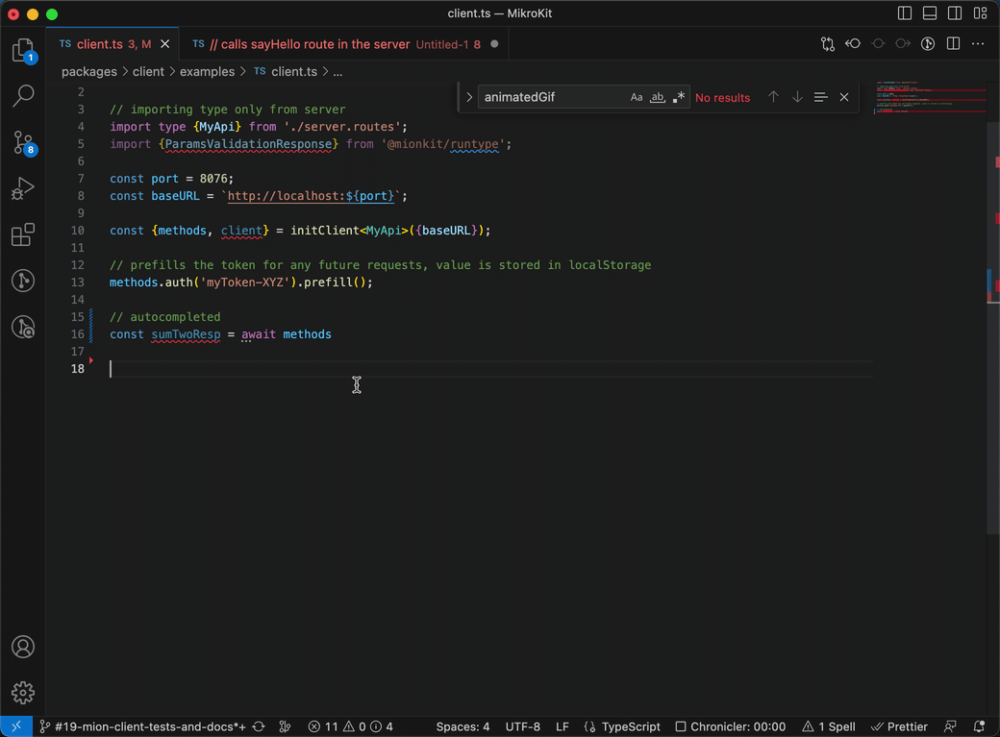
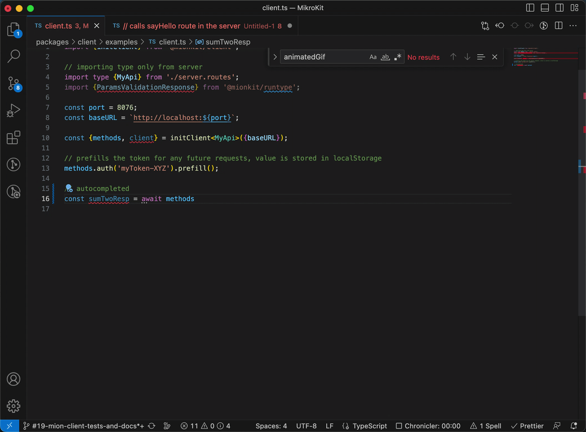

<p align="center">
  <picture>
    <source media="(prefers-color-scheme: dark)" srcset="https://raw.githubusercontent.com/MionKit/mion/master/assets/public/bannerx90-dark.png">
    <source media="(prefers-color-scheme: light)" srcset="https://raw.githubusercontent.com/MionKit/mion/master/assets/public/bannerx90.png">
    
  </picture>
</p>
<p align="center">
  <strong>Fully typed client for mion Apis
  </strong>
</p>
<p align=center>
  
  
</p>

# `@mionkit/client`

Modern client for mion Apis:

- Strongly typed apis with autocompletion ans static type checking.
- Fully typed list of remote methods with it's parameters and return values.
- Automattic Validation and Serialization out of the box.
- Local Validation (no need to make a server request to validate parameters)
- Prefill request data to persist across multiple calls.
- No compilation needed

## Setting up the server

To be able to use the client the server must register a couple of routes required by the client to request remote methods metadata for validation and serialization. This routes are part of the `@mionkit/commons` package.

It is also required to export the **type** of the registered routes in the server.

```ts
// examples/server.routes.ts

import {PublicError} from '@mionkit/core';
import {Routes, registerRoutes} from '@mionkit/router';
import {clientRoutes} from '@mionkit/common';
import {Logger} from 'Logger';

export type User = {name: string; surname: string};
const routes = {
  auth: {
    headerName: 'Authorization',
    canReturnData: true,
    headerHook: (ctx, token: string): User | PublicError => {
      if (token === 'myToken-XYZ') return {name: 'My', surname: 'user'};
      return new PublicError({statusCode: 401, message: 'Unauthorized', name: 'Unauthorized'});
    },
  },
  sayHello: {route: (ctx, user: User): string | PublicError => `Hello ${user.name} ${user.surname}`},
  alwaysFails: (ctx, user: User): User | PublicError =>
    new PublicError({statusCode: 500, message: 'Something fails', name: 'UnknownError'}),
  utils: {
    sumTwo: (ctx, a: number): number => a + 2,
  },
  log: {
    forceRunOnError: true,
    hook: (ctx): any => {
      Logger.log(ctx.path, ctx.request.headers, ctx.request.body);
    },
  },
} satisfies Routes;

// init server or serverless router
// initHttpRouter(...);
// initAwsLambdaRouter(...);

// register routes and exporting the type of the Api to be used by client
const myApi = registerRoutes(routes);
export type MyApi = typeof myApi;

// register routes required by client, (these routes serve metadata, for validation and serialization)
registerRoutes(clientRoutes);
```

## Using the client

To use the client we just need to import the **type** of the registered routes, and initialize the client.

The `methods` returning when initializing the client is a fully typed object that contains all the remote methods with parameter types and return values.

```ts
// examples/client.ts

import {initClient} from '@mionkit/client';

// importing type only from server
import type {MyApi} from './server.routes';
import {ParamsValidationResponse} from '@mionkit/runtype';

const port = 8076;
const baseURL = `http://localhost:${port}`;

const {methods, client} = initClient<MyApi>({baseURL});

// prefills the token for any future requests, value is stored in localStorage
methods.auth('myToken-XYZ').prefill();

// calls sayHello route in the server
const sayHello = await methods.sayHello({name: 'John', surname: 'Doe'}).call();
console.log(sayHello); // Hello John Doe

// calls sumTwo route in the server
const sumTwoResp = await methods.utils.sumTwo(5).call();
console.log(sumTwoResp * 3); // 21

// validate parameters locally without calling the server
const validationResp: ParamsValidationResponse = await methods.sayHello({name: 'John', surname: 'Doe'}).validate();
console.log(validationResp); // {hasErrors: false, totalErrors: 0, errors: []}
```

#### Remote methods autocomplete



#### Remote params autocomplete



_[MIT](../../LICENSE) LICENSE_
