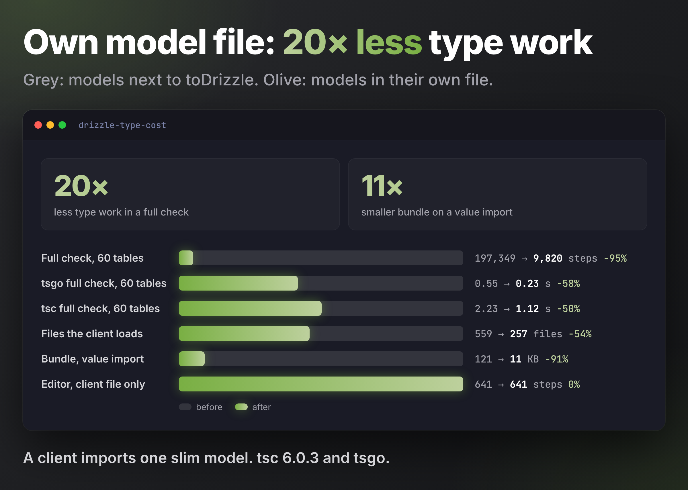

# Drizzle type cost: slim models next to toDrizzle

Why `drizzle-mixed-types` exists. A client imports one slim model (`User`, `Post`) from a file holding either only the slim schema, or also `toDrizzle`, relations and the `drizzle()` database (optionally with a few queries). Does the client pay for the Drizzle side it never uses?

## Answer

- **Editor: no.** The checker is lazy. Checking only the client file costs the same in both layouts, from 1 to 60 tables.
- **Full type check: yes.** `tsc` / `tsgo` on the client project checks every `.ts` file the client reaches. The shared file's `toDrizzle` calls, relations and queries get checked too: 5× more type work for the example app, 20× for 60 tables.
- **Files loaded: yes, in every mode.** The client loads about 300 extra Drizzle declaration files (257 → 559), even in the editor. About +0.08 s and +25 MB with `tsgo`.
- **Bundle: yes, on a value import.** Importing the slim `users` table as a value (forms, validation) bundles drizzle-orm: 11 KB → 123 KB. A type-only import changes nothing.
- **Only escape:** the shared file reaches the client as a compiled `.d.ts` with `skipLibCheck` (published package, built project reference). Type work is then equal, but the extra files still load.

## Setup

- Fixtures: the six real schema files of `src/db/` (pg, mysql, sqlite × builders, types) with their `.db.ts` companions. "Same file" = both concatenated. "Same file + queries" adds a select, a join, a relational query and a view select.
- Clients: type-only (`import type {User, Post, NewUser}`) and value (`import {users}`).
- Mion packages consumed as emitted `.d.ts` (like an installed package), drizzle-orm 0.45.2 from the workspace. `strict`, `skipLibCheck`, bundler resolution.
- Tools: TypeScript 6.0.3 API (client file only vs whole program), `tsc` and `tsgo` (native, built from the typescript-go submodule) with `--extendedDiagnostics`, median of 5 runs (3 for the scaling table), esbuild for bundles.
- Every fixture compiled with zero errors.

## Example app, type-only client

Type instantiations; the five other dialect / form pairs follow the same pattern.

| pg builders | split | same file | same file + queries |
| --- | ---: | ---: | ---: |
| Editor, client file only | 2,617 | 2,617 | 2,617 |
| Full check, shared file as `.ts` | 3,341 | 18,128 | 23,008 |
| Full check, shared file as `.d.ts` | 1,322 | 1,322 | 1,322 |
| Files in the program | 257 | 559 | 559 |
| `tsc` total time | 0.93 s | 1.34 s | 1.37 s |
| `tsgo` total time | 0.16 s | 0.26 s | 0.27 s |
| `tsgo` memory | 56 MB | 84 MB | 85 MB |

With the shared file as `.d.ts`, `tsgo` still takes 0.16 s vs 0.24 s and 54 MB vs 81 MB, all from loading the extra files.

## Scaling with table count

Generated pg tables (5 columns each), one `toDrizzle` and one query per table, client imports one model.

| Tables | Full check, split | Full check, same file | `tsgo` split / same | `tsc` split / same | Editor, both |
| ---: | ---: | ---: | ---: | ---: | ---: |
| 1 | 1,147 | 8,431 | 0.16 / 0.24 s | 0.87 / 1.19 s | 641 |
| 10 | 2,470 | 37,249 | 0.17 / 0.26 s | 0.87 / 1.34 s | 641 |
| 30 | 5,410 | 101,289 | 0.18 / 0.38 s | 0.86 / 1.68 s | 641 |
| 60 | 9,820 | 197,349 | 0.23 / 0.55 s | 1.12 / 2.23 s | 641 |

(Full-check columns are `tsgo` counts. `tsc` counts differ by at most 506.)

## Bundle, value import of `users` (pg builders, esbuild, minified)

| | split | same file |
| --- | ---: | ---: |
| Bytes | 10,911 | 123,408 |
| drizzle-orm modules | 0 | 105 |
