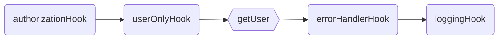
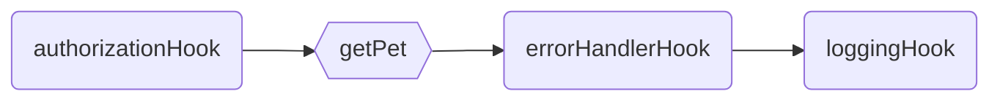

<p align="center">
  
</p>
<p align="center">
  <strong>RPC Like router with automatic Validation and Serialization
  </strong>
</p>
<p align=center>
  
  
  
</p>

# `@mikrokit/router`

Blazing fast router **_based in plain javascript objects_**. Thanks to it's RPC style there is no need for parameters or regular expression parsing when finding a route, just a simple [Map](https://developer.mozilla.org/en-US/docs/Web/JavaScript/Reference/Global_Objects/Map) in memory containing all the routes, can't get faster than that.

MikroKit Router uses **Remote Procedure Call** style routing, unlike traditional REST apis it does not use `GET`, `PUT`, `POST` and `DELETE` methods, everything is transmitted using `HTTP POST` method and all data is sent/received in the request and response `BODY`.

### Rpc VS Rest

| RPC Like Request                                            | REST Request                            | Description     |
| ----------------------------------------------------------- | --------------------------------------- | --------------- |
| POST `/users/get`<br>BODY `{"params":[{"id":1}]}`           | GET `/users/1`<br>BODY `NONE`           | Get user by id  |
| POST `/users/create`<br>BODY `{"params":[{"name":"John"}]}` | POST `/users`<br>BODY `{"name":"John"}` | Create new user |
| POST `/users/delete`<br>BODY `{"params":[{"id":1}]}`        | DELETE `/users/1`<br>BODY `NONE`        | Delete user     |
| POST `/users/getAll`<br>BODY `{}`                           | GET `/users` <br>BODY `NONE`            | Get All users   |

Please have a look to this great Presentation for more info about each different type of API and the pros and cons of each one:  
[Nate Barbettini – API Throwdown: RPC vs REST vs GraphQL, Iterate 2018](https://www.youtube.com/watch?v=IvsANO0qZEg)

## Routes

Routes are functions where the first parameter is the `call context`, the rest of parameters are extracted from the request body. Route names are defined using a plain javascript object, where every property of the object is the route's name. Adding types is recommended so correctness is statically checked.

```ts
// examples/routes-definition.ts

import {Route, Handler, Routes, MkkRouter} from '@mikrokit/router';

const sayHello: Handler = (context, name: string) => {
  return `Hello ${name}.`;
};

const sayHello2: Route = {
  route(context, name1: string, name2: string) {
    return `Hello ${name1} and ${name2}.`;
  },
};

const routes: Routes = {
  sayHello, // api/sayHello
  sayHello2, // api/sayHello2
};

MkkRouter.setRouterOptions({prefix: 'api/'});
MkkRouter.addRoutes(routes);
```

Using javascript names helps keeping route names simple, it is not recommended to use the array notation to define route names. no url decoding is done when finding the route

```ts
// examples/no-recommended-route-names.ts

import {Routes, MkkRouter, Route} from '@mikrokit/router';

const sayHello: Route = (context, name: string) => {
  return `Hello ${name}.`;
};

const routes: Routes = {
  'say-Hello': sayHello, // api/say-Hello  !! NOT Recommended
  'say Hello': sayHello, // api/say%20Hello  !! ROUTE WONT BE FOUND
};

MkkRouter.addRoutes(routes);
```

#### Request & Response

The function parameters are passed in the request body, as an Array in the `params` field. Elements in the array must have the same order as the function parameters. The function response data gets returned in the `response` field.

This names can be configured in the router options.

| POST REQUEST     | Request Body                   | Response Body                         |
| ---------------- | ------------------------------ | ------------------------------------- |
| `/api/sayHello`  | `{"params": ["John"] }`        | `{"response": "Hello John."}`         |
| `/api/sayHello2` | `{"params": ["Adan", "Eve"] }` | `{"response": "Hello Adan and Eve."}` |

## Hooks

A route might require some extra data like authorization, preconditions, logging, etc... Hooks are auxiliary functions executed in order before or after the route.

Hooks can use the `context` to share data with other routes and hooks. The return value will be ignored unless `canReturnData` is set to true, in that case the returned value will be serialized in the response body.

```ts
// examples/hooks-definition.ts

import {Route, Routes, MkkRouter, Hook} from '@mikrokit/router';
import {getAuthUser, isAuthorized} from 'MyAuth';

const authorizationHook: Hook = {
  fieldName: 'Authorization',
  inHeader: true,
  async hook(context, token: string) {
    const me = await getAuthUser(token);
    if (!isAuthorized(me)) throw {code: 401, message: 'user is not authorized'};
    context.auth = {me}; // user is added to context to shared with other routes/hooks
  },
};

const getPet: Route = async (context, petId: number) => {
  const pet = context.app.deb.getPet(petId);
  // ...
  return pet;
};

const logs: Hook = {
  async hook(context) {
    const me = context.errors;
    if (context.errors) await context.cloudLogs.error(context.errors);
    else context.cloudLogs.log(context.request.path, context.auth.me, context.mkkOutput);
  },
};

const routes: Routes = {
  authorizationHook, // header: Authorization (defined using fieldName)
  users: {
    getPet,
  },
  logs,
};

MkkRouter.addRoutes(routes);
```

## Execution Order

The order in which `routes` and `hooks` are added to the router is important as they will be executed in the same order they are declared (Top Down order). An execution path is generated for every route.

```ts
// examples/correct-definition-order.ts#L12-L26

const routes: Routes = {
  authorizationHook, // hook
  users: {
    userOnlyHook, // hook
    getUser, // route: users/getUser
  },
  pets: {
    getPet, // route: users/getUser
  },
  errorHandlerHook, // hook,
  loggingHook, // hook,
};

MkkRouter.addRoutes(routes);
```

#### Execution path for: `users/getUser`



#### Execution path for: `pets/getPets`



**_To guarantee the correct execution order of hooks and routes, the properties of the router CAN NOT BE numeric or digits only._**  
An error will thrown when adding routes with `mkkRouter.addRoutes`. More info about order of properties in javascript objects [here](https://stackoverflow.com/questions/5525795/does-javascript-guarantee-object-property-order) and [here](https://www.stefanjudis.com/today-i-learned/property-order-is-predictable-in-javascript-objects-since-es2015/).

```ts
// examples/correct-definition-order.ts#L27-L40

const invalidRoutes = {
  authorizationHook, // hook
  1: {
    // invalid (this would execute before the authorizationHook)
    getFoo, // route
  },
  '2': {
    // invalid (this would execute before the authorizationHook)
    getBar, // route
  },
};

MkkRouter.addRoutes(invalidRoutes); // throws an error
```

## Routes & Hooks options

<table>
<tr><th>Hook Config</th><th>Route Config</th></tr>
<tr>
<td>

```ts
// src/types.ts#L33-L48

/** Hook definition */
export type Hook = {
  /** Executes the hook even if an error was thrown previously */
  forceRunOnError?: boolean;
  /** Enables returning data in the responseBody */
  canReturnData?: boolean;
  /** Sets the value in a heather rather than the body */
  inHeader?: boolean;
  /** The fieldName in the request/response body */
  fieldName?: string;
  /** Description of the route, mostly for documentation purposes */
  description?: string;
  /** Hook handler */
  hook: Handler;
};
```

</td>
<td>

```ts
// src/types.ts#L14-L32

export type Handler = (context: any, ...args: any) => any | void | Promise<any | void>;

/** Route definition */
export type RouteObject = {
  /** overrides route's path */
  path?: string;
  /** overrides request body input field name */
  inputFieldName?: string;
  /** overrides response body output field name */
  outputFieldName?: string;
  /** description of the route, mostly for documentation purposes */
  description?: string;
  /** Route Handler */
  route: Handler;
};

/** A route can be a full route definition or just the handler */
export type Route = RouteObject | Handler;
```

</td>
</tr>
</table>

#### Extending Route and Hook Types

Your application might need to add some extra metadata to every route or hook, to keep types working you can extend the `Route` and `Hook` types as follows:

```ts
// examples/extending-routes-and-hooks.ts

import {Route, Hook} from '@mikrokit/router';

type MyRoute = Route & {doNotFail: boolean};
type MyHook = Hook & {shouldLog: boolean};

const someRoute: MyRoute = {
  doNotFail: true,
  route: () => {
    if (someRoute.doNotFail) {
      // do something
    } else {
      throw {statusCode: 400, message: 'operation failed'};
    }
  },
};

const someHook: MyHook = {
  shouldLog: false,
  hook: (context) => {
    if (someHook.shouldLog) {
      context.app.cloudLogs.log('hello');
    } else {
      // do something else
    }
  },
};
```

## Call Context

All data related to the call and app is passed in the first parameter to routes/hooks handler the `Context`.

#### Context Type

```ts
// src/types.ts#L122-L146

/** The call Context object passed as first parameter to any hook or route */
export type Context<App, SharedData, ServerReq extends MkRequest, ServerResp extends MkResponse> = {
  /** Static Data: main App, db driver, libraries, etc... */
  app: Readonly<App>;

  server: {
    /** Server request, '@types/aws-lambda/APIGatewayEvent' when using aws lambda */
    req: Readonly<ServerReq>;
    /** Server response, '@types/aws-lambda/APIGatewayProxyCallback' when using aws lambda */
    resp: Readonly<ServerResp>;
  };
  /** Route's path */
  path: Readonly<string>;
  /** route errors, returned to the public */
  responseErrors: MkError[];
  /** private errors, can be used for logging etc */
  privateErrors: (MkError | Error | any)[];
  /** parsed request.body */
  request: MapObj;
  /** returned data (non parsed) */
  reply: MapObj;
  /** shared data between route/hooks handlers */
  shared: SharedData;
};
```

#### Using context

```ts
// examples/using-context.ts

import {MkkRouter, Context} from '@mikrokit/router';
import {APIGatewayProxyResult, APIGatewayEvent} from 'aws-lambda';
import {someDbDriver} from 'someDbDriver';
import {cloudLogs} from 'MyCloudLogLs';

const app = {cloudLogs, db: someDbDriver};
const sharedData = {auth: {me: null}};

type App = typeof app;
type SharedData = typeof sharedData;
type CallContext = Context<App, SharedData, APIGatewayEvent, APIGatewayProxyResult>;

const getMyPet = async (context: CallContext) => {
  // use of context inside handlers
  const user = context.shared.auth.me;
  const pet = context.app.db.getPetFromUser(user);
  context.app.cloudLogs.log('pet from user retrieved');
  return pet;
};

const routes = {getMyPet};
MkkRouter.initRouter(app, () => structuredClone(sharedData));
MkkRouter.addRoutes(routes);
```

## Automatic Validation and Serialization

This router uses [Deepkit](https://deepkit.io/) runtime types to automatically [validate](https://docs.deepkit.io/english/validation.html) params data and [serialize](https://docs.deepkit.io/english/serialization.html) response data.

Thanks to Deepkit's magic the type information is available at runtime and the data is auto-magically Validated and Serialized. For mor information please read deepkit's documentation:

- Request [Validation](https://docs.deepkit.io/english/validation.html)
- Response [Serialization](https://docs.deepkit.io/english/serialization.html)

#### Request Validation examples

<table>
<tr><th>Code</th><th> Request <code>POST: users/getById</code> </th></tr>
<tr>
<td>

```ts
// examples/get-user-request.ts

import {Route, Routes, MkkRouter} from '@mikrokit/router';

interface Entity {
  id: number;
}

const getUser: Route = async (context, entity: Entity) => {
  const user = await context.db.getUserById(entity.id);
  return user;
};

const routes: Routes = {
  users: {
    getUser, // api/users/getUser
  },
};

MkkRouter.addRoutes(routes);
```

</td>
<td>

```yml
# VALID REQUEST BODY
{
  "getUser": [ {"id" : 1} ]
}

# INVALID REQUEST BODY (user.id is not a number)
{
  "getUser": [ {"id" : "1"} ]
}

# INVALID REQUEST BODY (missing parameter user.id)
{
  "getUser": [ {"ID" : 1} ]
}

# INVALID REQUEST BODY (missing parameters)
{
  "getUser": []
}
```

</td>
</tr>
</table>

## &nbsp;

_[MIT](../../LICENSE) LICENSE_
