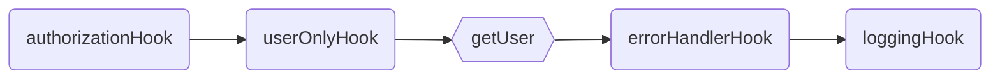

<p align="center">
  
</p>
<p align="center">
  <strong>RPC Like router with automatic Validation and Serialization.
  </strong>
</p>
<p align=center>
  
  
  
</p>

# `@mikrokit/router`

🚀 Lightweight router **_based in plain javascript objects_**.

Thanks to it's RPC style there is no need to parse parameters or regular expressions when finding a route. Just a simple [Map](https://developer.mozilla.org/en-US/docs/Web/JavaScript/Reference/Global_Objects/Map) in memory containing all the routes.

MikroKit Router uses a **Remote Procedure Call** style routing, unlike traditional routers it does not use `GET`, `PUT`, `POST` and `DELETE` methods, everything **should** be transmitted using `HTTP POST` method and all data is sent/received in the request/response `body` and `headers`.

- `HTTP` method is ignored by this router.
- Data is sent and received only in the `body` and `headers`. (no request params)
- Data is sent and received only in `JSON` format.

### Rpc VS Rest

| RPC Like Request                                                   | REST Request                            | Description     |
| ------------------------------------------------------------------ | --------------------------------------- | --------------- |
| POST `/users/get`<br>BODY `{"/users/get":[{"id":1}]}`              | GET `/users/1`<br>BODY `NONE`           | Get user by id  |
| POST `/users/create`<br>BODY `{"/users/create":[{"name":"John"}]}` | POST `/users`<br>BODY `{"name":"John"}` | Create new user |
| POST `/users/delete`<br>BODY `{"/users/delete":[{"id":1}]}`        | DELETE `/users/1`<br>BODY `NONE`        | Delete user     |
| POST `/users/getAll`<br>BODY `{"/users/getAll":[]}`                | GET `/users` <br>BODY `NONE`            | Get All users   |

Please have a look to this great Presentation for more info about each different type of API and the pros and cons of each one:  
[Nate Barbettini – API Throwdown: RPC vs REST vs GraphQL, Iterate 2018](https://www.youtube.com/watch?v=IvsANO0qZEg)

## `Routes`

A route is just a function, the first parameter is always the `call context`, the rest of parameters are extracted from the request body or headers. Route names are defined using a plain javascript object, where every property of the object is the route's name. Adding types is recommended when defining a route so typescript can statically check parameters.

MikroKit only cares about the `path`, and completely ignores the http method, so in theory request could be made using `POST` or `PUT`, or the router could be used in any event driven environment where the concept of method does not exist.

```ts
// examples/routes-definition.routes.ts

import {Route, Handler, Routes, MkRouter} from '@mikrokit/router';

const sayHello: Handler = (context, name: string): string => {
  return `Hello ${name}.`;
};

const sayHello2: Route = {
  route(context, name1: string, name2: string): string {
    return `Hello ${name1} and ${name2}.`;
  },
};

const routes: Routes = {
  sayHello, // api/sayHello
  sayHello2, // api/sayHello2
};

MkRouter.setRouterOptions({prefix: 'api/'});
MkRouter.addRoutes(routes);
```

Using javascript names helps keeping route names simple, it is not recommended to use the array notation to define route names. no url decoding is done when finding the route

```ts
// examples/no-recommended-names.routes.ts

import {Routes, MkRouter, Route} from '@mikrokit/router';

const sayHello: Route = (context, name: string): string => {
  return `Hello ${name}.`;
};

const routes: Routes = {
  'say-Hello': sayHello, // api/say-Hello  !! NOT Recommended
  'say Hello': sayHello, // api/say%20Hello  !! ROUTE WONT BE FOUND
};

MkRouter.addRoutes(routes);
```

#### Request & Response

`Route parameters` are passed as an Array in the request body, in a field with the same name as the route. Elements in the array must have the same order as the function parameters.

`Route response` is send back in the body in a field with the same name as the route.

The reason for this weird naming is to future proof the router to be able to accept multiple routes on a single request. However this can be changed setting the `routeFieldName` in the router options.

| POST REQUEST     | Request Body                           | Response Body                               |
| ---------------- | -------------------------------------- | ------------------------------------------- |
| `/api/sayHello`  | `{"/api/sayHello": ["John"] }`         | `{"/api/sayHello": "Hello John."}`          |
| `/api/sayHello2` | `{"/api/sayHello2": ["Adan", "Eve"] }` | `{"/api/sayHello2": "Hello Adan and Eve."}` |

## `Hooks`

A route might require some extra data like authorization, preconditions, logging, etc... Hooks are auxiliary functions executed in order before or after the route.

Hooks can use `context.shared` to share data with other routes and hooks. The return value will be ignored unless `canReturnData` is set to true, in that case the returned value will be serialized in and send back in response body.

```ts
// examples/hooks-definition.routes.ts

import {Route, Routes, MkRouter, Hook} from '@mikrokit/router';
import {getAuthUser, isAuthorized} from 'MyAuth';

const authorizationHook: Hook = {
  fieldName: 'Authorization',
  inHeader: true,
  async hook(context, token: string): Promise<void> {
    const me = await getAuthUser(token);
    if (!isAuthorized(me)) throw {code: 401, message: 'user is not authorized'};
    context.auth = {me}; // user is added to context to shared with other routes/hooks
  },
};

const getPet: Route = async (context, petId: number): Promise<Pet> => {
  const pet = context.app.deb.getPet(petId);
  // ...
  return pet;
};

const logs: Hook = {
  async hook(context): Promise<void> {
    const me = context.errors;
    if (context.errors) await context.cloudLogs.error(context.errors);
    else context.cloudLogs.log(context.request.path, context.auth.me, context.mkkOutput);
  },
};

const routes: Routes = {
  authorizationHook, // header: Authorization (defined using fieldName)
  users: {
    getPet,
  },
  logs,
};

MkRouter.addRoutes(routes);
```

## `Execution Order`

The order in which `routes` and `hooks` are added to the router is important as they will be executed in the same order they are defined (Top Down order). An execution path is generated for every route.

```ts
// examples/correct-definition-order.routes.ts#L12-L26

const routes: Routes = {
  authorizationHook, // hook
  users: {
    userOnlyHook, // hook
    getUser, // route: users/getUser
  },
  pets: {
    getPet, // route: users/getUser
  },
  errorHandlerHook, // hook,
  loggingHook, // hook,
};

MkRouter.addRoutes(routes);
```

#### Execution path for: `users/getUser`



#### Execution path for: `pets/getPets`


**_To guarantee the correct execution order of hooks and routes, the properties of the router CAN NOT BE numeric or digits only._**  
An error will thrown when adding routes with `MkRouter.addRoutes`. More info about order of properties in javascript objects [here](https://stackoverflow.com/questions/5525795/does-javascript-guarantee-object-property-order) and [here](https://www.stefanjudis.com/today-i-learned/property-order-is-predictable-in-javascript-objects-since-es2015/).

```ts
// examples/correct-definition-order.routes.ts#L27-L40

const invalidRoutes = {
  authorizationHook, // hook
  1: {
    // invalid (this would execute before the authorizationHook)
    getFoo, // route
  },
  '2': {
    // invalid (this would execute before the authorizationHook)
    getBar, // route
  },
};

MkRouter.addRoutes(invalidRoutes); // throws an error
```

## `Routes & Hooks Config`

<table>
<tr><th>Hooks config</th><th>Routes config</th></tr>
<tr>
<td>

```ts
// src/types.ts#L39-L53

/** Hook definition */
export type Hook = {
  /** Executes the hook even if an error was thrown previously */
  forceRunOnError?: boolean;
  /** Enables returning data in the responseBody */
  canReturnData?: boolean;
  /** Sets the value in a heather rather than the body */
  inHeader?: boolean;
  /** The fieldName in the request/response body */
  fieldName?: string;
  /** Description of the route, mostly for documentation purposes */
  description?: string;
  /** Hook handler */
  hook: Handler;
};
```

</td>
<td>

```ts
// src/types.ts#L23-L37

/** Route or Hook Handler */
export type Handler = (context: Context<any, any, any, any>, ...args: any) => any | Promise<any>;

/** Route definition */
export type RouteObject = {
  /** overrides route's path and fieldName in request/response body */
  path?: string;
  /** description of the route, mostly for documentation purposes */
  description?: string;
  /** Route Handler */
  route: Handler;
};

/** A route can be a full route definition or just the handler */
export type Route = RouteObject | Handler;
```

</td>
</tr>
</table>

#### Extending Route and Hook Types

Your application might need to add some extra metadata to every route or hook, to keep types working you can extend the `Route` and `Hook` types as follows:

```ts
// examples/extending-routes-and-hooks.routes.ts

import {Route, Hook} from '@mikrokit/router';

type MyRoute = Route & {doNotFail: boolean};
type MyHook = Hook & {shouldLog: boolean};

const someRoute: MyRoute = {
  doNotFail: true,
  route: (): void => {
    if (someRoute.doNotFail) {
      // do something
    } else {
      throw {statusCode: 400, message: 'operation failed'};
    }
  },
};

const someHook: MyHook = {
  shouldLog: false,
  hook: (context): void => {
    if (someHook.shouldLog) {
      context.app.cloudLogs.log('hello');
    } else {
      // do something else
    }
  },
};
```

## `Call Context`

All data related to the Application and called route is passed in the first parameter to routes/hooks handler the `Context`.
Some data like `request/reply body/headers` or `responseErrors` are available but it is not recommended modifying them specially within a route, their values are automatically assigned by the router. Instead just return data from the function or throw an error.

#### Context Type

```ts
// src/types.ts#L163-L198

    app: Readonly<App>;
    server: Readonly<AnyServerCall>;
    /** Route's path */
    path: Readonly<string>;
    /** route errors, returned to the public */
    responseErrors: MkError[];
    /**
     * list of internal errors.
     * log is quite expensive so all errors will be logged at once at the end of the request;
     * error thrown by hooks and routes are automatically catch and added here.
     */
    internalErrors: (MkError | any)[];
    /** parsed request.body */
    request: {
        headers: MapObj;
        body: MapObj;
    };
    /** returned data (non parsed) */
    reply: {
        headers: MapObj;
        body: MapObj;
    };
    /** shared data between route/hooks handlers */
    shared: SharedData;
};

/** Function used to create the shared data object on each route call  */
export type SharedDataFactory<SharedData> = () => SharedData;

// #######  reflection #######

export type RouteParamValidator = (data: any) => ValidationErrorItem[];
export type RouteParamDeserializer = <T>(data: JSONPartial<T>) => T;
export type RouteOutputSerializer = <T>(data: T) => JSONSingle<T>;

// #######  type guards #######
```

#### Using context

```ts
// examples/using-context.routes.ts

import {MkRouter, Context} from '@mikrokit/router';
import {APIGatewayProxyResult, APIGatewayEvent} from 'aws-lambda';
import {someDbDriver} from 'someDbDriver';
import {cloudLogs} from 'MyCloudLogLs';

const app = {cloudLogs, db: someDbDriver};
const shared = {auth: {me: null}};
const getSharedData = (): typeof shared => shared;

type App = typeof app;
type SharedData = ReturnType<typeof getSharedData>;
type CallContext = Context<App, SharedData, APIGatewayEvent>;

const getMyPet = async (context: CallContext): Promise<Pet> => {
  // use of context inside handlers
  const user = context.shared.auth.me;
  const pet = context.app.db.getPetFromUser(user);
  context.app.cloudLogs.log('pet from user retrieved');
  return pet;
};

const routes = {getMyPet};
MkRouter.initRouter(app, getSharedData);
MkRouter.addRoutes(routes);
```

## `Automatic Serialization and Validation`

Mikrokit uses [Deepkit's runtime types](https://deepkit.io/) to automatically [validate](https://docs.deepkit.io/english/validation.html) request params and [serialize/deserialize](https://docs.deepkit.io/english/serialization.html) request/response data.

Thanks to Deepkit's magic the type information is available at runtime and the data can be auto-magically Validated and Serialized. For more information please read deepkit's documentation:

- Request [Validation](https://docs.deepkit.io/english/validation.html)
- Response/Request [Serialization/Deserialization](https://docs.deepkit.io/english/serialization.html)

#### Request Validation examples

<table>
<tr><th>Code</th><th>POST Request <code>/users/getUser</code></th></tr>
<tr>
<td>

```ts
// examples/get-user-request.routes.ts

import {Route, Routes, MkRouter} from '@mikrokit/router';

const getUser: Route = async (context: any, entity: {id: number}): Promise<User> => {
  const user = await context.db.getUserById(entity.id);
  return user;
};

const routes: Routes = {
  users: {
    getUser, // api/users/getUser
  },
};

MkRouter.addRoutes(routes);
```

</td>
<td>

```yml
# VALID REQUEST BODY
{ "/users/getUser": [ {"id" : 1} ]}

# INVALID REQUEST BODY (user.id is not a number)
{"/users/getUser": [ {"id" : "1"} ]}

# INVALID REQUEST BODY (missing parameter user.id)
{"/users/getUser": [ {"ID" : 1} ]}

# INVALID REQUEST BODY (missing parameters)
{"/users/getUser": []}
```

</td>
</tr>
</table>

#### !!! IMPORTANT !!!

Deepkit does not support [Type Inference](https://www.typescriptlang.org/docs/handbook/type-inference.html), `parameter types` and more importantly `return types` must be explicitly defined, so they are correctly validated/serialized.

🚫 Invalid route definitions!

```ts
const myRoute1: Route = () {};
const myRoute2: Route = () => null;
const sayHello: Route = (context, name) => `Hello ${name}`;
const getYser: Route = async (context, userId) => context.db.getUserById(userId);
```

✅ Valid route definitions!

```ts
const myRoute1: Route = (): void {};
const myRoute2: Route = (): null => null;
const sayHello: Route = (context: Context, name:string): string => `Hello ${name}`;
const getYser: Route = async (context: Context, userId:number): Promise<User> => context.db.getUserById(userId);
```

#### Configuring Eslint to enforce explicit types in router files:

Declaring explicit types everywhere can be a bit annoying, so you could suffix your route filles with `.routes.ts` and add bellow eslint config to your project, (the important part here is the `overrides` config).

<!-- `MkRouter.addRoutes` will fail if parameter types or return types are not defined and `enableValidation` or `enableSerialization` are enabled. -->

```js
module.exports = {
  root: true,
  parser: '@typescript-eslint/parser',
  plugins: ['@typescript-eslint'],
  extends: ['eslint:recommended', 'plugin:@typescript-eslint/recommended'],
  parserOptions: {
    project: ['./tsconfig.json', './packages/*/tsconfig.json'],
  },
  overrides: [
    {
      files: ['**/*.routes.ts'],
      rules: {
        '@typescript-eslint/explicit-function-return-type': 'error',
        '@typescript-eslint/no-explicit-any': 'error',
      },
    },
  ],
};
```

## `Router Options`

```ts
// src/constants.ts#L69-L122

    /**
     * Deepkit Serialization Options
     * @link https://docs.deepkit.io/english/serialization.html#_naming_strategy
     * */
    serializerNamingStrategy: undefined,

    /** Custom JSON parser, defaults to Native js JSON */
    jsonParser: JSON,
};

export const ROUTE_KEYS = Object.keys(DEFAULT_ROUTE);
export const HOOK_KEYS = Object.keys(DEFAULT_HOOK);

export const MAX_ROUTE_NESTING = 10;

```

## `Full Working Example`

```ts
// examples/full-example.routes.ts

import {MkRouter, Context, Route, Routes, Hook, MkError, StatusCodes} from '@mikrokit/router';
import {APIGatewayEvent} from 'aws-lambda';

interface User {
  id: number;
  name: string;
  surname: string;
}

type NewUser = Omit<User, 'id'>;

const myDBService = {
  usersStore: new Map<number, User>(),
  createUser: (user: NewUser): User => {
    const id = myDBService.usersStore.size + 1;
    const newUser: User = {id, ...user};
    myDBService.usersStore.set(id, newUser);
    return newUser;
  },
  getUser: (id: number): User | undefined => myDBService.usersStore.get(id),
  updateUser: (user: User): User | null => {
    if (!myDBService.usersStore.has(user.id)) return null;
    myDBService.usersStore.set(user.id, user);
    return user;
  },
  deleteUser: (id: number): User | null => {
    const user = myDBService.usersStore.get(id);
    if (!user) return null;
    myDBService.usersStore.delete(id);
    return user;
  },
};

// user is authorized if token === 'ABCD'
const myAuthService = {
  isAuthorized: (token: string): boolean => token === 'ABCD',
  getIdentity: (token: string): User | null => (token === 'ABCD' ? ({id: 0, name: 'admin', surname: 'admin'} as User) : null),
};

const app = {
  db: myDBService,
  auth: myAuthService,
};
const shared = {
  me: null as any as User,
};
const getSharedData = (): typeof shared => shared;

type App = typeof app;
type SharedData = ReturnType<typeof getSharedData>;
type CallContext = Context<App, SharedData, APIGatewayEvent>;

const getUser: Route = (ctx: CallContext, id: number): User => {
  const user = ctx.app.db.getUser(id);
  if (!user) throw {statusCode: 200, message: 'user not found'};
  return user;
};
const createUser: Route = (ctx: CallContext, newUser: NewUser): User => ctx.app.db.createUser(newUser);
const updateUser: Route = (ctx: CallContext, user: User): User => {
  const updated = ctx.app.db.updateUser(user);
  if (!updated) throw {statusCode: 200, message: 'user not found, can not be updated'};
  return updated;
};
const deleteUser: Route = (ctx: CallContext, id: number): User => {
  const deleted = ctx.app.db.deleteUser(id);
  if (!deleted) throw {statusCode: 200, message: 'user not found, can not be deleted'};
  return deleted;
};
const auth: Hook = {
  inHeader: true,
  fieldName: 'Authorization',
  hook: (ctx: CallContext, token: string): void => {
    const {auth} = ctx.app;
    if (!auth.isAuthorized(token)) throw {statusCode: StatusCodes.FORBIDDEN, message: 'Not Authorized'} as MkError;
    ctx.shared.me = auth.getIdentity(token) as User;
  },
};

const routes: Routes = {
  auth,
  users: {
    get: getUser, // api/v1/users/get
    create: createUser, // api/v1/users/create
    update: updateUser, // api/v1/users/update
    delete: deleteUser, // api/v1/users/delete
  },
};

MkRouter.initRouter(app, getSharedData, {prefix: 'api/v1'});
MkRouter.addRoutes(routes);
```

## &nbsp;

_[MIT](../../LICENSE) LICENSE_
