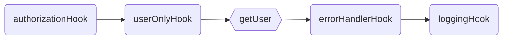
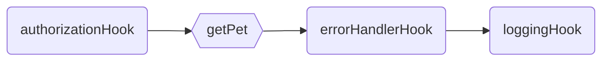

<p align="center">
  
</p>
<p align="center">
  <strong>RPC Like router with automatic Validation and Serialization
  </strong>
</p>
<p align=center>
  
  
  
</p>

# `@mikrokit/router`

Blazing fast router **_based in plain javascript objects_**. Thanks to the rpc style there is no need for parameters or regular expression parsing when finding a route, just a simple [Map](https://developer.mozilla.org/en-US/docs/Web/JavaScript/Reference/Global_Objects/Map) in memory containing all the routes, can't get faster than that.

MikroKit Router uses **Remote Procedure Call** style routing, unlike traditional REST apis it does not use `GET`, `PUT`, `POST` and `DELETE` methods, everything is transmitted using `HTTP POST` method and all data is sent/received in the request and response `BODY`.

### Rpc VS Rest

| RPC Like Request                                           | REST Request                            | Description     |
| ---------------------------------------------------------- | --------------------------------------- | --------------- |
| POST `/users/get`<br>BODY `{"input":[{"id":1}]}`           | GET `/users/1`<br>BODY `NONE`           | Get user by id  |
| POST `/users/create`<br>BODY `{"input":[{"name":"John"}]}` | POST `/users`<br>BODY `{"name":"John"}` | Create new user |
| POST `/users/delete`<br>BODY `{"input":[{"id":1}]}`        | DELETE `/users/1`<br>BODY `NONE`        | Delete user     |
| POST `/users/getAll`<br>BODY `{}`                          | GET `/users` <br>BODY `NONE`            | Get All users   |

Please have a look to this great Presentation for more info about each different type of API and the pros and cons of each one:  
[Nate Barbettini – API Throwdown: RPC vs REST vs GraphQL, Iterate 2018](https://www.youtube.com/watch?v=IvsANO0qZEg)

## Routes

Routes are just functions where the first parameter is the `context` and the rest of parameters are passed in the request body. Route names are defined using a plain javascript object, where every property of the object is the route's name.

```js
import {mkkRouter, Handler, Route} from '@mikrokit/router';

const sayHello: Handler = (context, name: string) => {
  return `Hello ${name}.`;
};

const sayHello2: Route = {
  route(context, name1: string, name2: string) {
    return `Hello ${name1} and ${name2}.`;
  },
};

const options = {prefix: 'api/'};

const routes = {
  sayHello, // api/sayHello
  sayHello2, // api/sayHello2
};

mkkRouter.addRoutes(routes, options);
```

Using javascript names helps keeping route names simple, it is not recommended to use the array notation to define route names. no url decoding is done when finding the route

```js
const sayHello: Handler = (context, name: string) => {
  return `Hello ${name}.`;
};

const routes = {
  'say-Hello': sayHello, // api/say-Hello  !! NOT GOOD
};

mkkRouter.addRoutes(routes, options);
```

#### Request & Response

The function parameters are passed in the request body, as an Array in the `input` field. Elements in the array must have the same order as the function parameters. The function response data gets returned in the `output` field.

This names can be configured in the router options.

| POST REQUEST     | Request Body                  | Response Body                       |
| ---------------- | ----------------------------- | ----------------------------------- |
| `/api/sayHello`  | `{"input": ["John"] }`        | `{"output": "Hello John."}`         |
| `/api/sayHello2` | `{"input": ["Adan", "Eve"] }` | `{"output": "Hello Adan and Eve."}` |

## Hooks

A route might require some extra data like authorization, preconditions, logging, etc... Hooks are auxiliary functions executed in order before or after the route.

Hooks can use the `context` to share data with other routes and hooks. The return value will be ignored unless `canReturnData` is set to true, in that case the returned value will be serialized in the response body.

```js
import {mkkRouter, mkkContext, Route, Hook} from '@mikrokit/router';

const authorizationHook: Hook = {
  stopNormalExecutionOnError: true,
  fieldName: 'Authorization',
  async hook(context: AppContext, token: string) {
    cons me = await getAuthUser(token);
    if (!isAuthorized) throw {code: 401, message: 'user is not authorized'};
    context.auth = {me}; // user is added to context to shared with other routes/hooks
  }
};

const getPet = async (context: AppContext, petId: number) => {
  const pet = context.
  ...
  return pet;
};

const loggingHook: Hook = {
  forceExecutionOnError: true,
  async hook(context: AppContext) {
    const me = context.errors;
    if (context.errors) await context.cloudLogs.error(context.errors);
    else context.cloudLogs.log(context.request.path, context.auth.me, context.mkkOutput)
  }
};

const routes = {
  // if `fieldName` would not have been set in the hook, then the `fieldName` would be : api/authorizationHook
  authorizationHook, // fieldName: Authorization
  users: {
    getPet, // fieldName: api/users/getPet
  },
  loggingHook, // no fieldName, is executed even when there are errors in the execution path
};

mkkRouter.addRoutes(routes, apiOptions);
```

## Execution Order

The order in which `routes` and `hooks` are added to the router is important as they will be executed in the same order they are declared (Top Down order). An execution path is generated for every route.

```js
const routes = {
  authorizationHook, // hook
  users: {
    userOnlyHook // hook
    getUser, // route: users/getUser
  },
  pets: {
    getPet, // route: users/getUser
  }
  errorHandlerHook, // hook,
  loggingHook, // hook,
};

mkkRouter.addRoutes(routes);
```

#### Execution path for: `users/getUser`



#### Execution path for: `pets/getPets`



**_To guarantee the correct execution order of hooks and routes, the properties of the router CAN NOT BE numeric or digits only._**  
An error will thrown when adding routes with `mkkRouter.addRoutes`. More info about order of properties in javascript objects [here](https://stackoverflow.com/questions/5525795/does-javascript-guarantee-object-property-order) and [here](https://www.stefanjudis.com/today-i-learned/property-order-is-predictable-in-javascript-objects-since-es2015/).

```js
const invalidRoutes = {
  authorizationHook, // hook
  1: {
    // invalid (this would execute before the authorizationHook)
    getFoo, // route
  },
  2: {
    // invalid (this would execute before the authorizationHook)
    getBar, // route
  },
};

mkkRouter.addRoutes(invalidRoutes); // throws an error
```

## Routes & Hooks options

<table>
<tr><th>Hook Config</th><th>Route Config</th></tr>
<tr>
<td>

```js
// ### default values shown ###
type Hook = {
  // Stops normal execution path if error is thrown
  stopOnError?: true,

  // Executes the hook even if an error was thrown previously
  forceRunOnError?: false,

  // enables returning data in the response body
  canReturnData?: false,

  // sets the value in a heather rather than the body
  returnInHeader?: false,

  // overrides the fieldName in the request/response body
  fieldName?: '', // default value's taken from route's name

  // hook's main handler
  hook: Handler,
};
```

</td>
<td>

```js
// ### default values shown ###
type RouteObject = {
  // overrides route's path
  path?: '', // default value's taken from route's path

  // overrides request body input field name
  inputFieldName?: 'input',

  // overrides response body output field name
  outputFieldName?: 'output',

  // route's main handler
  route: Handler,
};
```

</td>
</tr>
</table>

## Context

This router is agnostic about the server so the only context known by the router is the `errors`, `input` for the input data, and `output` for the output data. The rest of the context must be set when the app gets initialized as follows.

```js
import {mkkRouter, mkkContext, Route, Hook} from '@mikrokit/router';
import {someDbDriver} from 'someDbDriver';
import {cloudLogs} from 'someCloudLogLibrary';

const appContext = {
  cloudLogs,
  db: someDbDriver,
};

const authContext = {
  auth: {me: null}
}

/** Sets the  App and Route call context
 * First parameter is the static part of the app, libraries, drivers etc..
 * Second parameter is a factory function that returns a new context for every new request.
 * Be sure returned values don't store references to existing objects (no shallow copies),
 * you can use structuredClone used * for this.
 * */
const appContext = mkkRouter.setContext(appContext, () => structuredClone(authContext));

type AppContext = typeof appContext;


const route1 = async (context: AppContext, petId: number) => {
  // use of context inside handlers
  context.cloudLogs ... ;
  context.db ... ;
  context.auth.me ...;
  ...
  return pet;
};
const routes = { route1 };
mkkRouter.addRoutes(routes);

```

## Automatic Validation and Serialization

This router uses [Deepkit](https://deepkit.io/) runtime types to automatically [validate](https://docs.deepkit.io/english/validation.html) input data and [serialize](https://docs.deepkit.io/english/serialization.html) output data.

Thanks to Deepkit's magic the type information is available at runtime and the data is auto-magically Validated and Serialized. For mor information please read deepkit's documentation:

- Request [Validation](https://docs.deepkit.io/english/validation.html)
- Response [Serialization](https://docs.deepkit.io/english/serialization.html)

#### Request Validation examples

<table>
<tr><th>Code</th><th> Request <code>POST: users/getById</code> </th></tr>
<tr>
<td>

```js
import {mkkRouter} from '@mikrokit/router';

interface Entity {
  id: number;
}

const getUser = async (context, entity: Entity) => {
  const user = await context.db.getUserById(entity.id);
  return user;
};

const routes = {
  users: {
    getUser, // api/users/getUser
  },
};

mkkRouter.addRoutes(routes);
```

</td>
<td>

```yml
# VALID REQUEST BODY
{
  "getUser": [ {"id" : 1} ]
}

# INVALID REQUEST BODY (user.id is not a number)
{
  "getUser": [ {"id" : "1"} ]
}

# INVALID REQUEST BODY (missing parameter user.id)
{
  "getUser": [ {"ID" : 1} ]
}

# INVALID REQUEST BODY (missing parameters)
{
  "getUser": []
}
```

</td>
</tr>
</table>

## &nbsp;

_[MIT](../../LICENSE) LICENSE_
