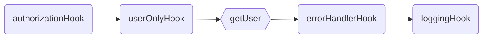

<p align="center">
  <picture>
    <source media="(prefers-color-scheme: dark)" srcset="../../assets/public/bannerx90-dark.png?raw=true">
    <source media="(prefers-color-scheme: light)" srcset="../../assets/public/bannerx90.png?raw=true">
    
  </picture>
</p>
<p align="center">
  <strong>RPC Like router with automatic Validation and Serialization.
  </strong>
</p>
<p align=center>

  
  
</p>

# `@mion/router`

🚀 Lightweight and fast RPC like router.

Thanks to it's RPC style there is no need to parse parameters or regular expressions when finding a route. Just a simple [Map](https://developer.mozilla.org/en-US/docs/Web/JavaScript/Reference/Global_Objects/Map) in memory containing all the routes.

mion Router uses a **Remote Procedure Call** style routing, unlike traditional routers it does not use `GET`, `PUT`, `POST` and `DELETE` methods, The Http method is ignored and all data is sent/received in the request/response `body` or `headers`.

- `HTTP` method is ignored by this router.
- Data is sent and received only in the `body` and `headers`. (no request params)
- Data is sent and received only in `JSON` format.

### Rpc VS Rest

| RPC Like Request                                                   | REST Request                            | Description     |
| ------------------------------------------------------------------ | --------------------------------------- | --------------- |
| POST `/users/get`<br>BODY `{"/users/get":[{"id":1}]}`              | GET `/users/1`<br>BODY `NONE`           | Get user by id  |
| POST `/users/create`<br>BODY `{"/users/create":[{"name":"John"}]}` | POST `/users`<br>BODY `{"name":"John"}` | Create new user |
| POST `/users/delete`<br>BODY `{"/users/delete":[{"id":1}]}`        | DELETE `/users/1`<br>BODY `NONE`        | Delete user     |
| POST `/users/getAll`<br>BODY `{"/users/getAll":[]}`                | GET `/users` <br>BODY `NONE`            | Get All users   |

Please have a look to this great Presentation for more info about each different type of API and the pros and cons of each one:  
[Nate Barbettini – API Throwdown: RPC vs REST vs GraphQL, Iterate 2018](https://www.youtube.com/watch?v=IvsANO0qZEg)

## `Routes`

A route is just a function, the first parameter is always the `call context`, the rest of parameters are extracted from the request body or headers. Route names are defined using a plain javascript object, where every property of the object is the route's name. Adding types is recommended when defining a route so typescript can statically check parameters.

mion only cares about the `path`, and completely ignores the http method, so in theory request could be made using `POST` or `PUT`, or the router could be used in any event driven environment where the concept of method does not exist.

```ts
// examples/routes-definition.routes.ts

import {setRouterOptions, registerRoutes} from '@mion/router';

const sayHello = (app, ctx, name: string): string => {
  return `Hello ${name}.`;
};

const sayHello2 = {
  route(app, ctx, name1: string, name2: string): string {
    return `Hello ${name1} and ${name2}.`;
  },
};

const routes = {
  sayHello, // api/sayHello
  sayHello2, // api/sayHello2
};

setRouterOptions({prefix: 'api/'});
export const apiSpec = registerRoutes(routes);
```

Using javascript names helps keeping route names simple, it is not recommended to use the array notation to define route names. no url decoding is done when finding the route

```ts
// examples/no-recommended-names.routes.ts

import {registerRoutes} from '@mion/router';

const sayHello = (app, ctx, name: string): string => {
  return `Hello ${name}.`;
};

const routes = {
  'say-Hello': sayHello, // api/say-Hello  !! NOT Recommended
  'say Hello': sayHello, // api/say%20Hello  !! ROUTE WONT BE FOUND
};

export const apiSpec = registerRoutes(routes);
```

#### Request & Response

`Route parameters` are passed as an Array in the request body, in a field with the same name as the route. Elements in the array must have the same order as the function parameters.

`Route response` is send back in the body in a field with the same name as the route.

The reason for this weird naming is to future proof the router to be able to accept multiple routes on a single request. However this can be changed setting the `routeFieldName` in the router options.

| POST REQUEST     | Request Body                           | Response Body                               |
| ---------------- | -------------------------------------- | ------------------------------------------- |
| `/api/sayHello`  | `{"/api/sayHello": ["John"] }`         | `{"/api/sayHello": "Hello John."}`          |
| `/api/sayHello2` | `{"/api/sayHello2": ["Adan", "Eve"] }` | `{"/api/sayHello2": "Hello Adan and Eve."}` |

## `Hooks`

A route might require some extra data like authorization, preconditions, logging, etc... Hooks are auxiliary functions that get executed in order before or after the route. (hooks can require remote parameters or act as a bootstrap middleware with no params, mion has no concept of events so there is no distinction, hooks are just a function that gets 'hooked' into the execution path). Multiple Hooks can be executed on but only a single Route will be executed per remote call.

Hooks can use `context.shared` to share data with other routes and hooks. The return value will be ignored unless `canReturnData` is set to true, in that case the returned value will be serialized in and sent back in the response body.

```ts
// examples/hooks-definition.routes.ts

import {Context, registerRoutes} from '@mion/router';
import {getAuthUser, isAuthorized} from 'MyAuth';
import type {Pet} from 'MyModels';

const authorizationHook = {
  fieldName: 'Authorization',
  inHeader: true,
  async hook(app, ctx, token: string): Promise<void> {
    const me = await getAuthUser(token);
    if (!isAuthorized(me)) throw {code: 401, message: 'user is not authorized'};
    ctx.shared.auth = {me}; // user is added to ctx to shared with other routes/hooks
  },
};

const getPet = async (app, ctx, petId: number): Promise<Pet> => {
  const pet = app.deb.getPet(petId);
  // ...
  return pet;
};

const logs = {
  forceRunOnError: true,
  async hook(app, ctx: Context<any>): Promise<void> {
    if (ctx.request) await app.cloudLogs.error(ctx.path, ctx.request.internalErrors);
    else app.cloudLogs.log(ctx.path, ctx.shared.me.name);
  },
};

const routes = {
  authorizationHook, // header: Authorization (defined using fieldName)
  users: {
    getPet,
  },
  logs,
};

export const apiSpec = registerRoutes(routes);
```

## `Execution Order`

The order in which `routes` and `hooks` are added to the router is important as they will be executed in the same order they are defined (Top Down order). An execution path is generated for every route.

```ts
// examples/correct-definition-order.routes.ts#L12-L26

const routes = {
  authorizationHook, // hook
  users: {
    userOnlyHook, // hook
    getUser, // route: users/getUser
  },
  pets: {
    getPet, // route: users/getUser
  },
  errorHandlerHook, // hook,
  loggingHook, // hook,
};

export const myValidApi = registerRoutes(routes);
```

#### Execution path for: `users/getUser`



#### Execution path for: `pets/getPets`


**_To guarantee the correct execution order of hooks and routes, the properties of the router CAN NOT BE numeric or digits only._**  
An error will thrown when adding routes with `Router.addRoutes`. More info about order of properties in javascript objects [here](https://stackoverflow.com/questions/5525795/does-javascript-guarantee-object-property-order) and [here](https://www.stefanjudis.com/today-i-learned/property-order-is-predictable-in-javascript-objects-since-es2015/).

```ts
// examples/correct-definition-order.routes.ts#L27-L40

const invalidRoutes = {
  authorizationHook, // hook
  1: {
    // invalid (this would execute before the authorizationHook)
    getFoo, // route
  },
  '2': {
    // invalid (this would execute before the authorizationHook)
    getBar, // route
  },
};

export const myInvalidApi = registerRoutes(invalidRoutes); // throws an error
```

## `Handling errors`

All errors thrown within Routes/Hooks will be catch and handled, as there is no concept of logger within the router errors are not automatically logged.

For every error thrown within the Routes/Hook Two types of errors are generated, Public errors are returned in the `response.publicErrors` & and private error stored in the `context.request.internalErrors` to be managed by any logger hook or similar. The public errors should only contains generic message and a status code, the private errors contains also stack trace and the rest of properties of any js Error.

Throwing a `RouteError` generates a public error otherwise a generic public 500 error is generated.

```ts
// examples/error-handling.routes.ts

import {RouteError, StatusCodes} from '@mion/router';
import type {Pet} from 'MyModels';

export const getPet = (app, ctx, id: string): Promise<Pet> => {
  try {
    const pet = app.db.getPet(id);
    if (!pet) {
      // Only statusCode and publicMessage will be returned in the response.body
      const statusCode = StatusCodes.BAD_REQUEST;
      const publicMessage = `Pet with id ${id} can't be found`;
      throw new RouteError(statusCode, publicMessage);
    }
    return pet;
  } catch (dbError) {
    // Only statusCode and publicMessage will be returned in the response.body
    const statusCode = StatusCodes.INTERNAL_SERVER_ERROR;
    const publicMessage = `Cant fetch data.`;
    /* 
         Full RouteError containing dbError message and stacktrace will be added
         to ctx.request.internalErrors, so it can be logged or managed after
        */
    throw new RouteError(statusCode, publicMessage, undefined, dbError as Error);
  }
};

export const alwaysError = (): void => {
  throw new Error('This error will generate a public 500 error with no message');
};
```

## `Routes & Hooks Config`

<table>
<tr><th>Routes</th><th>Hooks</th></tr>
<tr>
<td>

```ts
// src/types.ts#L24-L49

/** Route or Hook Handler, the remote function  */
export type Handler = (
  /** Static Data: main App, db driver, libraries, etc... */
  app: any,
  /** Call Context */
  context: Context<any, any>,
  /** Remote Call parameters */
  ...parameters: any
) => any | Promise<any>;

/** Route definition */
export type RouteDef = {
  /** overrides route's path and fieldName in request/response body */
  path?: string;
  /** description of the route, mostly for documentation purposes */
  description?: string;
  /** enable automatic parameter validation, defaults to true */
  enableValidation?: boolean;
  /** Enables serialization/deserialization */
  enableSerialization?: boolean;
  /** Route Handler */
  route: Handler;
};

/** A route can be a full route definition or just the handler */
export type Route = RouteDef | Handler;
```

</td>
<td>

```ts
// src/types.ts#L51-L70

/** Hook definition, a function that hooks into the execution path */
export type HookDef<App = any, CallContext extends Context<any, any> = any> = {
  /** Executes the hook even if an error was thrown previously */
  forceRunOnError?: boolean;
  /** Enables returning data in the responseBody,
   * hooks must explicitly enable returning data */
  canReturnData?: boolean;
  /** Sets the value in a heather rather than the body */
  inHeader?: boolean;
  /** The fieldName in the request/response body */
  fieldName?: string;
  /** Description of the route, mostly for documentation purposes */
  description?: string;
  /** enable automatic parameter validation, defaults to true */
  enableValidation?: boolean;
  /** Enables serialization/deserialization */
  enableSerialization?: boolean;
  /** Hook handler */
  hook: Handler;
};
```

</td>
</tr>
</table>

#### Extending Route and Hook Types

Your application might need to add some extra metadata to every route or hook, to keep types working you can extend the `Route` and `Hook` types as follows:

```ts
// examples/extending-routes-and-hooks.routes.ts

import {Route, HookDef} from '@mion/router';

type MyRoute = Route & {doNotFail: boolean};
type MyHook = HookDef & {shouldLog: boolean};

const someRoute: MyRoute = {
  doNotFail: true,
  route: (app, ctx): void => {
    if (someRoute.doNotFail) {
      // do something
    } else {
      throw {statusCode: 400, message: 'operation failed'};
    }
  },
};

const someHook: MyHook = {
  shouldLog: false,
  hook: (app, ctx): void => {
    if (someHook.shouldLog) {
      app.cloudLogs.log('hello');
    } else {
      // do something else
    }
  },
};
```

## `App & Call Context`

The `App` contains all static data and libs from your application, i.e: db access, third party libs etc, and is always passed as first parameter to the routes/hooks handlers.

The `Context` or `Call Context` contains all the data related to the ongoing call. Most of the data within the `Context` is marked as read only, this is because it is not recommended modifying the context manually just the `shared` object. It is still possible to modify it (the context is not a real Immutable js object). The context is always passed as the second parameter to the routes/hooks handlers.

#### Context Type

```ts
// src/types.ts#L156-L168

export type Context<SharedData, RawContext extends RawServerContext = any> = Readonly<{
  /** Route's path */
  path: Readonly<string>;
  /** Raw Server call context, contains the raw request and response */
  rawContext: Readonly<RawContext>;
  /** Router's own request object */
  request: Readonly<Request>;
  /** Router's own response object */
  response: Readonly<Response>;
  /** shared data between handlers (route/hooks) and that is not returned in the response. */
  shared: SharedData;
}>;
```

#### Declaring the app and context types

```ts
// examples/using-context.routes.ts

import {registerRoutes, initRouter} from '@mion/router';
import {someDbDriver} from 'someDbDriver';
import {cloudLogs} from 'MyCloudLogLs';
import type {Context} from '@mion/router';
import type {APIGatewayEvent} from 'aws-lambda';
import type {Pet} from 'MyModels';

const myApp = {cloudLogs, db: someDbDriver};
const shared = {auth: {me: null}};
const getSharedData = (): typeof shared => shared;

type App = typeof myApp;
type SharedData = ReturnType<typeof getSharedData>;
type ServerlessContext = {rawRequest: APIGatewayEvent; rawResponse?: null};
type CallContext = Context<SharedData, ServerlessContext>;

const getMyPet = async (app: App, ctx: CallContext): Promise<Pet> => {
  // use of ctx inside handlers
  const user = ctx.shared.auth.me;
  const pet = app.db.getPetFromUser(user);
  app.cloudLogs.log('pet from user retrieved');
  return pet;
};

const routes = {getMyPet};
initRouter(myApp, getSharedData);
export const apiSpec = registerRoutes(routes);
```

## `Automatic Serialization and Validation`

mion uses [Deepkit's runtime types](https://deepkit.io/) to automatically [validate](https://docs.deepkit.io/english/validation.html) request params and [serialize/deserialize](https://docs.deepkit.io/english/serialization.html) request/response data.

Thanks to Deepkit's magic the type information is available at runtime and the data can be auto-magically Validated and Serialized. For more information please read deepkit's documentation:

- Request [Validation](https://docs.deepkit.io/english/validation.html)
- Response/Request [Serialization/Deserialization](https://docs.deepkit.io/english/serialization.html)

#### Request Validation examples

<table>
<tr><th>Code</th><th>POST Request <code>/users/getUser</code></th></tr>
<tr>
<td>

```ts
// examples/get-user-request.routes.ts

import {registerRoutes, initRouter} from '@mion/router';
import type {User} from 'MyModels';

const getUser = async (app, ctx, entity: {id: number}): Promise<User> => {
  const user = await ctx.db.getUserById(entity.id);
  return user;
};

const routes = {
  users: {
    getUser, // api/users/getUser
  },
};

export const apiSpec = registerRoutes(routes);
```

</td>
<td>

```yml
# VALID REQUEST BODY
{ "/users/getUser": [ {"id" : 1} ]}

# INVALID REQUEST BODY (user.id is not a number)
{"/users/getUser": [ {"id" : "1"} ]}

# INVALID REQUEST BODY (missing parameter user.id)
{"/users/getUser": [ {"ID" : 1} ]}

# INVALID REQUEST BODY (missing parameters)
{"/users/getUser": []}
```

</td>
</tr>
</table>

#### !!! IMPORTANT !!!

Deepkit does not support [Type Inference](https://www.typescriptlang.org/docs/handbook/type-inference.html), `parameter types` and more importantly `return types` must be explicitly defined, so they are correctly validated/serialized.

🚫 Invalid route definitions!

```ts
const myRoute1: Route = () {};
const myRoute2: Route = () => null;
const sayHello: Route = (context, name) => `Hello ${name}`;
const getYser: Route = async (context, userId) => context.db.getUserById(userId);
```

✅ Valid route definitions!

```ts
const myRoute1: Route = (): void {};
const myRoute2: Route = (): null => null;
const sayHello: Route = (context: Context, name:string): string => `Hello ${name}`;
const getYser: Route = async (context: Context, userId:number): Promise<User> => context.db.getUserById(userId);
```

#### Configuring Eslint to enforce explicit types in router files:

Declaring explicit types everywhere can be a bit annoying, so you could suffix your route filles with `.routes.ts` and add bellow eslint config to your project, (the important part here is the `overrides` config).

<!-- `Router.addRoutes` will fail if parameter types or return types are not defined and `enableValidation` or `enableSerialization` are enabled. -->

```js
module.exports = {
  root: true,
  parser: '@typescript-eslint/parser',
  plugins: ['@typescript-eslint'],
  extends: ['eslint:recommended', 'plugin:@typescript-eslint/recommended'],
  parserOptions: {
    project: ['./tsconfig.json', './packages/*/tsconfig.json'],
  },
  overrides: [
    {
      files: ['**/*.routes.ts'],
      rules: {
        '@typescript-eslint/explicit-function-return-type': 'error',
        '@typescript-eslint/no-explicit-any': 'error',
      },
    },
  ],
};
```

## `Router Options`

```ts
// src/constants.ts#L37-L91

export const DEFAULT_ROUTE_OPTIONS: Readonly<RouterOptions> = {
  /** prefix for all routes, i.e: api/v1.
   * path separator is added between the prefix and the route */
  prefix: '',

  /** suffix for all routes, i.e: .json.
   * No path separator is added between the route and the suffix */
  suffix: '',

  /** function that transforms the path before finding a route */
  pathTransform: undefined,

  /**
   * configures the fieldName in the request/response body
   * used to send/receive route's params/response
   * */
  routeFieldName: undefined,

  /** Enables automatic parameter validation */
  enableValidation: true,

  /** Enables automatic serialization/deserialization */
  enableSerialization: true,

  /**
   * Deepkit Serialization Options
   * loosely defaults to false, Soft conversion disabled.
   * !! We Don't recommend to enable soft conversion as validation might fail
   * */
  serializationOptions: {
    loosely: false,
  },

  /**
   * Deepkit custom serializer
   * @link https://docs.deepkit.io/english/serialization.html#serialisation-custom-serialiser
   * */
  customSerializer: undefined,

  /**
   * Deepkit Serialization Options
   * @link https://docs.deepkit.io/english/serialization.html#_naming_strategy
   * */
  serializerNamingStrategy: undefined,

  /** Custom body parser, defaults to Native JSON */
  bodyParser: JSON,

  /** Response content type.
   * Might need to get updated if the @field bodyParser returns anything else than json  */
  responseContentType: 'application/json; charset=utf-8',

  /** set to true to generate router spec for clients.  */
  generateSpec: process.env.GENERATE_ROUTER_SPEC === 'true',
};
```

## `Full Working Example`

```ts
// examples/full-example.routes.ts

import {registerRoutes, initRouter, StatusCodes, Route} from '@mion/router';
import type {Context, RouteError} from '@mion/router';
import type {APIGatewayEvent} from 'aws-lambda';

interface User {
  id: number;
  name: string;
  surname: string;
}

type NewUser = Omit<User, 'id'>;

const myDBService = {
  usersStore: new Map<number, User>(),
  createUser: (user: NewUser): User => {
    const id = myDBService.usersStore.size + 1;
    const newUser: User = {id, ...user};
    myDBService.usersStore.set(id, newUser);
    return newUser;
  },
  getUser: (id: number): User | undefined => myDBService.usersStore.get(id),
  updateUser: (user: User): User | null => {
    if (!myDBService.usersStore.has(user.id)) return null;
    myDBService.usersStore.set(user.id, user);
    return user;
  },
  deleteUser: (id: number): User | null => {
    const user = myDBService.usersStore.get(id);
    if (!user) return null;
    myDBService.usersStore.delete(id);
    return user;
  },
};

// user is authorized if token === 'ABCD'
const myAuthService = {
  isAuthorized: (token: string): boolean => token === 'ABCD',
  getIdentity: (token: string): User | null => (token === 'ABCD' ? ({id: 0, name: 'admin', surname: 'admin'} as User) : null),
};

const myApp = {
  db: myDBService,
  auth: myAuthService,
};
const shared = {
  me: null as any as User,
};
const getSharedData = (): typeof shared => shared;

type App = typeof myApp;
type SharedData = ReturnType<typeof getSharedData>;
type ServerlessContext = {rawRequest: APIGatewayEvent; rawResponse?: null};
type CallContext = Context<SharedData, ServerlessContext>;

const getUser: Route = (app: App, ctx: CallContext, id): User => {
  const user = app.db.getUser(id);
  if (!user) throw {statusCode: 200, message: 'user not found'};
  return user;
};
const createUser = (app: App, ctx: CallContext, newUser: NewUser): User => app.db.createUser(newUser);
const updateUser = (app: App, ctx: CallContext, user: User): User => {
  const updated = app.db.updateUser(user);
  if (!updated) throw {statusCode: 200, message: 'user not found, can not be updated'};
  return updated;
};
const deleteUser = (app: App, ctx: CallContext, id: number): User => {
  const deleted = app.db.deleteUser(id);
  if (!deleted) throw {statusCode: 200, message: 'user not found, can not be deleted'};
  return deleted;
};
const auth = {
  inHeader: true,
  fieldName: 'Authorization',
  canReturnData: false,
  hook: (app: App, ctx: CallContext, token: string): void => {
    if (!app.auth.isAuthorized(token)) throw {statusCode: StatusCodes.FORBIDDEN, message: 'Not Authorized'} as RouteError;
    ctx.shared.me = app.auth.getIdentity(token) as User;
  },
};

const routes = {
  private: {hook: (): null => null},
  auth,
  users: {
    get: getUser, // api/v1/users/get
    create: createUser, // api/v1/users/create
    update: updateUser, // api/v1/users/update
    delete: deleteUser, // api/v1/users/delete
  },
};

initRouter(myApp, getSharedData, {prefix: 'api/v1'});
export const apiSpec = registerRoutes(routes);
```

## &nbsp;

_[MIT](../../LICENSE) LICENSE_
