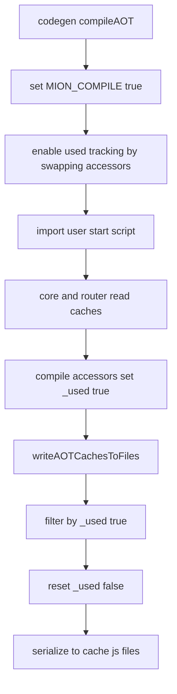

# AOT cache eviction via `_used` markers (plan)

## Problem summary

The AOT caches (JIT functions, pure functions, and router methods metadata) can grow without bound because old entries are never evicted. This is especially problematic on the server: preloading stale FAOT values can keep outdated cached entries forever.

## Target behavior

1. Every persisted AOT cache entry carries an `_used` marker.
   - In the generated cache source output, entries are written with `_used: false`.
2. During an AOT build run, any cache entry that is accessed is marked `_used: true`.
3. When writing cache files, only entries with `_used === true` are persisted.
4. Before persisting, the remaining entries have `_used` reset back to `false` so the next build can measure usage again.
5. To avoid runtime perf regression, the `_used` marking is enabled only during AOT builds (`MION_COMPILE=true`) by swapping cache accessors to compile-only siblings.

## Where this change lands

### Core: JIT + pure caches

- Primary cache API is in [`packages/core/src/jitUtils.ts`](packages/core/src/jitUtils.ts)
- AOT cache load happens via [`coreAOTLoadJitCaches()`](packages/core/src/jitUtils.ts:281)

Planned change:

- Add compile-only siblings (example names):
  - [`getJITCompile()`](packages/core/src/jitUtils.ts:93) sibling of [`getJIT()`](packages/core/src/jitUtils.ts:93)
  - [`getPureFnCompile()`](packages/core/src/jitUtils.ts:125) sibling of [`getPureFn()`](packages/core/src/jitUtils.ts:125)
  - Similar siblings for any other cache accessors that read entries and should count as usage (e.g. `getJitFn`, `usePureFn`, `getCompiledPureFn`, `has*` if those should count).

- Provide a small exported toggler used by codegen at build time:
  - `enableAOTUsedTracking()` (name TBD) mutates the `jitUtils` object to swap runtime accessors for compile ones iff `MION_COMPILE=true`.

Marking rule:

- On compile accessors, after reading an entry successfully, set `entry._used = true`.
- Be tolerant of older cache entries missing `_used` (treat as false until first access sets it).

### Core: router cache (methods metadata + method jitFns)

- Primary cache API is in [`packages/core/src/routerUtils.ts`](packages/core/src/routerUtils.ts)
- AOT metadata load happens via [`coreAOTLoadRoutesMetadataCache()`](packages/core/src/routerUtils.ts)

Planned change:

- Add compile-only siblings for routes cache accessors and swap them only during `MION_COMPILE=true`.
- Mark `_used` on access:
  - When metadata is retrieved (get/use) and found.
  - When method jitFns bundle is retrieved (get/use) and found.
- Mark `_used` on write paths that create or update entries during compile, so newly created routes/middleFns don’t get dropped if they are never subsequently read.

### Codegen: filter+reset on write

Cache files are emitted by codegen after running the user’s start script.

- Entry point for writing is [`writeAOTCachesToFiles()`](packages/codegen/src/aot-compile.ts:162)
- Actual file generation goes through [`compileAndWriteRunType()`](packages/codegen/src/cacheCompiler.ts:70)

Planned change:

1. Before running the user start script in [`compileAOT()`](packages/codegen/src/aot-compile.ts:97), enable compile-time accessor swapping in core (and routes cache) so usage is tracked while the app bootstraps.
2. In [`writeAOTCachesToFiles()`](packages/codegen/src/aot-compile.ts:162), apply eviction for all three caches:
   - Filter: keep only entries with `_used === true`.
   - Reset: set `_used = false` on the entries that remain.
3. Ensure filtering happens after the existing exclusion logic (`EXCLUDED_FNS`, `EXCLUDED_PURE_FNS`) so the output is the intersection of:
   - not excluded AND used.

## Data model / typing strategy

Because cache files are emitted via a JIT `toJSCode` path (see [`compileTypeToJs()`](packages/codegen/src/cacheCompiler.ts:99)), we should ensure `_used` exists on the _typed_ shapes that get serialized. Otherwise, `_used` mutations may be awkward/unsafe and we risk the compiler omitting the field depending on how types are expressed.

Planned typing approach:

- Introduce a small shared interface in core:
  - `Cacheable { _used?: boolean }`
- Ensure any value that can be stored in an AOT cache is typed as `... & Cacheable` (or extends it), so `_used` is a first-class field on all persisted entries.

Add `_used?: boolean` (via `Cacheable`) to the persisted/serializable shapes for:

- JIT compiled functions cache entries (persisted form)
- Compiled pure functions cache entries (persisted form)
- Router methods metadata cache entries

Notes:

- Use `_used` (exact key) as requested.
- Treat missing `_used` as `false`.
- During compile-time marking, mutate the in-memory objects. Since core already clones persisted entries when restoring caches (see cloning in [`restoreCaches()`](packages/core/src/jitUtils.ts:287)), we can freely add `_used` without mutating the imported AOT package objects.

## Accessor swapping design (perf protection)

Goal: keep normal runtime as-is (no extra property writes / branch checks) and enable marking only during AOT builds.

Approach:

- Implement each accessor in two layers:
  - A “base” function with the original hot-path logic (no marking).
  - A “compile” wrapper that calls the base function and marks `_used` on the returned entry.
- At build start (`MION_COMPILE=true`), swap the public methods on the cache objects (`jitUtils`, `routesCache`) to point to the compile wrappers.

Mermaid sketch:

## Testing plan

1. Unit tests for filter+reset helpers
   - Given a cache with mixed `_used` states, confirm only used entries are persisted.
   - Confirm `_used` is reset to `false` on output entries.
2. Integration-ish AOT compile test
   - Seed template AOT caches with an “old” entry with `_used: false`.
   - Run compileAOT with a start script that does NOT touch that entry.
   - Assert output cache file does not include the old entry.
   - Assert entries that are used during startup remain.

## Rollout / compatibility

- Existing cache files without `_used` must still load.
- On the first AOT build after upgrade, only entries actually accessed during that build will remain.
- Server-side stale-cache issue should be mitigated because preloaded-but-unused entries will be evicted when regenerating caches.

## Implementation checklist (for Code mode)

This mirrors the workspace todo list and is the execution order.

- Identify all cache access points that must mark usage (JIT, pure, router).
- Add `_used?: boolean` to the relevant persisted types.
- Implement compile-only siblings + swap toggles in core caches.
- Enable swapping early in codegen AOT compile flow.
- Filter+reset before writing cache files.
- Add tests + update docs.
