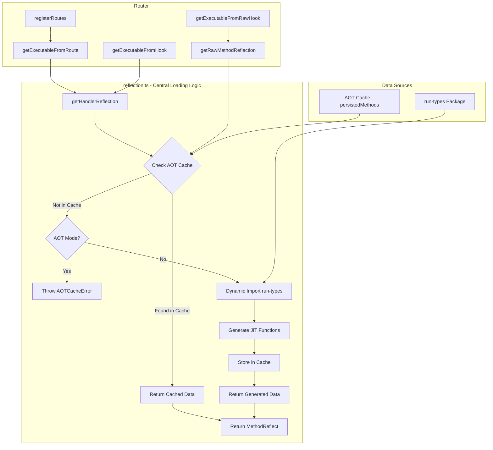

# AOT Lazy Loading for @mionkit/router

## Problem Statement

Currently, the `@mionkit/router` package imports `@mionkit/run-types` directly via static imports in [`packages/router/src/lib/reflection.ts`](packages/router/src/lib/reflection.ts). This means the entire run-types package is loaded even when running in AOT mode where all JIT functions and router metadata are pre-compiled and cached.

### Issues with Current Approach

1. **Bundle Size**: The `@mionkit/run-types` package is heavy and includes the entire type reflection system
2. **Secure Environments**: AOT mode is designed for secure environments that don't allow `new Function()` - but currently run-types is still loaded
3. **Startup Performance**: Loading run-types adds unnecessary overhead when all functions are already in cache
4. **Memory Usage**: The reflection system consumes memory even when not needed

## Goals

1. **Lazy load run-types**: Only import `@mionkit/run-types` when actually needed (non-AOT mode)
2. **AOT validation**: In AOT mode, validate that all routes/hooks have their JIT functions in cache
3. **Fail fast**: Throw clear errors if AOT cache is incomplete rather than silently falling back
4. **Async initialization**: Make `initRouter` and `registerRoutes` async to enable dynamic imports
5. **Centralized reflection**: All run-types loading logic encapsulated in `reflection.ts`

## Architecture Overview

The key insight is that **all run-types functionality is encapsulated in [`packages/router/src/lib/reflection.ts`](packages/router/src/lib/reflection.ts)**. This module is the single point of contact between the router and run-types, making it the ideal place to implement AOT/dynamic loading logic.



## Implementation Strategy

### Phase 1: Reflection Module First

The first and most critical step is to refactor [`packages/router/src/lib/reflection.ts`](packages/router/src/lib/reflection.ts) to:

1. Check AOT cache first for any reflection request
2. If found in cache, return cached data (no run-types needed)
3. If not in cache and AOT mode, throw `AOTCacheError`
4. If not in cache and non-AOT mode, dynamically import run-types

**This module must be thoroughly tested before proceeding with other changes.**

Create [`packages/router/src/lib/reflection-aot.spec.ts`](packages/router/src/lib/reflection-aot.spec.ts) to verify:

- AOT cache hit returns cached data without loading run-types
- AOT cache miss in AOT mode throws `AOTCacheError`
- AOT cache miss in non-AOT mode dynamically loads run-types
- Dynamic import only happens once (module is cached)

## Detailed Design

### 1. Router Options Extension

Add `aot` flag to [`RouterOptions`](packages/router/src/types/general.ts:28):

```typescript
export interface RouterOptions<Req = any, ContextData extends Record<string, any> = any> extends CoreOptions {
  // ... existing options ...

  /**
   * Enable AOT (Ahead-of-Time) mode.
   * When true, router will use pre-compiled JIT functions from cache
   * and will NOT load @mionkit/run-types package.
   * Throws error if any route/hook is missing from AOT cache.
   * @default false
   */
  aot: boolean;
}
```

### 2. Reflection Module Refactoring

Transform [`packages/router/src/lib/reflection.ts`](packages/router/src/lib/reflection.ts) to be the central point for AOT/run-types loading:

```typescript
// packages/router/src/lib/reflection.ts

// ############ This file is the ONLY one importing '@mionkit/run-types' within the router ########
// All run-types loading logic is encapsulated here.
// In AOT mode, run-types is never loaded - all data comes from cache.

// Type-only imports (these don't cause runtime loading)
import type {FunctionRunType, BaseRunType, MemberRunType, RunTypeOptions, JitFnCompiler} from '@mionkit/run-types';
import type {MethodWithJitFns, AnyFn, JitCompiledFunctions} from '@mionkit/core';
import {Handler} from '../types/handlers';
import {RouterOptions} from '../types/general';
import {DEFAULT_ROUTE_OPTIONS, HEADER_HOOK_DEFAULT_PARAMS, ROUTE_DEFAULT_PARAMS} from '../constants';
import {EMPTY_HASH, HeadersSubset} from '@mionkit/core';
import {getPersistedMethod, addToPersistedMethods} from './methodsCache';

// Lazy-loaded module reference - only loaded in non-AOT mode
let runTypesModule: typeof import('@mionkit/run-types') | null = null;

// AOT Cache Error
export class AOTCacheError extends Error {
  constructor(message: string) {
    super(message);
    this.name = 'AOTCacheError';
  }
}

type MethodReflect = Omit<MethodWithJitFns, 'id' | 'type' | 'nestLevel' | 'pointer' | 'options'>;

/**
 * Dynamically loads the run-types module.
 * Only called in non-AOT mode when cache miss occurs.
 * Module is cached after first load.
 */
async function loadRunTypes(): Promise<typeof import('@mionkit/run-types')> {
  if (runTypesModule) return runTypesModule;
  runTypesModule = await import('@mionkit/run-types');
  return runTypesModule;
}

/**
 * Gets handler reflection data.
 *
 * Loading Strategy:
 * 1. Check if data exists in AOT cache (persistedMethods)
 * 2. If found, return cached data (no run-types loading)
 * 3. If not found and AOT mode, throw AOTCacheError
 * 4. If not found and non-AOT mode, dynamically load run-types and generate
 */
export async function getHandlerReflection(
  handler: Handler,
  routeId: string,
  routerOptions: RouterOptions,
  isHeaderHook: boolean = false
): Promise<MethodReflect> {
  // Step 1: Check AOT cache first
  const cached = getPersistedMethod(routeId, handler);
  if (cached) {
    // Cache hit - return cached data without loading run-types
    return extractReflectionFromCached(cached);
  }

  // Step 2: Cache miss - check if AOT mode
  if (routerOptions.aot) {
    throw new AOTCacheError(
      `Route/hook "${routeId}" not found in AOT cache. ` + `Regenerate AOT caches using 'mion-build-aot' command.`
    );
  }

  // Step 3: Non-AOT mode - dynamically load run-types and generate
  const rt = await loadRunTypes();
  return generateReflectionWithRunTypes(handler, routeId, routerOptions, isHeaderHook, rt);
}

/**
 * Gets raw method reflection data.
 * Raw hooks have minimal reflection needs but still need isAsync check.
 */
export async function getRawMethodReflection(
  handler: Handler,
  routeId: string,
  routerOptions: RouterOptions
): Promise<MethodReflect> {
  // Step 1: Check AOT cache first
  const cached = getPersistedMethod(routeId, handler);
  if (cached) {
    return extractReflectionFromCached(cached);
  }

  // Step 2: Cache miss - check if AOT mode
  if (routerOptions.aot) {
    throw new AOTCacheError(
      `Raw hook "${routeId}" not found in AOT cache. ` + `Regenerate AOT caches using 'mion-build-aot' command.`
    );
  }

  // Step 3: Non-AOT mode - dynamically load run-types for isAsync check
  const rt = await loadRunTypes();
  const handlerRunType = rt.reflectFunction(handler);

  return {
    paramNames: [],
    paramsJitFns: nullJitFns,
    returnJitFns: nullJitFns,
    paramsJitHash: '',
    returnJitHash: '',
    hasReturnData: false,
    isAsync: handlerRunType.isAsync(),
  };
}

/**
 * Extracts reflection data from a cached method.
 * Used when AOT cache hit occurs.
 */
function extractReflectionFromCached(cached: any): MethodReflect {
  return {
    paramNames: cached.paramNames,
    paramsJitFns: cached.paramsJitFns,
    returnJitFns: cached.returnJitFns,
    paramsJitHash: cached.paramsJitHash,
    returnJitHash: cached.returnJitHash,
    hasReturnData: cached.hasReturnData,
    isAsync: cached.isAsync,
    headersParam: cached.headersParam,
    headersReturn: cached.headersReturn,
  };
}

/**
 * Generates reflection data using run-types.
 * Only called in non-AOT mode when cache miss occurs.
 */
function generateReflectionWithRunTypes(
  handler: Handler,
  routeId: string,
  routerOptions: RouterOptions,
  isHeaderHook: boolean,
  rt: typeof import('@mionkit/run-types')
): MethodReflect {
  // ... existing implementation using rt module ...
  // All run-types functions accessed via rt parameter
}

// ... rest of helper functions that use run-types module parameter ...
```

### 3. Reflection AOT Test File

Create [`packages/router/src/lib/reflection-aot.spec.ts`](packages/router/src/lib/reflection-aot.spec.ts):

```typescript
/* ########
 * 2024 mion
 * Author: Ma-jerez
 * License: MIT
 * The software is provided "as is", without warranty of any kind.
 * ######## */

import {getHandlerReflection, getRawMethodReflection, AOTCacheError, nullJitFns} from './reflection';
import {setPersistedMethods, resetPersistedMethods} from './methodsCache';
import {RouterOptions} from '../types/general';
import {DEFAULT_ROUTE_OPTIONS} from '../constants';
import type {CallContext} from '../types/context';

// Test handlers
const simpleHandler = (ctx: CallContext, name: string): string => `Hello ${name}`;
const asyncHandler = async (ctx: CallContext, id: number): Promise<{id: number}> => ({id});
const noParamsHandler = (ctx: CallContext): void => {};
const rawHandler = (ctx: CallContext, req: any, res: any): void => {};

// Mock AOT cache data
const mockCachedMethod = {
  paramNames: ['name'],
  paramsJitFns: {
    /* mock JIT functions */
  },
  returnJitFns: {
    /* mock JIT functions */
  },
  paramsJitHash: 'mock-params-hash',
  returnJitHash: 'mock-return-hash',
  hasReturnData: true,
  isAsync: false,
};

describe('reflection.ts AOT Loading', () => {
  const defaultOpts: RouterOptions = {...DEFAULT_ROUTE_OPTIONS, aot: false};
  const aotOpts: RouterOptions = {...DEFAULT_ROUTE_OPTIONS, aot: true};

  beforeEach(() => {
    resetPersistedMethods();
  });

  describe('getHandlerReflection', () => {
    describe('AOT Cache Hit', () => {
      it('should return cached data without loading run-types', async () => {
        // Setup: populate cache with mock data
        setPersistedMethods({
          'test/route': mockCachedMethod,
        });

        const result = await getHandlerReflection(simpleHandler, 'test/route', aotOpts, false);

        expect(result.paramNames).toEqual(['name']);
        expect(result.paramsJitHash).toBe('mock-params-hash');
        expect(result.hasReturnData).toBe(true);
      });

      it('should work in both AOT and non-AOT mode when cache hit', async () => {
        setPersistedMethods({
          'test/route': mockCachedMethod,
        });

        // AOT mode
        const aotResult = await getHandlerReflection(simpleHandler, 'test/route', aotOpts, false);
        expect(aotResult.paramNames).toEqual(['name']);

        // Non-AOT mode
        const nonAotResult = await getHandlerReflection(simpleHandler, 'test/route', defaultOpts, false);
        expect(nonAotResult.paramNames).toEqual(['name']);
      });
    });

    describe('AOT Cache Miss - AOT Mode', () => {
      it('should throw AOTCacheError when route not in cache', async () => {
        await expect(getHandlerReflection(simpleHandler, 'missing/route', aotOpts, false)).rejects.toThrow(AOTCacheError);
      });

      it('should include route ID in error message', async () => {
        await expect(getHandlerReflection(simpleHandler, 'users/getUser', aotOpts, false)).rejects.toThrow('users/getUser');
      });

      it('should suggest regenerating AOT caches', async () => {
        await expect(getHandlerReflection(simpleHandler, 'test/route', aotOpts, false)).rejects.toThrow('mion-build-aot');
      });
    });

    describe('AOT Cache Miss - Non-AOT Mode', () => {
      it('should dynamically load run-types and generate reflection', async () => {
        const result = await getHandlerReflection(simpleHandler, 'test/route', defaultOpts, false);

        expect(result.paramNames).toContain('name');
        expect(result.paramsJitFns).toBeDefined();
        expect(result.returnJitFns).toBeDefined();
      });

      it('should handle async handlers correctly', async () => {
        const result = await getHandlerReflection(asyncHandler, 'test/asyncRoute', defaultOpts, false);

        expect(result.isAsync).toBe(true);
        expect(result.paramNames).toContain('id');
      });

      it('should handle handlers with no params', async () => {
        const result = await getHandlerReflection(noParamsHandler, 'test/noParams', defaultOpts, false);

        expect(result.paramNames).toEqual([]);
        expect(result.paramsJitFns).toBe(nullJitFns);
      });
    });
  });

  describe('getRawMethodReflection', () => {
    describe('AOT Cache Hit', () => {
      it('should return cached data for raw hooks', async () => {
        const rawCached = {
          ...mockCachedMethod,
          paramNames: [],
          hasReturnData: false,
        };
        setPersistedMethods({
          'test/rawHook': rawCached,
        });

        const result = await getRawMethodReflection(rawHandler, 'test/rawHook', aotOpts);

        expect(result.paramNames).toEqual([]);
        expect(result.hasReturnData).toBe(false);
      });
    });

    describe('AOT Cache Miss - AOT Mode', () => {
      it('should throw AOTCacheError for raw hooks not in cache', async () => {
        await expect(getRawMethodReflection(rawHandler, 'missing/rawHook', aotOpts)).rejects.toThrow(AOTCacheError);
      });
    });

    describe('AOT Cache Miss - Non-AOT Mode', () => {
      it('should dynamically load run-types for isAsync check', async () => {
        const result = await getRawMethodReflection(rawHandler, 'test/rawHook', defaultOpts);

        expect(result.paramNames).toEqual([]);
        expect(result.paramsJitFns).toBe(nullJitFns);
        expect(result.returnJitFns).toBe(nullJitFns);
        expect(result.hasReturnData).toBe(false);
      });
    });
  });

  describe('Dynamic Import Caching', () => {
    it('should only load run-types module once', async () => {
      // First call - should trigger dynamic import
      await getHandlerReflection(simpleHandler, 'route1', defaultOpts, false);

      // Second call - should use cached module
      await getHandlerReflection(asyncHandler, 'route2', defaultOpts, false);

      // Both should succeed without errors
      // (In a real test, we'd mock the import to verify it's only called once)
    });
  });
});
```

### 4. Async Router Functions

After reflection.ts is working and tested, make router functions async:

```typescript
// packages/router/src/router.ts

export async function initRouter(opts?: Partial<RouterOptions>): Promise<Readonly<RouterOptions>> {
  if (isRouterInitialized) throw new Error('Router has already been initialized');
  routerOptions = {...routerOptions, ...opts};
  validateSharedDataFactory(routerOptions);
  Object.freeze(routerOptions);
  setErrorOptions(routerOptions);
  isRouterInitialized = true;
  await registerRoutes({...mionErrorsRoutes});
  if (!routerOptions.skipClientRoutes) await registerRoutes({...mionClientRoutes});
  return routerOptions;
}

export async function registerRoutes<R extends Routes>(routes: R): Promise<PublicApi<R>> {
  if (!isRouterInitialized) throw new Error('initRouter should be called first');

  startHooks = await getExecutablesFromHooksCollectionAsync(startHooksDef);
  endHooks = await getExecutablesFromHooksCollectionAsync(endHooksDef);
  await recursiveFlatRoutesAsync(routes);

  if (shouldFullGenerateSpec()) return getPublicApi(routes);
  return {} as PublicApi<R>;
}

export async function initMionRouter<R extends Routes>(routes: R, opts?: Partial<RouterOptions>): Promise<PublicApi<R>> {
  await initRouter(opts);
  return registerRoutes(routes);
}
```

## Implementation Tasks

### Phase 1: Reflection Module (FIRST PRIORITY)

- [ ] Add `aot` option to `RouterOptions` interface
- [ ] Create `AOTCacheError` class in reflection.ts
- [ ] Convert static imports to type-only imports in reflection.ts
- [ ] Create `loadRunTypes()` async function for dynamic import
- [ ] Create `extractReflectionFromCached()` helper function
- [ ] Make `getHandlerReflection()` async with AOT cache check
- [ ] Make `getRawMethodReflection()` async with AOT cache check
- [ ] Update all helper functions to accept run-types module as parameter
- [ ] **Create `reflection-aot.spec.ts` test file**
- [ ] **Run and verify all reflection tests pass**

Note on AOT Validation Testing: For testing AOT cache validation, we can mock the AOT cache data before starting the router. This allows us to test scenarios like:

### Phase 2: Router Initialization (After Phase 1 is complete and tested)

- [ ] Make `initRouter()` async
- [ ] Make `registerRoutes()` async
- [ ] Make `initMionRouter()` async
- [ ] Create async versions of route processing functions:
  - [ ] `recursiveFlatRoutesAsync()`
  - [ ] `recursiveCreateExecutionPathAsync()`
  - [ ] `getExecutableFromHookAsync()`
  - [ ] `getExecutableFromRawHookAsync()`
  - [ ] `getExecutableFromRouteAsync()`
  - [ ] `getExecutablesFromHooksCollectionAsync()`

### Phase 3: Testing Updates

- [ ] Update all router tests to use `await` with `initRouter()` and `registerRoutes()`
- [ ] Update all platform adapter tests (http, aws, gcloud) to use async initialization
- [ ] Add integration tests for complete AOT workflow

**Note on AOT Validation Testing:** For testing AOT cache validation, we can mock the AOT cache data before starting the router. This allows us to test scenarios like:

- Complete cache (all routes present) - should succeed
- Incomplete cache (missing routes) - should throw AOTCacheError
- Cache with missing JIT functions - should throw AOTCacheError

### Phase 4: Update Examples and Documentation

- [ ] Update all examples to use `await initMionRouter()`
- [ ] Update AOT-OVERVIEW.md with new `aot` option
- [ ] Add migration guide for existing users

## Error Messages

### AOT Cache Missing Route

```
AOTCacheError: Route/hook "users/getUser" not found in AOT cache.
Regenerate AOT caches using 'mion-build-aot' command.
```

### AOT Cache Missing Raw Hook

```
AOTCacheError: Raw hook "mionDeserializeRequest" not found in AOT cache.
Regenerate AOT caches using 'mion-build-aot' command.
```

## Migration Guide

### Before (Sync)

```typescript
// Router initialization
initRouter({contextDataFactory: getSharedData});
registerRoutes({myRoute});

// Tests
beforeAll(() => {
  resetRouter();
  initRouter({contextDataFactory: getSharedData});
  registerRoutes({myRoute});
});

// Examples
initMionRouter(routes, options);
startNodeServer({port: 3000});
```

### After (Async)

```typescript
// Router initialization
await initRouter({contextDataFactory: getSharedData});
await registerRoutes({myRoute});

// Tests
beforeAll(async () => {
  resetRouter();
  await initRouter({contextDataFactory: getSharedData});
  await registerRoutes({myRoute});
});

// Examples
await initMionRouter(routes, options);
startNodeServer({port: 3000});
```

### AOT Mode Usage

```typescript
// Load AOT caches first
import {loadAOTCaches} from 'my-api-aot';
loadAOTCaches();

// Initialize router in AOT mode
await initMionRouter(routes, {aot: true});
startNodeServer({port: 3000});
```

## Performance Considerations

1. **Cold start improvement**: In AOT mode, no run-types loading = faster cold starts
2. **Memory reduction**: run-types module not loaded = less memory usage
3. **Bundle size**: With proper tree-shaking, run-types excluded from AOT bundles
4. **Initialization**: Async initialization adds minimal overhead (< 1ms in AOT mode)

## Security Considerations

1. **No `new Function()`**: In AOT mode, all JIT functions are pre-compiled, no runtime code generation
2. **Fail-fast validation**: Incomplete AOT cache throws immediately, preventing runtime issues
3. **Clear error messages**: Help developers identify and fix AOT cache issues quickly
