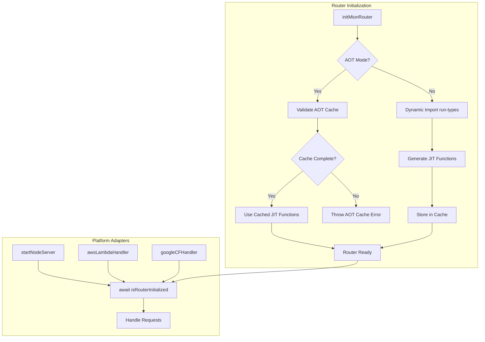

# AOT Lazy Loading for @mionkit/router

## Problem Statement

Currently, the `@mionkit/router` package imports `@mionkit/run-types` directly via static imports in [`packages/router/src/lib/reflection.ts`](packages/router/src/lib/reflection.ts). This means the entire run-types package is loaded even when running in AOT mode where all JIT functions and router metadata are pre-compiled and cached.

### Issues with Current Approach

1. **Bundle Size**: The `@mionkit/run-types` package is heavy and includes the entire type reflection system
2. **Secure Environments**: AOT mode is designed for secure environments that don't allow `new Function()` - but currently run-types is still loaded
3. **Startup Performance**: Loading run-types adds unnecessary overhead when all functions are already in cache
4. **Memory Usage**: The reflection system consumes memory even when not needed

## Goals

1. **Lazy load run-types**: Only import `@mionkit/run-types` when actually needed (non-AOT mode)
2. **AOT validation**: In AOT mode, validate that all routes/hooks have their JIT functions in cache
3. **Fail fast**: Throw clear errors if AOT cache is incomplete rather than silently falling back
4. **Async initialization**: Support async router initialization to enable dynamic imports
5. **Minimal test changes**: Use an `isRouterInitialized()` promise pattern to minimize changes to existing tests
6. **Platform adapter support**: Update HTTP, AWS, GCloud, and Bun adapters to await initialization

## Architecture Overview



## Detailed Design

### 1. Router Options Extension

Add `aot` flag to [`RouterOptions`](packages/router/src/types/general.ts:28):

```typescript
export interface RouterOptions<Req = any, ContextData extends Record<string, any> = any> extends CoreOptions {
  // ... existing options ...

  /**
   * Enable AOT (Ahead-of-Time) mode.
   * When true, router will use pre-compiled JIT functions from cache
   * and will NOT load @mionkit/run-types package.
   * Throws error if any route/hook is missing from AOT cache.
   * @default false
   */
  aot: boolean;
}
```

### 2. Async Initialization Pattern

Instead of making `initMionRouter` async (which would require changing all tests), introduce an `isRouterInitialized()` function:

```typescript
// packages/router/src/router.ts

let initializationPromise: Promise<void> | null = null;
let initializationResolver: (() => void) | null = null;

/**
 * Returns a promise that resolves when the router is fully initialized.
 * In non-AOT mode, this waits for dynamic imports to complete.
 * In AOT mode, this resolves immediately after cache validation.
 */
export function isRouterInitialized(): Promise<void> {
  if (!initializationPromise) {
    // Create a deferred promise
    initializationPromise = new Promise((resolve) => {
      initializationResolver = resolve;
    });
  }
  return initializationPromise;
}

// Called internally when initialization completes
function markInitialized(): void {
  if (initializationResolver) {
    initializationResolver();
  }
}
```

### 3. Reflection Module Refactoring

Transform [`packages/router/src/lib/reflection.ts`](packages/router/src/lib/reflection.ts) to use dynamic imports:

```typescript
// packages/router/src/lib/reflection.ts

// Type-only imports (these don't cause runtime loading)
import type {FunctionRunType, BaseRunType, MemberRunType, RunTypeOptions} from '@mionkit/run-types';

// Lazy-loaded module reference
let runTypesModule: typeof import('@mionkit/run-types') | null = null;

/**
 * Dynamically loads the run-types module.
 * Only called in non-AOT mode.
 */
async function loadRunTypes(): Promise<typeof import('@mionkit/run-types')> {
  if (runTypesModule) return runTypesModule;
  runTypesModule = await import('@mionkit/run-types');
  return runTypesModule;
}

/**
 * Gets handler reflection data.
 * In AOT mode, retrieves from cache.
 * In non-AOT mode, dynamically loads run-types and generates.
 */
export async function getHandlerReflectionAsync(
  handler: Handler,
  routeId: string,
  routerOptions: RouterOptions,
  isHeaderHook: boolean = false
): Promise<MethodReflect> {
  // Check if already in cache (AOT mode)
  const cached = getPersistedMethod(routeId, handler);
  if (cached) {
    return extractReflectionFromCached(cached);
  }

  // AOT mode requires all methods to be in cache
  if (routerOptions.aot) {
    throw new AOTCacheError(
      `Route/hook "${routeId}" not found in AOT cache. ` + `Regenerate AOT caches using 'mion-build-aot' command.`
    );
  }

  // Non-AOT mode: dynamically load run-types
  const rt = await loadRunTypes();
  return generateReflection(handler, routeId, routerOptions, isHeaderHook, rt);
}
```

### 4. Router Initialization Flow

Update [`packages/router/src/router.ts`](packages/router/src/router.ts) to handle async initialization:

```typescript
export function initMionRouter<R extends Routes>(routes: R, opts?: Partial<RouterOptions>): PublicApi<R> {
  initRouter(opts);
  const publicApi = registerRoutes(routes);

  // Start async initialization in background
  initializeAsync(opts?.aot ?? false).catch((err) => {
    console.error('Router initialization failed:', err);
    throw err;
  });

  return publicApi;
}

async function initializeAsync(isAOT: boolean): Promise<void> {
  if (isAOT) {
    // Validate all routes have cached JIT functions
    validateAOTCache();
  } else {
    // Generate JIT functions for any routes not in cache
    await generateMissingReflections();
  }
  markInitialized();
}
```

### 5. AOT Cache Validation

Add validation to ensure all routes have their JIT functions:

```typescript
// packages/router/src/lib/aotValidation.ts

export class AOTCacheError extends Error {
  constructor(message: string) {
    super(message);
    this.name = 'AOTCacheError';
  }
}

export function validateAOTCache(): void {
  const allIds = getAllExecutablesIds();
  const missingIds: string[] = [];

  for (const id of allIds) {
    const executable = getAnyExecutable(id);
    if (!executable) continue;

    // Check if JIT functions are properly loaded
    if (!hasValidJitFunctions(executable)) {
      missingIds.push(id);
    }
  }

  if (missingIds.length > 0) {
    throw new AOTCacheError(
      `AOT cache is incomplete. Missing JIT functions for: ${missingIds.join(', ')}. ` +
        `Regenerate AOT caches using 'mion-build-aot' command.`
    );
  }
}

function hasValidJitFunctions(executable: RemoteMethod): boolean {
  // Raw hooks don't need JIT functions
  if (executable.type === HandlerType.rawHook) return true;

  // Check params JIT functions (unless no params)
  if (executable.paramNames?.length > 0) {
    if (!executable.paramsJitFns?.isType?.fn) return false;
  }

  // Check return JIT functions (unless void return)
  if (executable.hasReturnData) {
    if (!executable.returnJitFns?.isType?.fn) return false;
  }

  return true;
}
```

### 6. Platform Adapter Updates

The `isRouterInitialized()` function is idempotent - it always returns the same promise instance. This means platform adapters can simply call `await isRouterInitialized()` directly without needing to cache the promise themselves.

#### Node HTTP Server ([`packages/http/src/mionHttp.ts`](packages/http/src/mionHttp.ts))

```typescript
export async function startNodeServer(options?: Partial<NodeHttpOptions>): Promise<HttpServer | HttpsServer> {
  // Wait for router initialization before starting server
  await isRouterInitialized();

  // ... existing implementation ...
}
```

#### AWS Lambda ([`packages/aws/src/awsLambda.ts`](packages/aws/src/awsLambda.ts))

```typescript
export async function awsLambdaHandler(rawRequest: APIGatewayEvent, awsContext: AwsContext): Promise<APIGatewayProxyResult> {
  // Wait for router initialization (isRouterInitialized() returns same promise, so this is efficient)
  await isRouterInitialized();

  // ... existing implementation ...
}
```

#### Google Cloud Functions ([`packages/gcloud/src/googleCF.ts`](packages/gcloud/src/googleCF.ts))

```typescript
export async function googleCFHandler(rawRequest: Request, rawResponse: Response): Promise<void> {
  // Wait for router initialization
  await isRouterInitialized();

  // ... existing implementation ...
}
```

### 7. Vite/Bundler Configuration

For Vite to properly tree-shake run-types when not needed, the dynamic import pattern should work automatically. However, document the recommended configuration:

```typescript
// vite.config.ts for AOT builds
export default defineConfig({
  build: {
    rollupOptions: {
      external: ['@mionkit/run-types'], // Exclude from bundle in AOT mode
    },
  },
});
```

## Implementation Tasks

### Phase 1: Core Infrastructure

- [ ] Add `aot` option to `RouterOptions` interface
- [ ] Create `AOTCacheError` class in new file `packages/router/src/lib/aotValidation.ts`
- [ ] Implement `isRouterInitialized()` promise pattern in router.ts
- [ ] Add `markInitialized()` internal function

### Phase 2: Reflection Module Refactoring

- [ ] Convert static imports to type-only imports in reflection.ts
- [ ] Create `loadRunTypes()` async function for dynamic import
- [ ] Create async versions of reflection functions:
  - [ ] `getHandlerReflectionAsync()`
  - [ ] `getRawMethodReflectionAsync()`
- [ ] Update helper functions to accept run-types module as parameter

### Phase 3: Router Initialization Updates

- [ ] Modify `initMionRouter()` to trigger async initialization
- [ ] Create `initializeAsync()` internal function
- [ ] Implement `validateAOTCache()` function
- [ ] Implement `generateMissingReflections()` for non-AOT mode
- [ ] Update `getExecutableFromHook()` to work with async reflection
- [ ] Update `getExecutableFromRawHook()` to work with async reflection
- [ ] Update `getExecutableFromRoute()` to work with async reflection

### Phase 4: Platform Adapter Updates

- [ ] Update `startNodeServer()` in packages/http to await `isRouterInitialized()`
- [ ] Update `awsLambdaHandler()` in packages/aws to await `isRouterInitialized()`
- [ ] Update `googleCFHandler()` in packages/gcloud to await `isRouterInitialized()`
- [ ] Review and update any Bun-specific code if needed

### Phase 5: Testing Updates

- [ ] Add tests for AOT mode validation (mock AOT cache data before starting router)
- [ ] Add tests for `isRouterInitialized()` promise behavior
- [ ] Update existing router tests to await `isRouterInitialized()` where needed
- [ ] Add integration tests for dynamic import behavior
- [ ] Test error messages for incomplete AOT cache

**Note on AOT Validation Testing:** For testing AOT cache validation, we can mock the AOT cache data before starting the router. This allows us to test scenarios like:

- Complete cache (all routes present) - should succeed
- Incomplete cache (missing routes) - should throw AOTCacheError
- Cache with missing JIT functions - should throw AOTCacheError

### Phase 6: Documentation

- [ ] Update AOT-OVERVIEW.md with new `aot` option
- [ ] Document `isRouterInitialized()` usage pattern
- [ ] Add migration guide for existing users
- [ ] Update platform adapter documentation

## Error Messages

### AOT Cache Missing Route

```
AOTCacheError: Route/hook "users/getUser" not found in AOT cache.
Regenerate AOT caches using 'mion-build-aot' command.
```

### AOT Cache Incomplete JIT Functions

```
AOTCacheError: AOT cache is incomplete. Missing JIT functions for: users/getUser, pets/getPet.
Regenerate AOT caches using 'mion-build-aot' command.
```

### Router Not Initialized

```
Error: Router is not initialized. Call initMionRouter() first and await isRouterInitialized() before handling requests.
```

## Backwards Compatibility

1. **Default behavior unchanged**: `aot: false` by default, so existing code works without changes
2. **Sync API preserved**: `initMionRouter()` remains synchronous, async work happens in background
3. **Platform adapters**: Already async, just need to await `isRouterInitialized()`
4. **Tests**: Tests that access JIT functions or executables after init will need to add `await isRouterInitialized()` - this is a simple one-line addition rather than restructuring test logic
5. **Examples**: Can simply add `await` to `startServer()` calls instead of modifying router initialization code

### Test Migration Pattern

Before:

```typescript
beforeAll(() => {
  resetRouter();
  initRouter({contextDataFactory: getSharedData});
  registerRoutes({myRoute});
});

it('should have correct executable', () => {
  const exec = getRouteExecutable('myRoute');
  expect(exec.paramsJitFns).toBeDefined();
});
```

After:

```typescript
beforeAll(async () => {
  resetRouter();
  initRouter({contextDataFactory: getSharedData});
  registerRoutes({myRoute});
  await isRouterInitialized(); // Simple one-line addition
});

it('should have correct executable', () => {
  const exec = getRouteExecutable('myRoute');
  expect(exec.paramsJitFns).toBeDefined();
});
```

### Example Migration Pattern

Before:

```typescript
initMionRouter(routes, options);
startNodeServer({port: 3000});
```

After:

```typescript
initMionRouter(routes, options);
await startNodeServer({port: 3000}); // startServer already awaits isRouterInitialized() internally
```

## Performance Considerations

1. **Cold start improvement**: In AOT mode, no run-types loading = faster cold starts
2. **Memory reduction**: run-types module not loaded = less memory usage
3. **Bundle size**: With proper tree-shaking, run-types excluded from AOT bundles
4. **First request latency**: Platform adapters wait for init, but this is typically < 1ms in AOT mode

## Security Considerations

1. **No `new Function()`**: In AOT mode, all JIT functions are pre-compiled, no runtime code generation
2. **Fail-fast validation**: Incomplete AOT cache throws immediately, preventing runtime issues
3. **Clear error messages**: Help developers identify and fix AOT cache issues quickly
