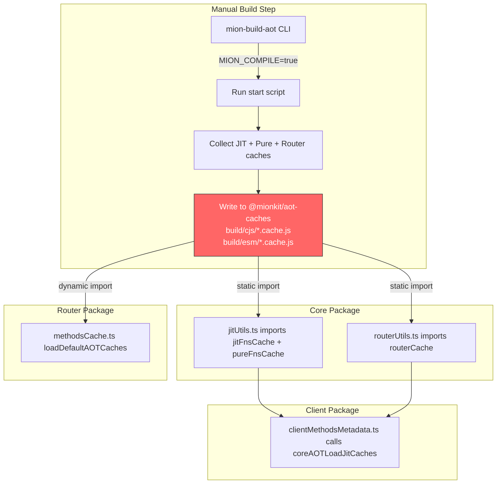
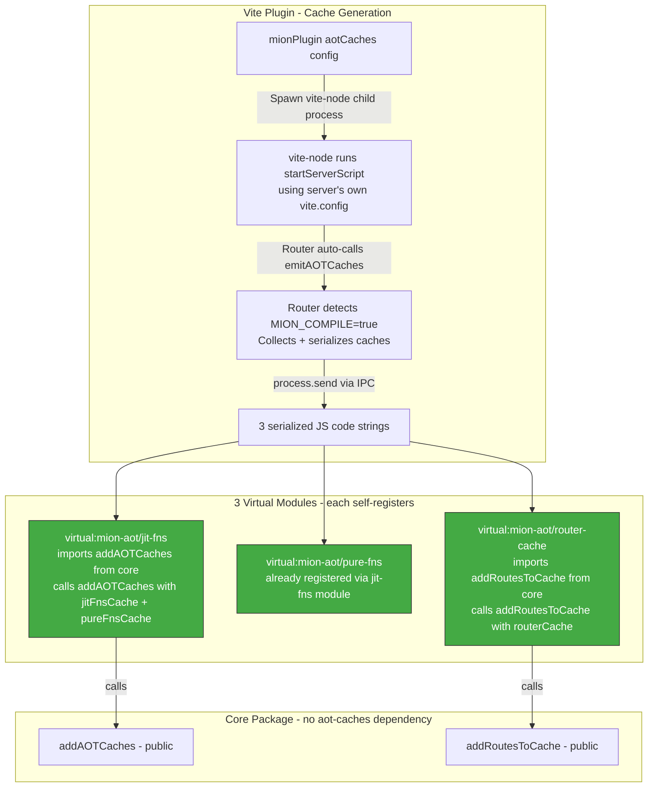
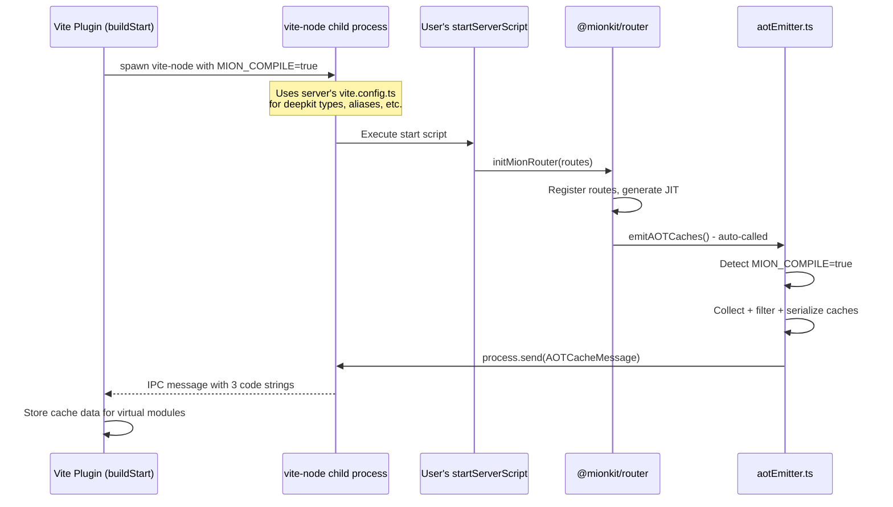

# Plan: Replace `@mionkit/aot-caches` with Vite Virtual Modules (Self-Registering)

## Summary

Replace the `@mionkit/aot-caches` physical package with **3 Vite virtual modules** that **self-register** their cache data into core. Core exposes public registration APIs; virtual modules import from core and call those APIs. Core has **zero knowledge** of virtual modules.

**Critical distinction:** The server/router does NOT need to run itself to generate AOT caches — it generates JIT data at runtime. AOT caches are only needed:

- **On the client** — which has no router dependency, so it uses `startServerScript` to fork the router and collect caches
- **On the server in production builds** — only when deploying to environments that prohibit `eval`/`new Function()`, the build step generates AOT caches and writes them to disk

**Router cache emission is already implemented:** The router's [`aotEmitter.ts`](packages/router/src/lib/aotEmitter.ts) already has `emitAOTCaches()` which detects `MION_COMPILE=true`, collects caches, serializes them with `toJSCode`, and sends them via `process.send()` (IPC). This is called automatically from [`initMionRouter()`](packages/router/src/router.ts:156).

## Current Architecture (Problem)



**Pain points:**

- `@mionkit/core` has a hard dependency on `@mionkit/aot-caches` (static imports)
- Must manually run `mion-build-aot` after every router change
- Circular dependency: core → aot-caches, but aot-caches is generated FROM router → core

## Proposed Architecture: 3 Self-Registering Virtual Modules



**Key design decisions:**

1. Core does NOT import from virtual modules. Each virtual module imports from core and pushes data in.
2. Using 3 separate modules makes it easier to generate, invalidate, and reload each cache independently.
3. The worker uses **vite-node** to run the server's start script with the server's own `vite.config.ts`, ensuring deepkit type metadata and all other Vite transformations are applied.
4. The router's existing [`emitAOTCaches()`](packages/router/src/lib/aotEmitter.ts:79) handles cache collection, filtering, serialization, and IPC emission automatically.

## Detailed Design

### 1. Core Changes: Make Registration APIs Public

#### `jitUtils.ts` — Remove `@mionkit/aot-caches` import

Currently [`jitUtils.ts:24`](packages/core/src/jit/jitUtils.ts:24) does:

```ts
import {jitFnsCache as aotJitFnsCache, pureFnsCache as aotPureFnsCache} from '@mionkit/aot-caches';
```

**Change:** Remove this import entirely. The `addAOTCaches()` function at [`jitUtils.ts:162`](packages/core/src/jit/jitUtils.ts:162) is already public and does exactly what we need — it calls `restoreCaches()` internally. No changes needed to its signature.

Also remove `coreAOTLoadJitCaches()` at [`jitUtils.ts:182`](packages/core/src/jit/jitUtils.ts:182) since it was the function that loaded from the static import. The virtual module will call `addAOTCaches()` directly instead.

#### `routerUtils.ts` — Remove `@mionkit/aot-caches` import

Currently [`routerUtils.ts:9`](packages/core/src/routerUtils.ts:9) does:

```ts
import {routerCache as aotRouterCacheRaw} from '@mionkit/aot-caches';
```

And [`routerUtils.ts:36-43`](packages/core/src/routerUtils.ts:36) uses `aotRouterCache` as a fallback in `getMetadata()`.

**Change:** Remove the import. Remove the `aotRouterCache` fallback from `routesCache.getMetadata()` and `routesCache.hasMetadata()`. The existing `addRoutesToCache()` at [`routerUtils.ts:165`](packages/core/src/routerUtils.ts:165) already adds routes to `methodsCache` — this is the registration API the virtual module will call.

Also remove `coreAOTLoadRoutesMetadataCache()` at [`routerUtils.ts:150`](packages/core/src/routerUtils.ts:150) since it loaded from the static import.

#### `core/vite.config.ts` — Remove `@mionkit/aot-caches` from externals

Currently [`core/vite.config.ts:88`](packages/core/vite.config.ts:88) has `'@mionkit/aot-caches'` in rollup externals. Remove it.

#### `core/package.json` — Remove `@mionkit/aot-caches` dependency

Remove `"@mionkit/aot-caches": "^0.7.2"` from dependencies.

### 2. Three Virtual Modules

#### `virtual:mion-aot/jit-fns` — JIT Functions + Pure Functions Cache

This module registers both JIT functions and pure functions into core's cache, since they are loaded together via `addAOTCaches()`.

When AOT caches are generated:

```ts
// Generated by plugin
import {addAOTCaches} from '@mionkit/core';

const jitFnsCache = {
  /* serialized JIT functions */
};
const pureFnsCache = {
  /* serialized pure functions */
};

addAOTCaches(jitFnsCache, pureFnsCache);
```

When AOT is disabled:

```ts
// No-op: AOT JIT caches not generated
```

#### `virtual:mion-aot/pure-fns` — Pure Functions Cache (standalone)

This module is for pure functions extracted from client source code (the existing `virtual:mion-server-pure-functions` functionality). It's separate from the JIT fns module because pure functions from client source are extracted via AST analysis, not from running the router.

When pure functions are extracted:

```ts
// Generated by plugin (same as current virtual:mion-server-pure-functions)
import {addAOTCaches} from '@mionkit/core';

const pureFnsCache = {
  /* extracted pure functions */
};

addAOTCaches({}, pureFnsCache);
```

When disabled:

```ts
// No-op: Pure functions not extracted
```

> **Note:** We could keep the existing `virtual:mion-server-pure-functions` module ID for backward compatibility, or rename it to `virtual:mion-aot/pure-fns` for consistency. The key change is that it now self-registers instead of just exporting data.

#### `virtual:mion-aot/router-cache` — Router Methods Cache

This module registers route metadata into core's routes cache.

When AOT caches are generated:

```ts
// Generated by plugin
import {addRoutesToCache} from '@mionkit/core';

const routerCache = {
  /* serialized router methods */
};

addRoutesToCache(routerCache);
```

When disabled:

```ts
// No-op: Router cache not generated
```

#### Why 3 Modules Instead of 1

1. **Independent generation:** JIT fns, pure fns, and router cache are generated from different sources and at different times. Keeping them separate means each can be regenerated independently.
2. **Selective invalidation:** During HMR, if only the router changes, only `virtual:mion-aot/router-cache` needs to be invalidated. If client pure functions change, only `virtual:mion-aot/pure-fns` needs to be invalidated.
3. **Simpler code generation:** Each module's generated code is small and focused. No need to merge three different data sources into one module.
4. **Selective imports:** A consumer can import only what they need. The client might import all three; the server in AOT mode might only import `virtual:mion-aot/jit-fns` and `virtual:mion-aot/router-cache`.

#### TypeScript Declarations

```ts
// packages/devtools/src/vite-plugin/virtual-modules.d.ts
declare module 'virtual:mion-aot/jit-fns' {
  // Self-registering module — calls addAOTCaches() on import
}
declare module 'virtual:mion-aot/pure-fns' {
  // Self-registering module — calls addAOTCaches() on import
}
declare module 'virtual:mion-aot/router-cache' {
  // Self-registering module — calls addRoutesToCache() on import
}
```

### 3. Plugin Configuration

```ts
export interface AOTCacheOptions {
  /**
   * Path to the server start script that initializes the router.
   * Required for client builds (client has no router dependency).
   * Not needed for server dev mode (router generates JIT at runtime).
   */
  startServerScript?: string;

  /**
   * Path to the server's vite.config.ts file.
   * Used by vite-node to run the start script with proper transformations
   * (deepkit type metadata, aliases, etc.).
   * If not provided, vite-node will auto-discover the config from the
   * startServerScript's directory.
   */
  serverViteConfig?: string;

  /**
   * AOT mode:
   * - 'client': Spawn vite-node with startServerScript to generate caches (for client builds)
   * - 'server-build': Generate AOT caches during vite build (for production server)
   * - false: Disabled — virtual modules are no-ops (default for server dev/tests)
   *
   * Defaults to false.
   */
  mode?: 'client' | 'server-build' | false;

  /** Excluded JIT function IDs */
  excludedFns?: string[];
  /** Excluded pure function names */
  excludedPureFns?: string[];
}

export interface MionPluginOptions {
  pureFunctions?: PureFunctionsPluginOptions;
  deepkitType?: DeepkitTypeOptions;
  aotCaches?: AOTCacheOptions;
}
```

### 4. Plugin Implementation

```ts
// Constants
const VIRTUAL_AOT_JIT_FNS = 'virtual:mion-aot/jit-fns';
const VIRTUAL_AOT_PURE_FNS = 'virtual:mion-aot/pure-fns';
const VIRTUAL_AOT_ROUTER_CACHE = 'virtual:mion-aot/router-cache';

const RESOLVED_AOT_JIT_FNS = '\0virtual:mion-aot/jit-fns';
const RESOLVED_AOT_PURE_FNS = '\0virtual:mion-aot/pure-fns';
const RESOLVED_AOT_ROUTER_CACHE = '\0virtual:mion-aot/router-cache';
```

Extend [`mionPlugin()`](packages/devtools/src/vite-plugin/mionPlugin.ts:121):

```ts
export function mionVitePlugin(options: MionPluginOptions): Plugin {
  let aotData: AOTCacheData | null = null;

  return {
    name: 'mion',
    enforce: 'pre',

    async buildStart() {
      const aotOpts = options.aotCaches;
      if (!aotOpts || aotOpts.mode === false) return;
      if (!aotOpts.startServerScript) {
        throw new Error('aotCaches.startServerScript is required when mode is set');
      }
      // Spawn vite-node to run the server and collect caches
      aotData = await generateAOTCaches(aotOpts);
    },

    resolveId(id) {
      if (id === VIRTUAL_AOT_JIT_FNS) return RESOLVED_AOT_JIT_FNS;
      if (id === VIRTUAL_AOT_PURE_FNS) return RESOLVED_AOT_PURE_FNS;
      if (id === VIRTUAL_AOT_ROUTER_CACHE) return RESOLVED_AOT_ROUTER_CACHE;
      // ... existing resolveId for pure functions
      return null;
    },

    load(id) {
      if (id === RESOLVED_AOT_JIT_FNS) {
        if (!aotData) return '// No-op: AOT JIT caches not generated';
        return generateJitFnsModule(aotData.jitFnsCode, aotData.pureFnsCode);
      }
      if (id === RESOLVED_AOT_PURE_FNS) {
        if (!aotData) return '// No-op: AOT pure fns not generated';
        return generatePureFnsModule(aotData.pureFnsCode);
      }
      if (id === RESOLVED_AOT_ROUTER_CACHE) {
        if (!aotData) return '// No-op: AOT router cache not generated';
        return generateRouterCacheModule(aotData.routerCacheCode);
      }
      // ... existing load for pure functions
      return null;
    },

    handleHotUpdate({file, server}) {
      if (!options.aotCaches || options.aotCaches.mode === false) return;
      // Regenerate and selectively invalidate
      if (shouldRegenerate(file, options.aotCaches)) {
        generateAOTCaches(options.aotCaches).then((data) => {
          aotData = data;
          // Invalidate all 3 virtual modules
          for (const vmId of [RESOLVED_AOT_JIT_FNS, RESOLVED_AOT_PURE_FNS, RESOLVED_AOT_ROUTER_CACHE]) {
            const mod = server.moduleGraph.getModuleById(vmId);
            if (mod) server.moduleGraph.invalidateModule(mod);
          }
        });
      }
    },
  };
}
```

Module generators:

```ts
function generateJitFnsModule(jitFnsCode: string, pureFnsCode: string): string {
  return `import { addAOTCaches } from '@mionkit/core';
const jitFnsCache = ${jitFnsCode};
const pureFnsCache = ${pureFnsCode};
addAOTCaches(jitFnsCache, pureFnsCache);
`;
}

function generatePureFnsModule(pureFnsCode: string): string {
  return `import { addAOTCaches } from '@mionkit/core';
const pureFnsCache = ${pureFnsCode};
addAOTCaches({}, pureFnsCache);
`;
}

function generateRouterCacheModule(routerCacheCode: string): string {
  return `import { addRoutesToCache } from '@mionkit/core';
const routerCache = ${routerCacheCode};
addRoutesToCache(routerCache);
`;
}
```

### 5. Cache Generation via vite-node

The worker uses **vite-node** to run the server's start script. This is critical because:

- The server needs **deepkit type compiler** transformations for runtime type reflection
- The server's `vite.config.ts` has aliases, plugins, and other transformations
- Using vite-node ensures the start script runs in the same environment as the actual server



#### Generator Implementation

```ts
// packages/devtools/src/vite-plugin/aotCacheGenerator.ts
import {fork} from 'child_process';
import {resolve, dirname} from 'path';

export interface AOTCacheData {
  jitFnsCode: string;
  pureFnsCode: string;
  routerCacheCode: string;
}

/**
 * Generates AOT caches by spawning vite-node to run the server's start script.
 *
 * vite-node is used instead of plain node/ts-node because:
 * 1. The server needs deepkit type compiler transformations
 * 2. The server's vite.config.ts has aliases and plugins that must be applied
 * 3. vite-node provides the same environment as the actual server build
 *
 * The router's emitAOTCaches() (called automatically from initMionRouter)
 * detects MION_COMPILE=true and sends the serialized caches via IPC.
 */
export async function generateAOTCaches(options: AOTCacheOptions): Promise<AOTCacheData> {
  const startScript = resolve(options.startServerScript!);

  // Determine the vite config to use
  // If serverViteConfig is provided, use it; otherwise let vite-node auto-discover
  const viteConfigArgs = options.serverViteConfig ? ['--config', resolve(options.serverViteConfig)] : [];

  return new Promise((resolve, reject) => {
    // Spawn vite-node as a child process with IPC channel
    const child = fork(require.resolve('vite-node/bin/vite-node'), [...viteConfigArgs, startScript], {
      env: {...process.env, MION_COMPILE: 'true'},
      stdio: ['pipe', 'pipe', 'pipe', 'ipc'],
      cwd: dirname(startScript),
    });

    let resolved = false;

    child.on('message', (msg: any) => {
      if (msg?.type === 'mion-aot-caches') {
        resolved = true;
        resolve({
          jitFnsCode: msg.jitFnsCode,
          pureFnsCode: msg.pureFnsCode,
          routerCacheCode: msg.routerCacheCode,
        });
        child.kill(); // Clean up after receiving caches
      }
    });

    // Capture stderr for error reporting
    let stderr = '';
    child.stderr?.on('data', (data) => {
      stderr += data.toString();
    });

    child.on('error', (err) => {
      if (!resolved) reject(new Error(`vite-node failed to start: ${err.message}`));
    });

    child.on('exit', (code) => {
      if (!resolved) {
        reject(
          new Error(
            `vite-node exited with code ${code} before emitting AOT caches.\n` +
              `Make sure the startServerScript calls initMionRouter() and the router ` +
              `is fully initialized.\n` +
              (stderr ? `stderr: ${stderr}` : '')
          )
        );
      }
    });

    // Timeout safety
    setTimeout(() => {
      if (!resolved) {
        child.kill();
        reject(
          new Error('AOT cache generation timed out (30s). ' + 'Make sure the server start script completes initialization.')
        );
      }
    }, 30000);
  });
}
```

**Why vite-node instead of fork + ts-node:**

- vite-node uses the server's own `vite.config.ts` which includes the deepkit type compiler plugin
- No need to separately configure ts-node, tsconfig-paths, or the deepkit transformer
- Consistent with how the server runs in development (via Vite)
- Handles ESM/CJS module resolution correctly

**Why not the Vite Node API (`createServer` + `ssrLoadModule`):**

- We need process isolation (MION_COMPILE=true sets global state, compile tracking wraps jitUtils)
- The child process must be separate to avoid polluting the plugin's Vite instance
- vite-node CLI handles all the setup automatically

### 6. Two Distinct Scenarios

#### Scenario 1: Client Build

```ts
// client/vite.config.ts
mionPlugin({
  deepkitType: {tsConfig: './tsconfig.json'},
  aotCaches: {
    mode: 'client',
    startServerScript: '../server/src/init.ts',
    serverViteConfig: '../server/vite.config.ts', // optional, auto-discovered if omitted
  },
});
```

```ts
// client/main.ts
import 'virtual:mion-aot/jit-fns'; // Registers JIT + pure fns
import 'virtual:mion-aot/router-cache'; // Registers route metadata
import {initClient} from '@mionkit/client';
```

The plugin spawns vite-node with `../server/src/init.ts` using the server's vite config. The router initializes, auto-calls `emitAOTCaches()`, and sends caches via IPC.

#### Scenario 2: Server — Development (no AOT needed)

```ts
// server/vite.config.ts
mionPlugin({
  deepkitType: {tsConfig: './tsconfig.json'},
  // No aotCaches — router generates JIT at runtime
});
```

```ts
// server/main.ts
// No virtual module imports needed
import {initMionRouter} from '@mionkit/router';
const api = await initMionRouter(routes); // JIT mode
```

#### Scenario 3: Server — Production Build (AOT for restricted environments)

```ts
// server/vite.config.ts
mionPlugin({
  deepkitType: {tsConfig: './tsconfig.json'},
  aotCaches: {
    mode: 'server-build',
    startServerScript: './src/init.ts',
  },
});
```

```ts
// server/main.ts
import 'virtual:mion-aot/jit-fns'; // Registers JIT + pure fns
import 'virtual:mion-aot/router-cache'; // Registers route metadata
import {initMionRouter} from '@mionkit/router';
const api = await initMionRouter(routes, {aot: true}); // AOT mode
```

### 7. How Tests Work

| Scenario                   | Setup                                                                 | Behavior                                                     |
| -------------------------- | --------------------------------------------------------------------- | ------------------------------------------------------------ |
| **Server unit tests**      | No `aotCaches` in plugin config                                       | Virtual modules are no-ops. Router generates JIT at runtime. |
| **Client unit tests**      | `aotCaches: { mode: 'client', startServerScript: './test/setup.ts' }` | Plugin spawns vite-node, generates real caches.              |
| **AOT integration tests**  | `aotCaches: { mode: 'client', startServerScript: './test/setup.ts' }` | Same as client — tests verify AOT mode works.                |
| **Existing test patterns** | `resetJitFnCaches()` / `resetClientCaches()`                          | Continue to work — they clear in-memory caches.              |

For the **monorepo's own tests** (core, router, client packages):

- **Core tests:** Don't need AOT caches. Virtual modules are no-ops or not configured.
- **Router tests:** Don't need AOT caches (router generates JIT at runtime). AOT-specific tests can use `mode: 'client'` with a test router setup.
- **Client tests:** Need AOT caches. Use `mode: 'client'` with `startServerScript` pointing to the test server setup.

### 8. Router Package Changes

#### `methodsCache.ts` — Remove `loadDefaultAOTCaches()`

Currently [`methodsCache.ts:99`](packages/router/src/lib/methodsCache.ts:99) dynamically imports `@mionkit/aot-caches`. This is no longer needed because:

- In dev mode: router generates JIT at runtime, no AOT needed
- In AOT mode: virtual modules are imported at the entry point before router init

**Change:** Remove `loadDefaultAOTCaches()`. In `initRouter()` when `aot: true`, add a validation check that the caches are populated. If not, throw a helpful error telling the user to import the virtual modules.

#### `aotEmitter.ts` — Already Implemented ✅

The router's [`aotEmitter.ts`](packages/router/src/lib/aotEmitter.ts) is already implemented with:

- [`emitAOTCaches()`](packages/router/src/lib/aotEmitter.ts:79) — detects `MION_COMPILE=true` + `process.send`, collects/filters/serializes caches, sends via IPC
- [`AOTCacheMessage`](packages/router/src/lib/aotEmitter.ts:41) interface — defines the IPC message format
- Filtering logic for used entries, excluded JIT fns, and excluded pure fns
- Dynamic import of `@mionkit/run-types` for `toJSCode` serialization
- Auto-called from [`initMionRouter()`](packages/router/src/router.ts:156)

### 9. Client Package Changes

#### `clientMethodsMetadata.ts` — Remove AOT loading calls

Currently [`clientMethodsMetadata.ts:206-208`](packages/client/src/clientMethodsMetadata.ts:206) calls:

```ts
coreAOTLoadRoutesMetadataCache();
coreAOTLoadJitCaches();
```

**Change:** Remove these calls. The client entry point imports the virtual modules which self-register everything before the client code runs. Keep the MION_ROUTES validation at [`clientMethodsMetadata.ts:210-217`](packages/client/src/clientMethodsMetadata.ts:210) as a safety check.

## Implementation Plan (Todo List)

### Phase 1: Core — Remove `@mionkit/aot-caches` dependency

- [ ] Remove `import ... from '@mionkit/aot-caches'` from [`jitUtils.ts`](packages/core/src/jit/jitUtils.ts:24)
- [ ] Remove `coreAOTLoadJitCaches()` function from [`jitUtils.ts`](packages/core/src/jit/jitUtils.ts:182) (keep `addAOTCaches()` public)
- [ ] Remove `import ... from '@mionkit/aot-caches'` from [`routerUtils.ts`](packages/core/src/routerUtils.ts:9)
- [ ] Remove `aotRouterCache` fallback from [`routesCache.getMetadata()`](packages/core/src/routerUtils.ts:36) and [`routesCache.hasMetadata()`](packages/core/src/routerUtils.ts:61)
- [ ] Remove `coreAOTLoadRoutesMetadataCache()` function from [`routerUtils.ts`](packages/core/src/routerUtils.ts:150) (keep `addRoutesToCache()` public)
- [ ] Remove `@mionkit/aot-caches` from [`core/package.json`](packages/core/package.json) dependencies
- [ ] Remove `'@mionkit/aot-caches'` from [`core/vite.config.ts`](packages/core/vite.config.ts:88) rollup externals
- [ ] Update [`resetJitFnCaches()`](packages/core/src/jit/jitUtils.ts:248) to not call `coreAOTLoadJitCaches()`
- [ ] Verify core tests pass

### Phase 2: Vite Plugin — Add 3 AOT virtual modules

- [ ] Add `AOTCacheOptions` to [`types.ts`](packages/devtools/src/vite-plugin/types.ts) (including `startServerScript` and `serverViteConfig`)
- [ ] Add virtual module constants to [`constants.ts`](packages/devtools/src/vite-plugin/constants.ts) (3 module IDs + 3 resolved IDs)
- [ ] Create `aotCacheGenerator.ts` — spawns vite-node child process, listens for `mion-aot-caches` IPC message from router's `emitAOTCaches()`
- [ ] Create module generators: `generateJitFnsModule()`, `generatePureFnsModule()`, `generateRouterCacheModule()`
- [ ] Extend [`mionPlugin()`](packages/devtools/src/vite-plugin/mionPlugin.ts:121) with `resolveId`/`load` for all 3 virtual modules
- [ ] Add `buildStart` hook for client/server-build modes (spawn vite-node)
- [ ] Add HMR support to regenerate and selectively invalidate virtual modules
- [ ] Add TypeScript declaration file for all 3 virtual modules
- [ ] Write tests for the virtual module generation

### Phase 3: Router — Remove `loadDefaultAOTCaches()`

- [ ] Remove [`loadDefaultAOTCaches()`](packages/router/src/lib/methodsCache.ts:99) from `methodsCache.ts`
- [ ] Update [`initRouter()`](packages/router/src/router.ts:141) to not call `loadDefaultAOTCaches()`
- [ ] Add validation in `initRouter()` when `aot: true` to check caches are populated
- [ ] Update router AOT tests to import virtual modules
- [ ] Update router `vitest.config.ts` to include `mionPlugin()` with appropriate config

### Phase 4: Client — Remove AOT loading calls

- [ ] Remove `coreAOTLoadJitCaches()` and `coreAOTLoadRoutesMetadataCache()` calls from [`clientMethodsMetadata.ts`](packages/client/src/clientMethodsMetadata.ts:206)
- [ ] Keep the MION_ROUTES validation check as a safety net
- [ ] Update client entry to import `virtual:mion-aot/jit-fns` and `virtual:mion-aot/router-cache`
- [ ] Update client tests
- [ ] Update client `vitest.config.ts` to include `mionPlugin()` with `mode: 'client'`

### Phase 5: Cleanup

- [ ] Remove [`packages/aot-caches/`](packages/aot-caches/package.json) directory
- [ ] Remove [`packages/devtools/mion-aot-template/`](packages/devtools/mion-aot-template/package.json) directory
- [ ] Remove [`cli-init-aot.ts`](packages/devtools/src/codegen/cli-init-aot.ts), [`cli-build-aot.ts`](packages/devtools/src/codegen/cli-build-aot.ts), `run-init-aot.ts`, `run-build-aot.ts` from devtools codegen
- [ ] Remove CLI bin entries from devtools `package.json`
- [ ] Update workspace configuration (remove aot-caches from workspaces)
- [ ] Update any documentation referencing `mion-build-aot` or `mion-init-aot`

## Open Questions

1. **Pure functions module overlap:** Currently there's `virtual:mion-server-pure-functions` (from client AST extraction) and the new `virtual:mion-aot/pure-fns` (from running the router). Should we:
   - **(A)** Keep them separate — `virtual:mion-server-pure-functions` for client-extracted pure fns, `virtual:mion-aot/pure-fns` for server-generated pure fns
   - **(B)** Merge them into `virtual:mion-aot/pure-fns` which handles both sources
   - **Recommendation:** Start with (A) to minimize changes. Merge later if it makes sense.

2. **Server-build mode implementation:** For production server AOT, the plugin spawns vite-node with `startServerScript` (same as client mode). The generated virtual modules get bundled into the server build output.

3. **Monorepo internal vitest configs:** Each package that imports from core needs the plugin in its vitest config. For packages that don't need AOT data, `aotCaches` can be omitted (virtual modules return no-ops).

4. **vite-node availability:** vite-node is included with Vite (it's part of the vitest ecosystem). Need to verify it's available as a dependency or add it explicitly.

5. **Compile tracking / `_used` flag:** The old disk-based approach used `enableCompileTracking()` to mark cache entries with a `_used` flag to filter out stale entries from previous compilations. With virtual modules, caches are regenerated from scratch every time — there's no stale data to worry about. The `_used` flag filtering in [`aotEmitter.ts`](packages/router/src/lib/aotEmitter.ts:91) can be simplified or removed in a future cleanup, but it's harmless for now.
