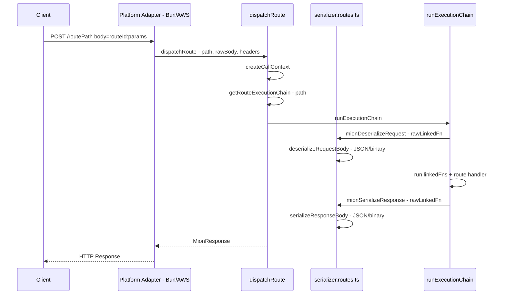
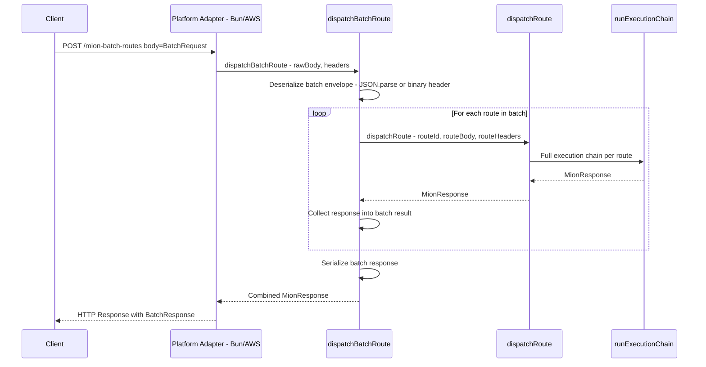
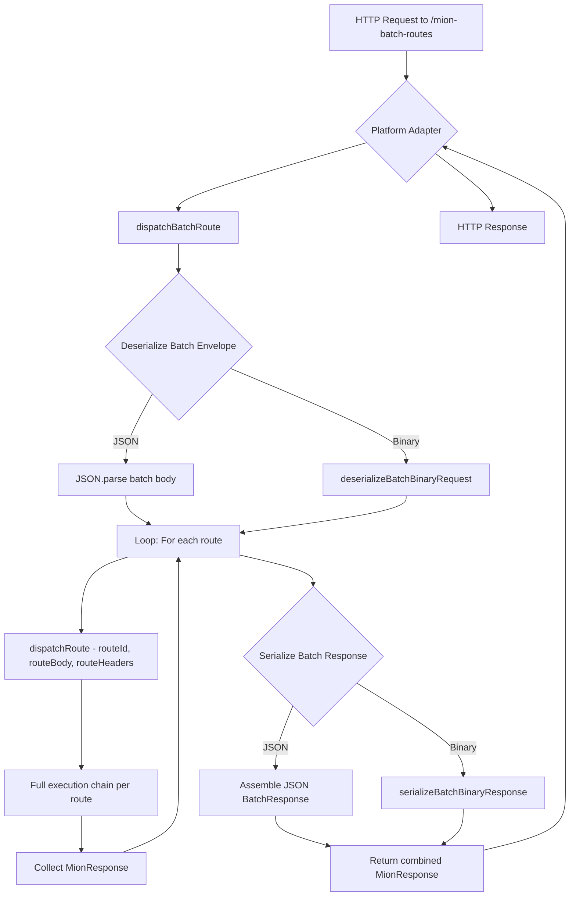
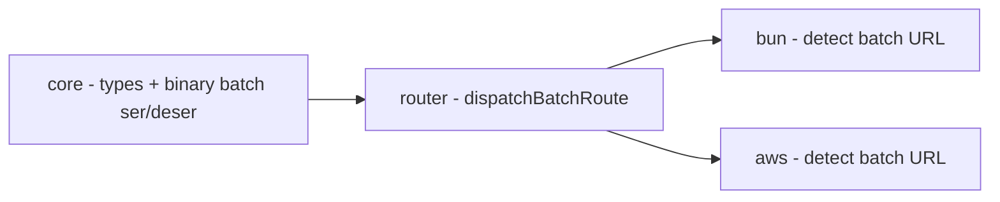

# Batch Routes Feature Plan

## Overview

Support multiple route calls in a single HTTP request. When a client sends a request to the reserved URL `/mion-batch-routes`, the server will deserialize the batch payload, dispatch each route individually, and return a combined batch response.

## Current Single-Route Flow



## Proposed Batch Flow



## Request/Response Format

### BatchRequest

```typescript
interface BatchRequest {
  /** Array of route paths - e.g. /users/get, /posts/list */
  routeIds: string[];
  /** Per-route request bodies - each is the individual route body */
  bodies: RawRequestBody[];
}
```

All routes in the batch share the HTTP request headers. No per-route headers in the request.

### BatchResponse

```typescript
interface BatchResponse {
  /** Route paths matching request order */
  routeIds: string[];
  /** HTTP status code per route */
  statuses: number[];
  /** Per-route response bodies */
  bodies: RawResponseBody[];
}
```

Response headers use **last-write-wins** strategy on the shared HTTP response headers. No per-route headers in the response. This keeps the format simple and can be extended later if needed.

### JSON Example

**Request:**

```json
{
  "routeIds": ["/users/get", "/posts/list"],
  "bodies": [{"users-get": ["user-123"]}, {"posts-list": [10, 0]}]
}
```

**Response:**

```json
{
  "routeIds": ["/users/get", "/posts/list"],
  "statuses": [200, 200],
  "bodies": [{"users-get": {"id": "user-123", "name": "John"}}, {"posts-list": [{"id": "p1", "title": "Hello"}]}]
}
```

### Binary Format

For binary, the batch envelope is a thin wrapper around individual binary payloads:

```
Binary Batch Request/Response:
[4 bytes]  - Number of routes (uint32 LE)
For each route:
  [4 bytes]  - Route ID string length (uint32 LE)
  [N bytes]  - Route ID string (UTF-8)
  [4 bytes]  - Status code (uint32 LE) -- response only, omitted in request
  [4 bytes]  - Body length in bytes (uint32 LE)
  [M bytes]  - Individual route binary body (same format as single-route binary)
```

The individual route binary body within each slot uses the exact same format as the existing [`serializeBinaryBody`](packages/core/src/binary/bodySerializer.ts:15) / [`deserializeBinaryBody`](packages/core/src/binary/bodyDeserializer.ts:13) functions.

## Design Decisions

1. **Each route gets its own full dispatch cycle**: Each route in the batch goes through the complete [`dispatchRoute`](packages/router/src/dispatch.ts:28) flow including its own execution chain (deserialize, linkedFns, route handler, serialize). This ensures batch behavior is identical to individual requests.

2. **Error isolation**: If one route fails, others still execute. Unrecoverable errors (e.g., binary deserialization of the batch envelope itself) fail the entire batch.

3. **Response headers**: Last-write-wins for shared HTTP response headers. No per-route headers in request or response - keeps the format simple and can be extended later.

4. **Server-side only**: Client-side batch API will be implemented separately in a future task.

5. **Serialization format**: The batch envelope format (JSON vs binary) matches the Content-Type of the HTTP request. Individual route bodies within the batch use the same format.

## Implementation Tasks

> **Execution order**: JSON dispatch first → test → binary support → test → platform adapters → integration tests.
> Each phase should be fully working and tested before moving to the next.

### Phase 1: JSON Batch Dispatch (router package)

#### Task 1: Add batch constants and types to core package

**Files to modify:**

- [`packages/core/src/constants.ts`](packages/core/src/constants.ts) - Add `MION_ROUTES.batchRoutes` constant
- New file: `packages/core/src/types/batch.types.ts` - Define `BatchRequest` and `BatchResponse` interfaces

**Details:**

- Add `batchRoutes: 'mion@batchRoutes'` to the [`MION_ROUTES`](packages/core/src/constants.ts:24) object
- Define the reserved URL path constant: `BATCH_ROUTE_PATH = '/mion-batch-routes'`
- Export `BatchRequest` and `BatchResponse` types

---

#### Task 2: Add batch router options

**Files to modify:**

- [`packages/router/src/types/general.ts`](packages/router/src/types/general.ts) - Add batch options to `RouterOptions`
- [`packages/router/src/constants.ts`](packages/router/src/constants.ts) - Add defaults

**Details:**

- Add `maxBatchSize: number` option (default: 20) to [`RouterOptions`](packages/router/src/types/general.ts:28)
- Add defaults to [`DEFAULT_ROUTE_OPTIONS`](packages/router/src/constants.ts:16)

---

#### Task 3: Implement `dispatchBatchRoute` with JSON support

**Files to modify:**

- [`packages/router/src/dispatch.ts`](packages/router/src/dispatch.ts) - Add `dispatchBatchRoute` function

**Details:**

- New exported function `dispatchBatchRoute` that:
  1. Validates batch size is within limits
  2. Deserializes the JSON batch envelope (`JSON.parse` or pre-parsed object)
  3. Extracts `routeIds` and `bodies` from the batch request
  4. Loops through each route, calling the existing [`dispatchRoute`](packages/router/src/dispatch.ts:28) for each
  5. Collects individual `MionResponse` objects
  6. Merges response headers (last-write-wins for the shared HTTP headers)
  7. Assembles the `BatchResponse` (routeIds, statuses, bodies)
  8. Returns a single `MionResponse` containing the batch response body

- The key insight is that each individual route dispatch already handles its own serialization/deserialization through the execution chain. The batch layer only needs to:
  - Parse the outer batch envelope
  - Pass individual route data to `dispatchRoute`
  - Collect and wrap the results

- Initially implement JSON support only. Binary support will be added in Phase 2.

---

#### Task 4: Write JSON batch dispatch tests

**Files to create:**

- `packages/router/src/batchDispatch.spec.ts`

**Details:**

- Test batch dispatch with JSON format (multiple routes)
- Test error isolation (one route fails, others succeed)
- Test batch size limit enforcement
- Test batch with linkedFns (auth, etc.)
- Test batch with headersFn methods
- Test empty batch request
- Test invalid batch format handling

---

### Phase 2: Binary Batch Support (core + router packages)

#### Task 5: Implement batch binary envelope serializer/deserializer in core

**Files to create:**

- `packages/core/src/binary/batchBodyDeserializer.ts`
- `packages/core/src/binary/batchBodySerializer.ts`

**Details:**

- `deserializeBatchBinaryRequest`: Reads the batch binary envelope, extracts route IDs and per-route binary body slices. Does NOT deserialize individual route bodies - that happens in each route's own dispatch cycle.
- `serializeBatchBinaryResponse`: Writes the batch binary envelope wrapping individual route binary response bodies (including per-route status codes).
- These functions handle only the batch envelope layer. Individual route bodies are handled by the existing [`deserializeBinaryBody`](packages/core/src/binary/bodyDeserializer.ts:13) and [`serializeBinaryBody`](packages/core/src/binary/bodySerializer.ts:15).

---

#### Task 6: Add binary support to `dispatchBatchRoute`

**Files to modify:**

- [`packages/router/src/dispatch.ts`](packages/router/src/dispatch.ts) - Add binary batch handling within `dispatchBatchRoute`

**Details:**

- For binary batch requests: Use the batch binary deserializer from Task 5 to extract route IDs and body byte slices
- Each body slice is passed as `Uint8Array` to `dispatchRoute` which will handle it through the normal binary deserialization path
- For binary batch responses: Use the batch binary serializer from Task 5 to wrap individual route binary responses
- Important: The DataView index management needs careful handling - each route gets its own slice, not a shared DataView

---

#### Task 7: Write binary batch dispatch tests

**Files to create:**

- `packages/router/src/batchBinaryDispatch.spec.ts`

**Details:**

- Test batch binary envelope serialization/deserialization roundtrip
- Test batch dispatch with binary format (multiple routes)
- Test with various route counts (1, 5, 20)
- Test with empty bodies
- Test error handling for malformed binary data
- Test error isolation with binary format

---

### Phase 3: Platform Adapters (bun + aws packages)

#### Task 8: Update Bun adapter to detect batch URL

**Files to modify:**

- [`packages/bun/src/bunHttp.ts`](packages/bun/src/bunHttp.ts) - Detect `/mion-batch-routes` path

**Details:**

- In the Bun fetch handler, check if `path === BATCH_ROUTE_PATH`
- If batch: call `dispatchBatchRoute` instead of `dispatchRoute`
- The `reply` function should work as-is since `dispatchBatchRoute` returns a standard `MionResponse`
- The batch response body type (JSON/binary) matches the request content-type

---

#### Task 9: Update AWS adapter to detect batch URL

**Files to modify:**

- [`packages/aws/src/awsLambda.ts`](packages/aws/src/awsLambda.ts) - Detect `/mion-batch-routes` path

**Details:**

- In the AWS Lambda handler, check if `path === BATCH_ROUTE_PATH`
- If batch: call `dispatchBatchRoute` instead of `dispatchRoute`
- Same pattern as Bun adapter

---

#### Task 10: Write integration tests for batch routes via Bun adapter

**Files to create:**

- `packages/bun/src/bunHttp.batch.test.ts`

**Details:**

- End-to-end test: HTTP request to `/mion-batch-routes` with JSON body
- End-to-end test: HTTP request to `/mion-batch-routes` with binary body
- Test response format matches `BatchResponse` structure
- Test mixed success/error scenarios
- Test with auth linkedFns

## Architecture Diagram



## Package Dependency Flow



## Key Files Summary

| File                                                | Change Type | Description                                |
| --------------------------------------------------- | ----------- | ------------------------------------------ |
| `packages/core/src/constants.ts`                    | Modify      | Add batch route constant                   |
| `packages/core/src/types/batch.types.ts`            | New         | BatchRequest/BatchResponse types           |
| `packages/core/src/binary/batchBodyDeserializer.ts` | New         | Binary batch envelope deserializer         |
| `packages/core/src/binary/batchBodySerializer.ts`   | New         | Binary batch envelope serializer           |
| `packages/router/src/types/general.ts`              | Modify      | Add batch options to RouterOptions         |
| `packages/router/src/constants.ts`                  | Modify      | Add batch defaults                         |
| `packages/router/src/dispatch.ts`                   | Modify      | Add dispatchBatchRoute function            |
| `packages/bun/src/bunHttp.ts`                       | Modify      | Detect batch URL, call dispatchBatchRoute  |
| `packages/aws/src/awsLambda.ts`                     | Modify      | Detect batch URL, call dispatchBatchRoute  |
| `packages/router/src/batchDispatch.spec.ts`         | New         | JSON batch dispatch unit tests (Phase 1)   |
| `packages/router/src/batchBinaryDispatch.spec.ts`   | New         | Binary batch dispatch unit tests (Phase 2) |
| `packages/bun/src/bunHttp.batch.test.ts`            | New         | Bun integration tests (Phase 3)            |
