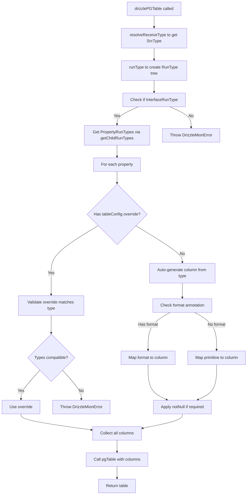

# @mionkit/drizzle - Detailed Implementation Plan

## Overview

This document provides a detailed implementation plan for the `@mionkit/drizzle` package. The implementation follows the specification in [`drizzle-mion-spec.md`](./drizzle-mion-spec.md) and the architecture in [`drizzle-mion-implementation.md`](./drizzle-mion-implementation.md).

## File Structure

```
packages/drizze/
├── index.ts                    # Re-exports all public APIs
├── package.json                # Package configuration with drizzle-orm peer dep
├── tsconfig.json               # TypeScript configuration
├── vite.config.ts              # Build configuration
├── jest.config.js              # Test configuration
├── README.md                   # Package documentation
└── src/
    ├── postgres.ts             # drizzlePGTable export
    ├── mysql.ts                # drizzleMysqlTable export
    ├── sqlite.ts               # drizzleSqliteTable export
    ├── core/
    │   ├── errors.ts           # Error types and messages
    │   ├── typeTraverser.ts    # RunType tree traversal
    │   ├── validator.ts        # Config validation
    │   └── utils.ts            # Shared utilities
    ├── mappers/
    │   ├── base.mapper.ts      # Base mapper interface
    │   ├── pg.mapper.ts        # PostgreSQL mappings
    │   ├── mysql.mapper.ts     # MySQL mappings
    │   └── sqlite.mapper.ts    # SQLite mappings
    └── types/
        ├── common.types.ts     # Shared types
        ├── pg.types.ts         # PG-specific types
        ├── mysql.types.ts      # MySQL-specific types
        └── sqlite.types.ts     # SQLite-specific types
```

## Implementation Phases

### Phase 1: Core Infrastructure

#### 1.1 Error Types - [`src/core/errors.ts`](../packages/drizze/src/core/errors.ts)

```typescript
/** Custom error class for drizzle-mion integration errors */
export class DrizzleMionError extends Error {
  constructor(message: string) {
    super(message);
    this.name = 'DrizzleMionError';
  }
}

/** Error messages for common scenarios */
export const ErrorMessages = {
  TYPE_MISMATCH: (prop: string, expected: string, actual: string) =>
    `Type mismatch for property "${prop}": TypeScript type expects ${expected}, but drizzle column is "${actual}"`,
  EXTRA_COLUMN: (column: string, typeName: string) => `Column "${column}" exists in tableConfig but not in type "${typeName}"`,
  NULLABILITY_MISMATCH: (prop: string) => `Property "${prop}" is optional in type but column has .notNull() constraint`,
  INVALID_TYPE: (kindName: string) => `drizzle table type must be an object/interface type, got: "${kindName}"`,
  UNSUPPORTED_PRIMITIVE: (kind: string) => `Unsupported primitive type: ${kind}`,
};
```

#### 1.2 Type Traverser - [`src/core/typeTraverser.ts`](../packages/drizze/src/core/typeTraverser.ts)

Key responsibilities:

- Extract property information from TypeScript types using mion's RunType system
- Identify format names and parameters
- Detect nested objects vs primitives
- Handle optional properties

```typescript
export interface PropertyInfo {
  name: string;
  runType: BaseRunType;
  isOptional: boolean;
  isNestedObject: boolean;
  isArray: boolean;
  formatName?: string;
  formatParams?: Record<string, any>;
  primitiveKind?: ReflectionKind;
}

export interface TypeInfo {
  typeName: string;
  properties: PropertyInfo[];
}

export function extractTypeInfo<T>(type?: ReceiveType<T>): TypeInfo;
```

#### 1.3 Validator - [`src/core/validator.ts`](../packages/drizze/src/core/validator.ts)

Key responsibilities:

- Validate tableConfig against TypeScript type
- Check type compatibility
- Check nullability constraints
- Report errors and warnings

```typescript
export interface ValidationResult {
  valid: boolean;
  errors: string[];
  warnings: string[];
}

export function validateConfig(typeInfo: TypeInfo, tableConfig: Record<string, any>): ValidationResult;
```

#### 1.4 Common Types - [`src/types/common.types.ts`](../packages/drizze/src/types/common.types.ts)

```typescript
export type DatabaseType = 'postgres' | 'mysql' | 'sqlite';

export interface ColumnMapping {
  builder: any;
  drizzleType: string;
}
```

### Phase 2: PostgreSQL Implementation

#### 2.1 PG Types - [`src/types/pg.types.ts`](../packages/drizze/src/types/pg.types.ts)

Define TypeScript types for PostgreSQL column mappings and table config.

#### 2.2 Base Mapper - [`src/mappers/base.mapper.ts`](../packages/drizze/src/mappers/base.mapper.ts)

Abstract base class for all database mappers:

```typescript
export abstract class BaseColumnMapper {
  abstract mapPrimitive(kind: ReflectionKind, propName: string): ColumnMapping;
  abstract mapFormat(formatName: string, formatParams: Record<string, any>, propName: string): ColumnMapping;
  abstract mapArray(propName: string): ColumnMapping;
  abstract mapObject(propName: string): ColumnMapping;
  abstract mapDate(propName: string): ColumnMapping;

  mapProperty(prop: PropertyInfo): ColumnMapping;
}
```

#### 2.3 PG Mapper - [`src/mappers/pg.mapper.ts`](../packages/drizze/src/mappers/pg.mapper.ts)

PostgreSQL-specific mappings:

| TypeScript Type | PostgreSQL Column          |
| --------------- | -------------------------- |
| `string`        | `text()`                   |
| `number`        | `doublePrecision()`        |
| `boolean`       | `boolean()`                |
| `bigint`        | `bigint({mode: 'bigint'})` |
| `Date`          | `timestamp()`              |
| `T[]`           | `jsonb()`                  |
| `{...}`         | `jsonb()`                  |

Format mappings:
| Format | PostgreSQL Column |
|--------|-------------------|
| `uuid` | `uuid()` |
| `email` | `text()` or `varchar(254)` |
| `datetime` | `timestamp()` |
| `date` | `date()` |
| `time` | `time()` |
| `ip` | `inet()` |
| `integer` | `integer()` |

#### 2.4 PostgreSQL Function - [`src/postgres.ts`](../packages/drizze/src/postgres.ts)

```typescript
export function drizzlePGTable<T>(
  tableName: string,
  tableConfig?: Partial<Record<keyof T, any>>,
  type?: ReceiveType<T>
): PgTableWithColumns<...>;
```

### Phase 3: MySQL Implementation

#### 3.1 MySQL Mapper - [`src/mappers/mysql.mapper.ts`](../packages/drizze/src/mappers/mysql.mapper.ts)

MySQL-specific mappings:

| TypeScript Type | MySQL Column               |
| --------------- | -------------------------- |
| `string`        | `text()`                   |
| `number`        | `double()`                 |
| `boolean`       | `boolean()`                |
| `bigint`        | `bigint({mode: 'bigint'})` |
| `Date`          | `timestamp()`              |
| `T[]`           | `json()`                   |
| `{...}`         | `json()`                   |

Format mappings:
| Format | MySQL Column |
|--------|--------------|
| `uuid` | `varchar(36)` |
| `email` | `varchar(254)` |
| `datetime` | `datetime()` |
| `date` | `date()` |
| `time` | `time()` |
| `ip` | `varchar(45)` |
| `integer` | `int()` |

#### 3.2 MySQL Function - [`src/mysql.ts`](../packages/drizze/src/mysql.ts)

```typescript
export function drizzleMysqlTable<T>(
  tableName: string,
  tableConfig?: Partial<Record<keyof T, any>>,
  type?: ReceiveType<T>
): MySqlTableWithColumns<...>;
```

### Phase 4: SQLite Implementation

#### 4.1 SQLite Mapper - [`src/mappers/sqlite.mapper.ts`](../packages/drizze/src/mappers/sqlite.mapper.ts)

SQLite-specific mappings:

| TypeScript Type | SQLite Column                  |
| --------------- | ------------------------------ |
| `string`        | `text()`                       |
| `number`        | `real()`                       |
| `boolean`       | `integer({mode: 'boolean'})`   |
| `bigint`        | `blob({mode: 'bigint'})`       |
| `Date`          | `integer({mode: 'timestamp'})` |
| `T[]`           | `text({mode: 'json'})`         |
| `{...}`         | `text({mode: 'json'})`         |

Format mappings:
| Format | SQLite Column |
|--------|---------------|
| `uuid` | `text()` |
| `email` | `text()` |
| `datetime` | `text()` |
| `date` | `text()` |
| `time` | `text()` |
| `ip` | `text()` |
| `integer` | `integer()` |

#### 4.2 SQLite Function - [`src/sqlite.ts`](../packages/drizze/src/sqlite.ts)

```typescript
export function drizzleSqliteTable<T>(
  tableName: string,
  tableConfig?: Partial<Record<keyof T, any>>,
  type?: ReceiveType<T>
): SQLiteTableWithColumns<...>;
```

### Phase 5: TypeScript Types and Integration

#### 5.1 Mapped Types for Compile-Time Safety

```typescript
type DrizzleColumnType<T, DB extends DatabaseType> = T extends string
  ? StringColumnType<DB>
  : T extends number
    ? NumberColumnType<DB>
    : T extends boolean
      ? BooleanColumnType<DB>
      : T extends bigint
        ? BigIntColumnType<DB>
        : T extends Date
          ? DateColumnType<DB>
          : T extends Array<any>
            ? JsonColumnType<DB>
            : T extends object
              ? JsonColumnType<DB>
              : never;

type PGTableConfig<T> = {
  [K in keyof T]?: DrizzleColumnType<T[K], 'postgres'>;
};
```

#### 5.2 Update package.json

```json
{
  "peerDependencies": {
    "drizzle-orm": ">=0.36.0"
  }
}
```

### Phase 6: Documentation

- Add JSDoc comments to all public APIs
- Update README.md with:
  - Installation instructions
  - Basic usage examples
  - Format type mappings
  - Foreign key and relations examples
  - Error handling

## Testing Strategy

### Unit Tests

Each phase includes unit tests for:

- Type traverser functionality
- Column mapping logic
- Validation utilities
- Error handling

### Integration Tests

Test actual drizzle table creation:

- Simple types
- Formatted types
- Nested objects and arrays
- Optional properties
- tableConfig overrides

### Type Tests

Ensure TypeScript errors for invalid configurations using `tsd` or similar.

## Key Implementation Notes

1. **RunType System**: Use [`runType()`](../packages/run-types/src/createRunType.ts:66) to create RunType tree from TypeScript types
2. **Format Detection**: Use [`getRunTypeFormat()`](../packages/run-types/src/lib/formats.ts:54) to get format information
3. **Property Traversal**: Use [`InterfaceRunType.getChildRunTypes()`](../packages/run-types/src/nodes/collection/interface.ts:27) to get properties
4. **Optional Detection**: Use [`PropertyRunType.isOptional()`](../packages/run-types/src/nodes/member/property.ts:35) to check optionality
5. **Kind Detection**: Use `runType.src.kind` with `ReflectionKind` enum to identify type kinds

## Dependencies

The package depends on:

- `@mionkit/core` - Core utilities and types
- `@mionkit/run-types` - Runtime type system
- `drizzle-orm` (peer) - Drizzle ORM

## Mermaid Diagram: Type Traversal Flow



## Next Steps

1. Switch to Code mode to implement Phase 1
2. Run tests after each phase
3. Iterate based on test results
4. Complete all phases sequentially
