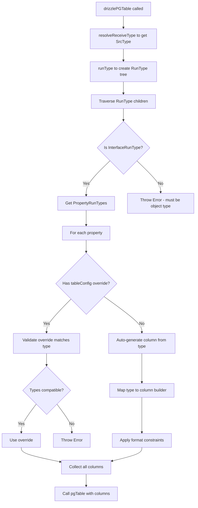

# @mionkit/drizzle - Specification Document

## Overview

The `@mionkit/drizzle` package provides integration between mion's runtime type system and Drizzle ORM. Unlike `drizzle-zod` which generates Zod schemas FROM drizzle tables, this package works in the opposite direction: it auto-generates drizzle table configurations FROM TypeScript types while allowing optional overrides.

## Goals

1. **Auto-generate drizzle table schemas** from TypeScript types using mion's runtime type metadata
2. **Validate compatibility** between TypeScript types and any provided table configuration overrides
3. **Map mion type formats** to appropriate drizzle column types and constraints
4. **Support all three databases**: PostgreSQL, MySQL, and SQLite
5. **Differentiate nested objects from relations** using type metadata annotations

## API Design

### Core Functions

```typescript
// PostgreSQL
export function drizzlePGTable<T>(
    tableName: string,
    tableConfig?: Partial<PGTableConfig<T>>,
    type?: ReceiveType<T>
): PgTableWithColumns<...>;

// MySQL
export function drizzleMysqlTable<T>(
    tableName: string,
    tableConfig?: Partial<MysqlTableConfig<T>>,
    type?: ReceiveType<T>
): MySqlTableWithColumns<...>;

// SQLite
export function drizzleSqliteTable<T>(
    tableName: string,
    tableConfig?: Partial<SqliteTableConfig<T>>,
    type?: ReceiveType<T>
): SQLiteTableWithColumns<...>;
```

### Usage Examples

```typescript
// Basic usage - auto-generate table from type
interface User {
  id: string;
  email: string;
  name: string;
  age: number;
  createdAt: Date;
}

// Minimal - just specify primary key
export const userTable = drizzlePGTable<User>('user', {
  id: uuid('id').primaryKey(),
});

// Full auto-generation with primary key override
// All other columns are auto-generated from the User type

interface UserWithFormats {
  id: StrUUIDv7; // format imported from type-formats package
  email: StrEmail; // format imported from type-formats package
  name: string;
  bio?: string; // Optional = nullable
  tags: string[]; // Array = jsonb in PG
  metadata: {theme: string}; // Nested object = jsonb
}

export const userTable = drizzlePGTable<UserWithFormats>('user', {
  id: uuid('id').primaryKey(),
});
// Auto-generates:
// - email: text('email').notNull()  (with length constraint from format)
// - name: text('name').notNull()
// - bio: text('bio')  (nullable because optional)
// - tags: jsonb('tags').notNull()
// - metadata: jsonb('metadata').notNull()
```

## Type Mappings

### Primitive Type Mappings

| TypeScript Type | PostgreSQL                 | MySQL                      | SQLite                         |
| --------------- | -------------------------- | -------------------------- | ------------------------------ |
| `string`        | `text()`                   | `text()`                   | `text()`                       |
| `number`        | `doublePrecision()`        | `double()`                 | `real()`                       |
| `boolean`       | `boolean()`                | `boolean()`                | `integer({mode: 'boolean'})`   |
| `bigint`        | `bigint({mode: 'bigint'})` | `bigint({mode: 'bigint'})` | `blob({mode: 'bigint'})`       |
| `Date`          | `timestamp()`              | `timestamp()`              | `integer({mode: 'timestamp'})` |

### Type Format Mappings (from `@mionkit/type-formats`)

All format types are imported from `@mionkit/type-formats`.

#### String Formats (from `FormatsString`)

| Format Type      | PostgreSQL                 | MySQL                    | SQLite   | Notes                 |
| ---------------- | -------------------------- | ------------------------ | -------- | --------------------- |
| `StrFormat<P>`   | `text()` or `varchar(n)`   | `text()` or `varchar(n)` | `text()` | Base string format    |
| `StrEmail`       | `text()` or `varchar(254)` | `varchar(254)`           | `text()` | Email format          |
| `StrEmailStrict` | `text()` or `varchar(254)` | `varchar(254)`           | `text()` | Strict email          |
| `StrUrl`         | `text()`                   | `text()`                 | `text()` | URL format (max 2048) |
| `StrUrlHttp`     | `text()`                   | `text()`                 | `text()` | HTTP/HTTPS URLs only  |
| `StrUUIDv4`      | `uuid()`                   | `varchar(36)`            | `text()` | UUID v4 format        |
| `StrUUIDv7`      | `uuid()`                   | `varchar(36)`            | `text()` | UUID v7 format        |
| `StrIP`          | `inet()`                   | `varchar(45)`            | `text()` | IP address (v4 or v6) |
| `StrIPv4`        | `inet()`                   | `varchar(15)`            | `text()` | IPv4 only             |
| `StrIPv6`        | `inet()`                   | `varchar(45)`            | `text()` | IPv6 only             |
| `StrDomain`      | `text()`                   | `varchar(253)`           | `text()` | Domain name           |
| `StrDateTime`    | `timestamp()`              | `datetime()`             | `text()` | ISO 8601 datetime     |
| `StrDate`        | `date()`                   | `date()`                 | `text()` | ISO 8601 date         |
| `StrTime`        | `time()`                   | `time()`                 | `text()` | ISO 8601 time         |

#### Number Formats (from `FormatsNumber`)

| Format Type      | PostgreSQL          | MySQL        | SQLite      | Notes              |
| ---------------- | ------------------- | ------------ | ----------- | ------------------ |
| `NumFormat<P>`   | varies              | varies       | varies      | Base number format |
| `NumInteger`     | `integer()`         | `int()`      | `integer()` | Integer constraint |
| `NumFloat`       | `doublePrecision()` | `double()`   | `real()`    | Float constraint   |
| `NumPositive`    | `doublePrecision()` | `double()`   | `real()`    | min: 0             |
| `NumNegative`    | `doublePrecision()` | `double()`   | `real()`    | max: 0             |
| `NumPositiveInt` | `integer()`         | `int()`      | `integer()` | min: 0, integer    |
| `NumNegativeInt` | `integer()`         | `int()`      | `integer()` | max: 0, integer    |
| `NumInt8`        | `smallint()`        | `tinyint()`  | `integer()` | -128 to 127        |
| `NumInt16`       | `smallint()`        | `smallint()` | `integer()` | -32768 to 32767    |
| `NumInt32`       | `integer()`         | `int()`      | `integer()` | Full 32-bit range  |
| `NumUInt8`       | `smallint()`        | `tinyint()`  | `integer()` | 0 to 255           |
| `NumUInt16`      | `smallint()`        | `smallint()` | `integer()` | 0 to 65535         |
| `NumUInt32`      | `integer()`         | `int()`      | `integer()` | 0 to 4294967295    |

#### BigInt Formats (from `FormatsBigint`)

| Format Type       | PostgreSQL | MySQL      | SQLite                   | Notes              |
| ----------------- | ---------- | ---------- | ------------------------ | ------------------ |
| `BigNumFormat<P>` | `bigint()` | `bigint()` | `blob({mode: 'bigint'})` | Base bigint format |
| `BigNumPositive`  | `bigint()` | `bigint()` | `blob({mode: 'bigint'})` | min: 0n            |
| `BigNumNegative`  | `bigint()` | `bigint()` | `blob({mode: 'bigint'})` | max: 0n            |
| `BigNumInt64`     | `bigint()` | `bigint()` | `blob({mode: 'bigint'})` | 64-bit signed      |

### Format Params to Drizzle Constraints

#### StringParams (for `StrFormat<P>`)

| Param             | Type                   | Drizzle Constraint      | Notes                    |
| ----------------- | ---------------------- | ----------------------- | ------------------------ |
| `maxLength`       | `number`               | `varchar({length: n})`  | Max string length        |
| `length`          | `number`               | `char({length: n})`     | Exact length (PG, MySQL) |
| `minLength`       | `number`               | Runtime validation only | Min string length        |
| `pattern`         | `{val: RegExp, ...}`   | Runtime validation only | Regex pattern            |
| `allowedChars`    | `{val: string, ...}`   | Runtime validation only | Allowed characters       |
| `disallowedChars` | `{val: string, ...}`   | Runtime validation only | Disallowed characters    |
| `allowedValues`   | `{val: string[], ...}` | Runtime validation only | Enum-like values         |
| `trim`            | `boolean`              | Runtime formatting only | Trim whitespace          |
| `lowercase`       | `boolean`              | Runtime formatting only | Convert to lowercase     |
| `uppercase`       | `boolean`              | Runtime formatting only | Convert to uppercase     |

#### FormatParams_Number (for `NumFormat<P>`)

| Param        | Type      | Drizzle Constraint      | Notes                     |
| ------------ | --------- | ----------------------- | ------------------------- |
| `integer`    | `boolean` | Use `integer()` type    | Integer constraint        |
| `float`      | `boolean` | Use `doublePrecision()` | Float constraint          |
| `min`        | `number`  | Runtime validation only | Minimum value (inclusive) |
| `max`        | `number`  | Runtime validation only | Maximum value (inclusive) |
| `gt`         | `number`  | Runtime validation only | Greater than (exclusive)  |
| `lt`         | `number`  | Runtime validation only | Less than (exclusive)     |
| `multipleOf` | `number`  | Runtime validation only | Must be multiple of value |

#### FormatParams_BigInt (for `BigNumFormat<P>`)

| Param        | Type     | Drizzle Constraint      | Notes                     |
| ------------ | -------- | ----------------------- | ------------------------- |
| `min`        | `bigint` | Runtime validation only | Minimum value (inclusive) |
| `max`        | `bigint` | Runtime validation only | Maximum value (inclusive) |
| `gt`         | `bigint` | Runtime validation only | Greater than (exclusive)  |
| `lt`         | `bigint` | Runtime validation only | Less than (exclusive)     |
| `multipleOf` | `bigint` | Runtime validation only | Must be multiple of value |

### Complex Type Mappings

| TypeScript Type               | PostgreSQL         | MySQL              | SQLite                 |
| ----------------------------- | ------------------ | ------------------ | ---------------------- |
| `T[]` (array)                 | `jsonb()`          | `json()`           | `text({mode: 'json'})` |
| `{...}` (nested object)       | `jsonb()`          | `json()`           | `text({mode: 'json'})` |
| `T \| null` (union with null) | Column is nullable | Column is nullable | Column is nullable     |
| `T?` (optional)               | Column is nullable | Column is nullable | Column is nullable     |

## Handling Nested Objects and Arrays

### Simple Approach - No Annotations Needed

The approach is completely automatic:

1. **Primitive types** (string, number, boolean, Date, bigint) → columns (auto-generated)
2. **Foreign keys** → primitive types + explicit config in tableConfig (like primary keys)
3. **Nested objects** → automatically stored as JSON/JSONB
4. **Arrays** → automatically stored as JSON/JSONB

No special annotations are required. Any nested object or array in the TypeScript type will automatically become a JSON column.

### ⚠️ Important: When to Use Nested Objects vs Foreign Keys

**Nested objects should be the exception, not the rule.** They are appropriate for:

- Simple value objects (settings, preferences, metadata)
- Data that doesn't need to be queried independently
- Data that doesn't have its own identity/lifecycle

**Use foreign keys (primitive IDs) for:**

- References to other entities
- Data that needs to be queried independently
- Data with its own identity/lifecycle

```typescript
// ✅ CORRECT: Profile is a simple value object - good use of nested JSON
interface Profile {
  bio: string;
  avatar: string;
}

interface User {
  id: string;
  name: string;
  profile: Profile; // Simple value object - stored as JSON
}

// ❌ WRONG: Book references User entity - should NOT embed the entire User
interface Book {
  id: string;
  title: string;
  owner: User; // ❌ This would store the entire User as JSON!
}

// ✅ CORRECT: Use a foreign key ID instead
interface Book {
  id: string;
  title: string;
  ownerId: string; // ✅ Foreign key - just the ID
}

// Then define the foreign key constraint in tableConfig:
const books = drizzlePGTable<Book>('books', {
  id: uuid('id').primaryKey(),
  ownerId: uuid('owner_id').references(() => users.id),
});
```

### Usage Examples

```typescript
// Nested object type - will be stored as JSON automatically
// This is appropriate because Profile is a simple value object
interface Profile {
  bio: string;
  avatar: string;
}

// Main entity type
interface User {
  id: string; // Primary key - defined in tableConfig
  name: string; // Regular column - auto-generated as text
  email: string; // Regular column - auto-generated as text
  departmentId: string; // Foreign key - just a string, constraint in tableConfig
  profile: Profile; // Simple value object - auto-generated as jsonb
  tags: string[]; // Array of primitives - auto-generated as jsonb
  settings: {theme: string}; // Inline value object - auto-generated as jsonb
}

// Create the table - only primary key and foreign key need explicit config
export const users = drizzlePGTable<User>('users', {
  id: uuid('id').primaryKey(),
  departmentId: uuid('department_id').references(() => departments.id),
});

// Auto-generates the rest:
// - name: text('name').notNull()
// - email: text('email').notNull()
// - profile: jsonb('profile').notNull()
// - tags: jsonb('tags').notNull()
// - settings: jsonb('settings').notNull()
```

### How It Works

1. **Primitive types** (string, number, boolean, Date, bigint):
   - Auto-generate columns based on type
   - Can be overridden in tableConfig for primary keys, foreign keys, or custom constraints

2. **Arrays** (string[], number[], any[]):
   - Auto-generate as JSON/JSONB columns
   - Stored as JSON arrays in the database

3. **Nested objects** (interfaces, inline objects):
   - Auto-generate as JSON/JSONB columns
   - The nested object is serialized/deserialized automatically
   - **Should only be used for simple value objects, not entity references**

### Foreign Keys - Defined in tableConfig

Foreign keys are just primitive types in the TypeScript interface. The foreign key constraint is defined in the tableConfig, similar to primary keys:

```typescript
interface Post {
  id: string;
  title: string;
  content: string;
  authorId: string; // Foreign key - just a string type, NOT author: User
}

export const posts = drizzlePGTable<Post>('posts', {
  id: uuid('id').primaryKey(),
  authorId: uuid('author_id').references(() => users.id, {onDelete: 'cascade'}),
});
```

### Relations - Defined Separately

Drizzle relations are defined separately from the table schema. They are NOT part of the TypeScript entity type:

```typescript
// Relations are defined separately using drizzle's relations() function
export const postsRelations = relations(posts, ({one}) => ({
  author: one(users, {
    fields: [posts.authorId],
    references: [users.id],
  }),
}));

export const usersRelations = relations(users, ({many}) => ({
  posts: many(posts),
}));
```

### Validation Rules

1. **tableConfig column type mismatch** → Error if override doesn't match TypeScript type
2. **Extra columns in tableConfig** → Error if column doesn't exist in type

## Implementation Architecture

### Core Components

```
packages/drizze/
├── index.ts                 # Re-exports all functions
├── src/
│   ├── postgres.ts          # drizzlePGTable implementation
│   ├── mysql.ts             # drizzleMysqlTable implementation
│   ├── sqlite.ts            # drizzleSqliteTable implementation
│   ├── core/
│   │   ├── typeTraverser.ts # Traverse RunType tree
│   │   ├── columnMapper.ts  # Map types to column builders
│   │   ├── validator.ts     # Validate config vs type
│   │   └── formatMapper.ts  # Map type formats to columns
│   └── types/
│       ├── postgres.types.ts
│       ├── mysql.types.ts
│       └── sqlite.types.ts
```

### Type Traversal Flow



### Validation Logic

The validator compares the RunType metadata with the provided drizzle column configuration:

1. **Type Compatibility Check**
   - String type must map to text/varchar/char columns
   - Number type must map to numeric columns
   - Boolean type must map to boolean columns
   - Date type must map to date/timestamp columns
   - Arrays/Objects must map to json/jsonb columns

2. **Nullability Check**
   - Optional properties must not have `.notNull()` constraint
   - Required properties should have `.notNull()` constraint (warning if missing)

3. **Format Constraint Check**
   - If type has `maxLength`, column should have compatible length
   - If type has `uuid` format, column should be uuid type (PG) or varchar(36)

## Runtime Behavior

### Error Handling

```typescript
// Type mismatch error
throw new DrizzleMionError(
  'Type mismatch for property "email": ' + 'TypeScript type is "string" but drizzle column is "integer"'
);

// Missing required property error
throw new DrizzleMionError(
  'Property "name" exists in type but not in tableConfig. ' + 'Either add the column or remove the property from the type.'
);

// Nullability mismatch error
throw new DrizzleMionError('Property "bio" is optional in type but column has .notNull() constraint');
```

### Format Validation

When a type has a format annotation, we validate that the drizzle column is compatible:

```typescript
// Type: email: TypeFormat<string, 'email', {maxLength: 100}>
// Column: text('email').notNull()
// Result: Valid - text can store emails

// Type: id: TypeFormat<string, 'uuid', {version: '4'}>
// Column: integer('id')
// Result: Error - UUID format requires string-compatible column
```

## TypeScript Type Safety

### Mapped Types for Table Config

```typescript
// Maps TypeScript type to allowed drizzle column types
type DrizzleColumnType<T> = T extends string
  ? PgTextBuilder | PgVarcharBuilder | PgUuidBuilder
  : T extends number
    ? PgDoublePrecisionBuilder | PgIntegerBuilder | PgRealBuilder
    : T extends boolean
      ? PgBooleanBuilder
      : T extends bigint
        ? PgBigIntBuilder
        : T extends Date
          ? PgTimestampBuilder | PgDateBuilder
          : T extends Array<any>
            ? PgJsonbBuilder
            : T extends object
              ? PgJsonbBuilder
              : never;

// Table config type derived from the entity type
type PGTableConfig<T> = {
  [K in keyof T]: DrizzleColumnType<T[K]>;
};
```

## Dependencies

The package will need these peer dependencies:

```json
{
  "peerDependencies": {
    "drizzle-orm": ">=0.36.0"
  },
  "dependencies": {
    "@mionkit/core": "^0.7.2",
    "@mionkit/run-types": "^0.7.2"
  }
}
```

## Testing Strategy

1. **Unit Tests**: Test type traversal and mapping logic
2. **Integration Tests**: Test actual drizzle table creation
3. **Type Tests**: Ensure TypeScript errors for invalid configurations

```typescript
// Type test - should error
const badTable = drizzlePGTable<User>('user', {
  id: integer('id').primaryKey(), // Error: User.id is string, not number
});

// Type test - should pass
const goodTable = drizzlePGTable<User>('user', {
  id: uuid('id').primaryKey(),
});
```

## Future Considerations

1. **Index Support**: Allow specifying indexes via type annotations or config
2. **Relations**: Support drizzle relations based on type references
3. **Migrations**: Generate migration files from type changes
4. **Select/Insert Schemas**: Similar to drizzle-zod's createSelectSchema/createInsertSchema
