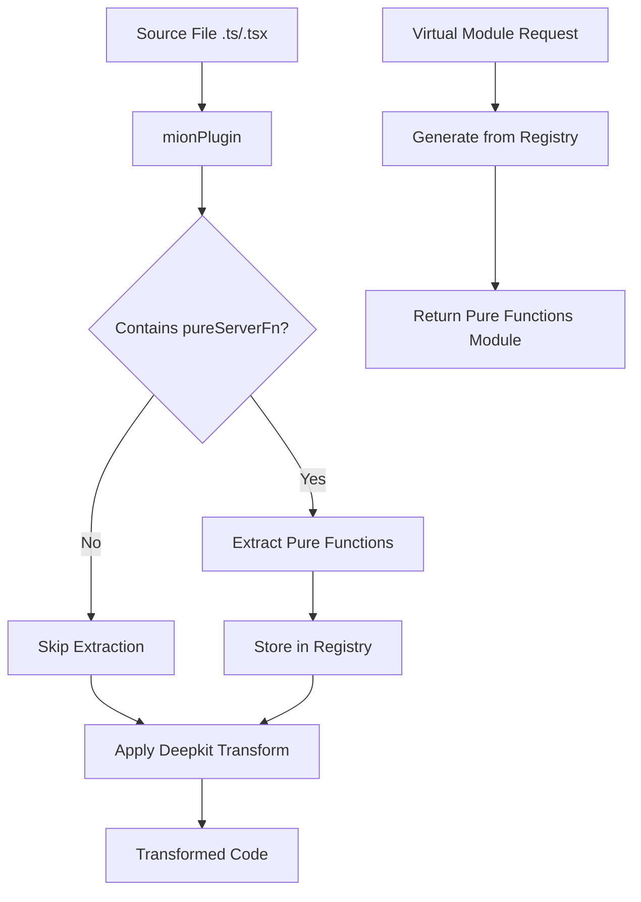

# Plan: Integrate Deepkit Type Transformer into Mion Vite Plugin

## Problem Statement

The current mion vite plugin (`pureFunctionsPlugin`) extracts `pureServerFn()` calls from client code and makes them available on the server via a virtual module. However, when used alongside the deepkit vite plugin (`@deepkit/vite`), there's a conflict:

1. **Deepkit plugin runs first** (both have `enforce: 'pre'`)
2. Deepkit transforms the TypeScript code, modifying the AST
3. The mion plugin then tries to extract pure functions from the **already-transformed** code
4. This causes AST parsing issues because the code structure has changed

## Solution: Unified Mion Vite Plugin

Create a single unified plugin that:

1. **First** extracts pure functions from the **original** TypeScript source
2. **Then** applies deepkit type transformations to the code

This ensures pure function extraction happens on clean, untransformed TypeScript.

## Architecture



## Implementation Steps

### Step 1: Create [`deepkit-type.ts`](packages/devtools/src/vite-plugin/deepkit-type.ts)

Copy the deepkit vite plugin source into our codebase. This gives us full control over the transformation pipeline.

````typescript
// packages/devtools/src/vite-plugin/deepkit-type.ts
import {createFilter} from '@rollup/pluginutils';
import type {Plugin} from 'vite';
import {DeepkitLoader, type DeepkitLoaderOptions} from '@deepkit/type-compiler';

export interface DeepkitTypeOptions {
    /**
     * Glob patterns to include. Defaults to ['**/*.tsx', '**/*.ts']
     */
    include?: string | string[];

    /**
     * Glob patterns to exclude. Defaults to 'node_modules/**'
     */
    exclude?: string | string[];

    /**
     * Path to tsconfig.json. If not provided, will search from project root.
     */
    tsConfig?: string;

    /**
     * Override reflection mode. If not set, uses tsconfig's reflection option.
     * Set to 'default' to enable reflection for all files regardless of tsconfig.
     * Useful for simple projects without explicit tsconfig reflection configuration.
     */
    reflection?: DeepkitLoaderOptions['reflection'];
}

/**
 * Deepkit type transformer function.
 * Can be used standalone or as part of the unified mion plugin.
 */
export function transformWithDeepkit(
    code: string,
    fileName: string,
    options: DeepkitTypeOptions = {}
): {code: string; map: null} | null {
    const filter = createFilter(
        options.include ?? ['**/*.tsx', '**/*.ts'],
        options.exclude ?? 'node_modules/**'
    );

    if (!filter(fileName)) return null;

    const loader = new DeepkitLoader({
        tsConfig: options.tsConfig,
        reflection: options.reflection,
    });

    const transformed = loader.transform(code, fileName);

    return {
        code: transformed,
        map: null,
    };
}

/**
 * Standalone deepkit type plugin - compatible with @deepkit/vite
 *
 * @example
 * ```ts
 * // vite.config.ts
 * import {deepkitType} from '@mionkit/devtools/vite-plugin';
 *
 * export default {
 *   plugins: [
 *     // Simple usage - enables reflection for all files
 *     deepkitType({ reflection: 'default' })
 *   ]
 * }
 * ```
 */
export function deepkitType(options: DeepkitTypeOptions = {}): Plugin {
    const filter = createFilter(options.include ?? ['**/*.tsx', '**/*.ts'], options.exclude ?? 'node_modules/**');

    const loader = new DeepkitLoader({
        tsConfig: options.tsConfig,
        reflection: options.reflection,
    });

    return {
        name: 'deepkit-type',
        enforce: 'pre',
        transform(code: string, fileName: string) {
            if (!filter(fileName)) return null;

            const transformed = loader.transform(code, fileName);

            return {
                code: transformed,
                map: null,
            };
        },
    };
}
````

### Step 2: Create [`mionPlugin.ts`](packages/devtools/src/vite-plugin/mionPlugin.ts) - Combined Plugin

Create a new unified plugin that orchestrates both transformations:

```typescript
// packages/devtools/src/vite-plugin/mionPlugin.ts
import type {Plugin} from 'vite';
import {DeepkitTypeOptions, transformWithDeepkit} from './deepkit-type.ts';
import {PureFunctionsPluginOptions, ExtractedPureFn} from './types.ts';
import {extractPureFnsFromSource} from './extractPureFn.ts';
import {generateVirtualModule} from './virtualModule.ts';
import {VIRTUAL_MODULE_ID, RESOLVED_VIRTUAL_MODULE_ID} from './constants.ts';
// ... file scanning logic

export interface MionPluginOptions {
  /** Options for pure function extraction - omit to disable */
  pureFunctions?: PureFunctionsPluginOptions;
  /** Options for deepkit type transformation - omit to disable */
  deepkitType?: DeepkitTypeOptions;
}

export function mionPlugin(options: MionPluginOptions): Plugin {
  let extractedFns: ExtractedPureFn[] | null = null;

  return {
    name: 'mion',
    enforce: 'pre',

    resolveId(id) {
      if (id === VIRTUAL_MODULE_ID) {
        return RESOLVED_VIRTUAL_MODULE_ID;
      }
      return null;
    },

    load(id) {
      if (id === RESOLVED_VIRTUAL_MODULE_ID) {
        if (!extractedFns && options.pureFunctions) {
          extractedFns = scanClientSource(options.pureFunctions);
        }
        return generateVirtualModule(extractedFns || []);
      }
      return null;
    },

    transform(code: string, fileName: string) {
      // Step 1: Extract pure functions BEFORE any transformation
      if (options.pureFunctions && code.includes('pureServerFn')) {
        try {
          const fns = extractPureFnsFromSource(code, fileName);
          // Store extracted functions - they will be available via virtual module
          // Note: This is for inline extraction, main extraction happens in load()
        } catch (err) {
          // Log but dont fail
        }
      }

      // Step 2: Apply deepkit transformation
      if (options.deepkitType) {
        return transformWithDeepkit(code, fileName, options.deepkitType);
      }

      return null;
    },

    handleHotUpdate({file, server}) {
      // Re-scan when client source changes
      if (options.pureFunctions) {
        const clientSrcPath = resolve(options.pureFunctions.clientSrcPath);
        if (file.startsWith(clientSrcPath)) {
          extractedFns = null;
          const mod = server.moduleGraph.getModuleById(RESOLVED_VIRTUAL_MODULE_ID);
          if (mod) {
            server.moduleGraph.invalidateModule(mod);
            return [mod];
          }
        }
      }
    },
  };
}
```

### Step 3: Update [`types.ts`](packages/devtools/src/vite-plugin/types.ts)

Add the new combined options type:

```typescript
// Add to existing types.ts
import {DeepkitTypeOptions} from './deepkit-type.ts';

export interface MionPluginOptions {
  /** Options for pure function extraction - omit to disable */
  pureFunctions?: PureFunctionsPluginOptions;
  /** Options for deepkit type transformation - omit to disable */
  deepkitType?: DeepkitTypeOptions;
}

export type {DeepkitTypeOptions};
```

### Step 4: Update [`index.ts`](packages/devtools/src/vite-plugin/index.ts)

Export the new unified plugin:

```typescript
// packages/devtools/src/vite-plugin/index.ts

// New unified plugin - recommended
export {mionPlugin} from './mionPlugin.ts';
export type {MionPluginOptions} from './types.ts';

// Standalone deepkit type transformer
export {transformWithDeepkit} from './deepkit-type.ts';
export type {DeepkitTypeOptions} from './deepkit-type.ts';

// Legacy exports - keep for backwards compatibility
export {pureFunctionsPlugin} from './plugin.ts';
export type {PureServerFnRegistry, PureServerFnRegistryEntry, PureFunctionsPluginOptions} from './types.ts';
export {VIRTUAL_MODULE_ID, RESOLVED_VIRTUAL_MODULE_ID} from './constants.ts';
export {extractPureFnsFromSource, PurityError} from './extractPureFn.ts';
export {createRegistry} from './registry.ts';
export {generateVirtualModule} from './virtualModule.ts';
```

### Step 5: Update [`package.json`](packages/devtools/package.json)

Add required dependencies:

```json
{
  "dependencies": {
    "@deepkit/type-compiler": "^1.0.1-alpha.157",
    "@rollup/pluginutils": "^5.1.0"
    // ... existing deps
  },
  "peerDependencies": {
    "typescript": ">=5.0.0",
    "vite": ">=5.0.0"
  }
}
```

### Step 6: Update Build Configuration

Update [`vite.vite-plugin.config.ts`](packages/devtools/vite.vite-plugin.config.ts) to include the new files:

```typescript
// Ensure deepkit-type.ts and mionPlugin.ts are included in the build
```

## Usage Example

### Before - Two Separate Plugins

```typescript
// vite.config.ts
import {deepkitType} from '@deepkit/vite';
import {pureFunctionsPlugin} from '@mionkit/devtools/vite-plugin';

export default defineConfig({
  plugins: [deepkitType({tsConfig: './tsconfig.json'}), pureFunctionsPlugin({clientSrcPath: '../client/src'})],
});
```

### After - Single Unified Plugin

```typescript
// vite.config.ts
import {mionPlugin} from '@mionkit/devtools/vite-plugin';

export default defineConfig({
  plugins: [
    mionPlugin({
      deepkitType: {
        tsConfig: './tsconfig.json',
      },
      pureFunctions: {
        clientSrcPath: '../client/src',
      },
    }),
  ],
});
```

## Key Benefits

1. **Correct Execution Order**: Pure function extraction happens on original source before deepkit transforms it
2. **Single Plugin**: Simpler configuration, one plugin instead of two
3. **Full Control**: We own the deepkit transformation code, can customize if needed
4. **Backwards Compatible**: Legacy `pureFunctionsPlugin` still available
5. **Optional Features**: Both deepkit and pure functions can be enabled/disabled independently

## Files to Create/Modify

| File                                                | Action | Description                           |
| --------------------------------------------------- | ------ | ------------------------------------- |
| `packages/devtools/src/vite-plugin/deepkit-type.ts` | Create | Deepkit type transformer function     |
| `packages/devtools/src/vite-plugin/mionPlugin.ts`   | Create | Unified mion vite plugin              |
| `packages/devtools/src/vite-plugin/types.ts`        | Modify | Add MionPluginOptions type            |
| `packages/devtools/src/vite-plugin/index.ts`        | Modify | Export new plugin and types           |
| `packages/devtools/package.json`                    | Modify | Add @deepkit/type-compiler dependency |
| `packages/devtools/vite.vite-plugin.config.ts`      | Modify | Include new files in build            |

## Testing Strategy

1. Create a test project with both pure functions and types requiring reflection
2. Verify pure functions are correctly extracted
3. Verify deepkit type metadata is preserved
4. Test HMR works correctly for both features
5. Test with only deepkit enabled
6. Test with only pure functions enabled

## Migration Path

1. Users can continue using `@deepkit/vite` separately if they dont need pure functions
2. Users needing both features should migrate to `mionPlugin`
3. Deprecation warning can be added to `pureFunctionsPlugin` when used alongside deepkit
