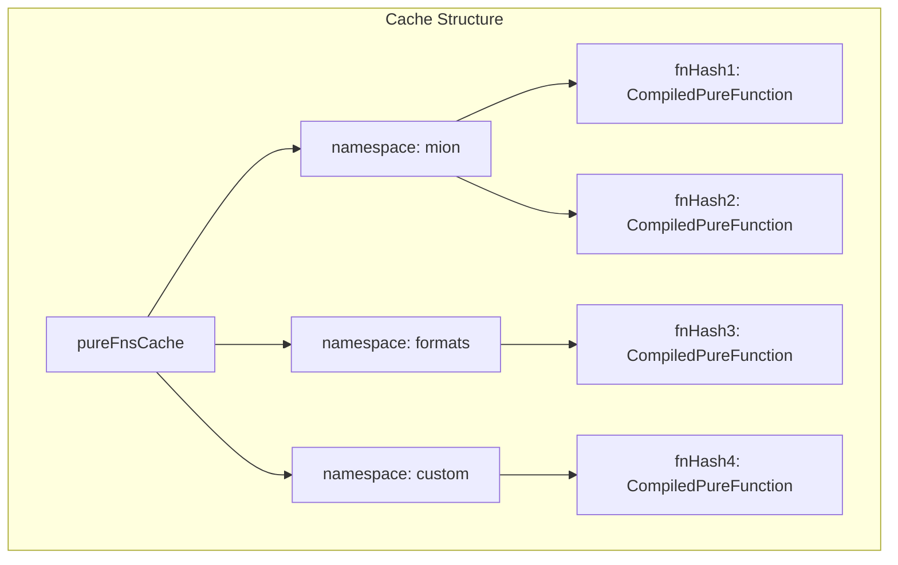
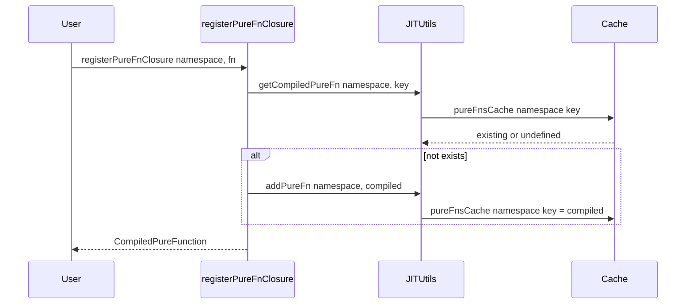

# Plan: Add Namespaces to Pure Functions

## Overview

Add namespace support to the pure functions system to allow organizing and isolating pure functions by namespace. This enables different parts of the application to have their own isolated set of pure functions.

**Important**: No default namespace - all functions require an explicit namespace. No backward compatibility needed.

## Current State

The current implementation uses a flat cache structure:

```typescript
const pureFnsCache: PureFunctionsCache = {};
// Structure: { fnHash: CompiledPureFunction }
```

## Proposed Changes

### New Cache Structure

```typescript
const pureFnsCache: NamespacedPureFunctionsCache = {};
// Structure: { namespace: { fnHash: CompiledPureFunction } }

// Example:
pureFnsCache = {
  'mion': { 'mionIsUUID': CompiledPureFunction, ... },
  'formats': { 'mionIsDateString': CompiledPureFunction, ... }
}
```

### No Default Namespace

All pure functions MUST specify a namespace. There is no default namespace for backward compatibility.

---

## Files to Modify

### 1. [`packages/core/src/types/general.types.ts`](packages/core/src/types/general.types.ts)

**Changes:**

- Add `PureFunctionNamespace` type alias
- Add `NamespacedPureFunctionsCache` type
- Update `JITUtils` interface to add namespace parameter to all pure function methods
- Add `namespace` field to `CompiledPureFunction` and `PureFunctionData` interfaces

```typescript
// New types
export type PureFunctionNamespace = string;
export type NamespacedPureFunctionsCache = Record<PureFunctionNamespace, PureFunctionsCache>;

// Updated JITUtils interface
export interface JITUtils {
  // ... existing methods ...
  addPureFn(namespace: string, compiledFn: CompiledPureFunction): void;
  usePureFn(namespace: string, name: string): PureFunction;
  getPureFn(namespace: string, name: string): PureFunction | undefined;
  getCompiledPureFn(namespace: string, name: string): CompiledPureFunction | undefined;
  hasPureFn(namespace: string, name: string): boolean;
}

// Updated PureFunctionData
export interface PureFunctionData {
  readonly namespace: string; // NEW
  readonly paramNames: string[];
  readonly code: string;
  readonly pureFnHash: string;
  readonly dependencies: Set<string>;
}
```

### 2. [`packages/core/src/jitUtils.ts`](packages/core/src/jitUtils.ts)

**Changes:**

- Change `pureFnsCache` from flat to nested structure
- Update all pure function methods to use namespace
- Add helper function to ensure namespace exists
- Update `restoreCaches` function
- Update `getJitFnCaches` return type
- Update `resetJitFnCaches` to clear nested structure

```typescript
// New cache structure
const pureFnsCache: NamespacedPureFunctionsCache = {};

// Helper function
function ensureNamespace(namespace: string): PureFunctionsCache {
    if (!pureFnsCache[namespace]) {
        pureFnsCache[namespace] = {};
    }
    return pureFnsCache[namespace];
}

// Updated methods in jitUtils object
addPureFn(namespace: string, compiledFn: CompiledPureFunction): CompiledPureFunction {
    const nsCache = ensureNamespace(namespace);
    const fnHash = compiledFn.pureFnHash;
    if (!fnHash) throw new Error('Pure function must have a name');
    const existing = nsCache[fnHash];
    if (existing) return existing;
    compiledFn.namespace = namespace;  // Set namespace on the compiled function
    nsCache[fnHash] = compiledFn;
    return compiledFn;
},
// ... similar updates for other methods
```

### 3. [`packages/run-types/src/lib/pureFn.ts`](packages/run-types/src/lib/pureFn.ts)

**Changes:**

- Add namespace as FIRST parameter to all exported functions
- No default namespace - all calls must specify namespace explicitly

```typescript
export function getCompiledPureFn(namespace: string, fnOrName: string | PureFunctionClosure): CompiledPureFunction | undefined {
  const key = getPureFunctionKey(fnOrName);
  return getJitUtils().getCompiledPureFn(namespace, key);
}

export function getPureFn(namespace: string, fnOrName: string | PureFunctionClosure): PureFunction | undefined {
  const key = getPureFunctionKey(fnOrName);
  return getJitUtils().getPureFn(namespace, key);
}

export function registerPureFnClosuresGroup(namespace: string, fnsWithCtx: PureFunctionClosure[]): CompiledPureFunction[] {
  const compiledFns = fnsWithCtx.map((fn) => registerPureFnClosure(namespace, fn));
  // ... rest of implementation
}

export function registerPureFnClosure(
  namespace: string,
  fnWithCtx: PureFunctionClosure,
  dependencies?: PureFunctionClosure[]
): CompiledPureFunction {
  const key = getPureFunctionKey(fnWithCtx);
  const existing = getJitUtils().getCompiledPureFn(namespace, key);
  // ... rest of implementation
}
```

### 4. [`packages/core/src/restoreJitFns.ts`](packages/core/src/restoreJitFns.ts)

**Changes:**

- Update `restoreCompiledJitFns` to work with namespaced cache
- Update `restoreCompiledPureFn` to use namespace
- Update `restorePureFunction` to include namespace

### 5. [`packages/core/src/utils.ts`](packages/core/src/utils.ts)

**Changes:**

- Update `initPureFunction` if it references namespace

### 6. [`packages/router/src/lib/remoteMethods.ts`](packages/router/src/lib/remoteMethods.ts)

**Changes:**

- Update pure function serialization to include namespace
- Update `getCompiledPureFn` calls to include namespace

### 7. [`packages/run-types/src/lib/jitFnCompiler.ts`](packages/run-types/src/lib/jitFnCompiler.ts)

**Changes:**

- Update `addPureFnDependency` method to use namespace
- Update generated code to include namespace in `utl.getPureFn` calls

### 8. [`packages/run-types/src/lib/utils.ts`](packages/run-types/src/lib/utils.ts)

**Changes:**

- Update `getPureFn` code generation to include namespace

### 9. Type-Formats Package Updates

Files to update:

- [`packages/type-formats/src/string/ip.runtype.ts`](packages/type-formats/src/string/ip.runtype.ts)
- [`packages/type-formats/src/string/uuid.runtype.ts`](packages/type-formats/src/string/uuid.runtype.ts)
- [`packages/type-formats/src/string/time.runtype.ts`](packages/type-formats/src/string/time.runtype.ts)
- [`packages/type-formats/src/string/date.runtype.ts`](packages/type-formats/src/string/date.runtype.ts)

**Changes:**

- Update all `registerPureFnClosure` calls to include namespace as first parameter
- Update all `registerPureFnClosuresGroup` calls to include namespace as first parameter
- Update all `utl.getPureFn` calls inside pure function closures to include namespace

**Example transformation for `ip.runtype.ts`:**

```typescript
// Before:
registerPureFnClosure(mionIsLocalHost);
registerPureFnClosure(mionIsIPV4, [mionIsLocalHost]);

// After:
registerPureFnClosure('formats', mionIsLocalHost);
registerPureFnClosure('formats', mionIsIPV4, [mionIsLocalHost]);

// Before (inside pure function):
const is_Localhost = utl.getPureFn('mionIsLocalHost');

// After:
const is_Localhost = utl.getPureFn('formats', 'mionIsLocalHost');
```

### 10. Codegen Package Updates

File: [`packages/codegen/src/cacheCompiler.spec.ts`](packages/codegen/src/cacheCompiler.spec.ts)

**Changes:**

- Update tests to use namespace parameter

---

## Test Updates

### [`packages/run-types/src/lib/pureFn.spec.ts`](packages/run-types/src/lib/pureFn.spec.ts)

- Update existing tests to use namespace
- Add new tests for namespace isolation
- Add tests for cross-namespace dependencies if supported

### [`packages/core/src/restoreJitFns.spec.ts`](packages/core/src/restoreJitFns.spec.ts)

- Update all test cases to use namespaced cache structure
- Update `utl.getPureFn` calls in test code to include namespace

### [`packages/core/src/jitUtils.spec.ts`](packages/core/src/jitUtils.spec.ts)

- Update cache loading tests for namespaced structure

---

## Architecture Diagram





---

## Migration Strategy

**No backward compatibility** - All existing code must be updated to use explicit namespaces.

1. **Breaking Change**: All `registerPureFnClosure`, `getPureFn`, etc. calls must include namespace as first parameter
2. **Update All Consumers**: Every file using pure functions must be updated
3. **Suggested Namespaces**:
   - `'mion'` - Core mion pure functions
   - `'formats'` - Type format validation functions
   - Custom namespaces for user-defined pure functions

---

## Open Questions

1. **Cross-namespace dependencies**: Should pure functions be able to depend on functions from other namespaces?
   - Recommendation: Yes, allow cross-namespace dependencies by specifying namespace in dependency resolution

2. **Namespace validation**: Should namespace names be validated?
   - Recommendation: Allow any string, but document best practices

3. **AOT Cache Structure**: How should the AOT cache files be structured?
   - Recommendation: Keep same file structure but with nested namespace objects

---

## Implementation Order

1. Update type definitions in core package
2. Update jitUtils.ts cache structure and methods
3. Update pureFn.ts in run-types package
4. Update restoreJitFns.ts
5. Update all consumers in type-formats package
6. Update codegen package
7. Update all tests
8. Manual testing and verification
