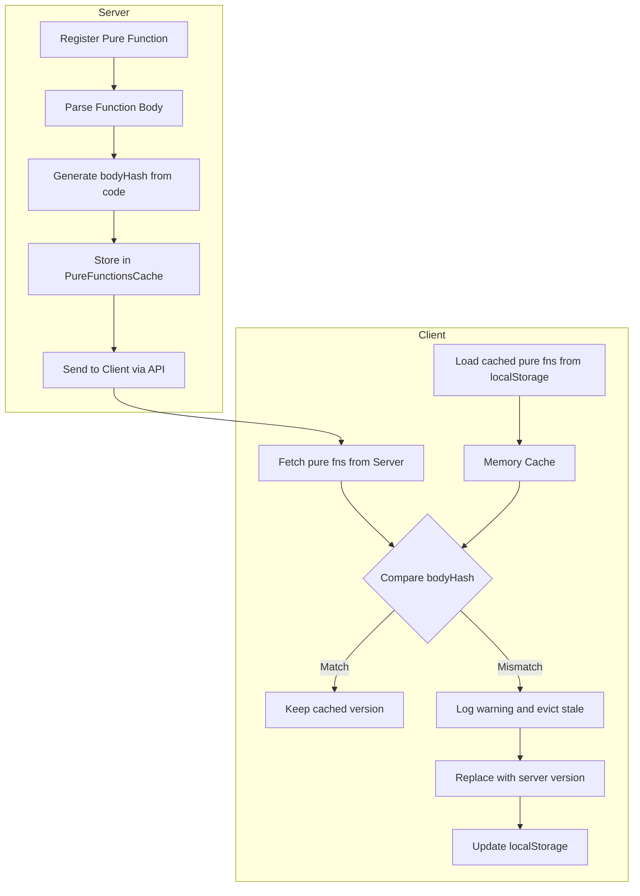

# Pure Function Versioning Implementation Plan

## Overview

This plan addresses the need for versioning pure functions to ensure cache consistency between server and client. Currently, JIT functions have built-in versioning through type-based hashes, but pure functions are only referenced by namespace and name, which doesn't account for code changes.

## Problem Statement

- **JIT Functions**: Hash is generated from the type definition, so any type change produces a unique hash (version embedded in hash)
- **Pure Functions**: Currently identified only by `namespace::name`, meaning code changes don't invalidate cached versions
- **Risk**: Client may use stale cached pure functions that don't match the server's current implementation

## Solution

Add a `bodyHash` field to pure functions that is computed from the function's body code. This hash will be:

1. Generated when registering pure functions on the server
2. Sent to clients along with pure function metadata
3. Validated on the client when loading cached pure functions
4. Used to evict stale entries when hashes don't match
5. use createUniqueHash from runtypes packages to generate the hash

## Architecture



## Data Flow

### Server Registration Flow

1. Developer defines a pure function closure
2. `registerPureFnClosure` is called
3. `parsePureFunctionWithCtx` extracts the function body and generates `bodyHash`
4. Pure function is stored in cache with both `pureFnHash` (name) and `bodyHash`
5. When client requests metadata, `bodyHash` is included in the response

### Client Cache Flow

1. Client loads cached pure functions from localStorage into memory cache
2. Client fetches new pure function metadata from server (includes `bodyHash`)
3. When adding server's pure functions to cache via `addSerializedJitCaches`, compare `bodyHash` with existing cached entry
4. If `bodyHash` differs (server version is newer), evict the stale cached entry and log warning
5. Replace with the server's version
6. Store updated data in localStorage

## Implementation Details

### 1. Update Type Definitions

**File**: [`packages/core/src/types/general.types.ts`](../packages/core/src/types/general.types.ts)

Add `bodyHash` field to `PureFunctionData` interface:

```typescript
/** Data for a pure function that can be serialized and deserialized. */
export interface PureFunctionData {
  /** The namespace this pure function belongs to */
  readonly namespace: string;
  /** The names of the arguments of the function */
  readonly paramNames: string[];
  /** The code of the function closure */
  readonly code: string;
  /** Unique id of the function - used as cache key */
  readonly pureFnHash: string;
  /** Hash of the function body for version validation */
  readonly bodyHash: string; // NEW FIELD
  /** The list of all pure functions that are used by this function and it's children. */
  readonly dependencies: Set<string>;
}
```

### 2. Generate Body Hash During Registration

**File**: [`packages/run-types/src/lib/pureFn.ts`](../packages/run-types/src/lib/pureFn.ts)

Modify `parsePureFunctionWithCtx` to generate a hash from the function body:

```typescript
import {quickHash} from './quickHash';

function parsePureFunctionWithCtx(namespace: string, createJitFn: PureFunctionClosure): CompiledPureFunction {
  // ... existing parsing code ...

  const body = fnString
    .substring(bodyStart + 1, bodyEnd)
    .trim()
    .replace(/[ \t]+/g, ' ');

  // Generate body hash for versioning
  const bodyHash = quickHash(body, 8); // 8 chars should be sufficient

  const compiled: CompiledPureFunction = {
    createJitFn: createJitFn,
    fn: null as any,
    namespace,
    pureFnHash: getPureFunctionKey(createJitFn.name),
    bodyHash, // NEW: Include body hash
    paramNames,
    code: body,
    dependencies: new Set<string>(),
  };
  return compiled;
}
```

### 3. Update Server-Side Cache Registration

**File**: [`packages/core/src/jitUtils.ts`](../packages/core/src/jitUtils.ts)

Modify `addPureFn` to validate hash consistency when a function with the same name already exists:

```typescript
addPureFn(namespace: string, compiledFn: CompiledPureFunction): CompiledPureFunction {
    const fnHash = compiledFn.pureFnHash;
    if (!fnHash) throw new Error('Pure function must have a name and must be unique');
    const nsCache = ensureNamespace(namespace);
    const existing = nsCache[fnHash];

    if (existing) {
        // Validate body hash matches - if not, this is a version conflict
        if (existing.bodyHash && compiledFn.bodyHash && existing.bodyHash !== compiledFn.bodyHash) {
            console.warn(
                `Pure function ${namespace}::${fnHash} body hash mismatch. ` +
                `Existing: ${existing.bodyHash}, New: ${compiledFn.bodyHash}. ` +
                `Replacing with new version.`
            );
            nsCache[fnHash] = compiledFn;
            return compiledFn;
        }
        return existing;
    }

    nsCache[fnHash] = compiledFn;
    return compiledFn;
}
```

### 4. Update Client-Side Storage

**File**: [`packages/client/src/clientMethodsMetadata.ts`](../packages/client/src/clientMethodsMetadata.ts)

The `storeDependencies` function already stores all fields from `PureFunctionData`, so it will automatically include `bodyHash` once the type is updated.

### 5. Update Client-Side Restoration with Validation

**File**: [`packages/client/src/clientMethodsMetadata.ts`](../packages/client/src/clientMethodsMetadata.ts)

Modify `restoreAllDependencies` to validate body hashes:

```typescript
/** Restores all JIT compiled functions and pure functions from localStorage and deserializes them */
export function restoreAllDependencies(options: ClientOptions) {
  const deps: Record<string, JitCompiledFnData> = {};
  const pureFnDeps: PureFnsDataCache = {};
  const pureFnKeyPrefix = `${STORAGE_KEY}:jit-pure-fn:${options.baseURL}:`;
  const staleKeys: string[] = []; // Track stale entries for eviction

  // ... existing JIT function restoration code ...

  for (let i = 0; i < localStorage.length; i++) {
    const key = localStorage.key(i);
    if (key?.startsWith(pureFnKeyPrefix)) {
      try {
        const data = localStorage.getItem(key);
        if (data) {
          const parsedData = JSON.parse(data);
          const pureFnData: PureFunctionData = {
            ...parsedData,
            dependencies: new Set(parsedData.dependencies),
          };

          // Extract namespace from key
          const keyParts = key.slice(pureFnKeyPrefix.length).split(':');
          const namespace = keyParts[0] || pureFnData.namespace;

          if (!pureFnDeps[namespace]) pureFnDeps[namespace] = {};
          pureFnDeps[namespace][pureFnData.pureFnHash] = pureFnData;
        }
      } catch (error) {
        console.warn(`Failed to restore pure function from key ${key}:`, error);
      }
    }
  }

  if (Object.keys(deps).length > 0 || Object.keys(pureFnDeps).length > 0) {
    addSerializedJitCaches(deps, pureFnDeps);
  }
}
```

### 6. Add Hash Validation in Core Cache Loading

**File**: [`packages/core/src/jitUtils.ts`](../packages/core/src/jitUtils.ts)

Modify `restoreCaches` to validate body hashes when loading pure functions:

```typescript
function restoreCaches(
  fnsCache: PersistedJitFunctionsCache | FnsDataCache,
  pureCache: PersistedPureFunctionsCache | PureFnsDataCache
) {
  // ... existing JIT function loading ...

  // Load namespaced pure functions with hash validation
  for (const namespace in pureCache) {
    const nsCache = ensureNamespace(namespace);
    const sourceNsCache = pureCache[namespace];
    for (const key in sourceNsCache) {
      const existing = nsCache[key];
      const incoming = sourceNsCache[key];

      if (existing) {
        // Validate body hash - evict if mismatch
        if (existing.bodyHash && incoming.bodyHash && existing.bodyHash !== incoming.bodyHash) {
          console.warn(
            `Pure function ${namespace}::${key} cache eviction: ` +
              `bodyHash mismatch (cached: ${existing.bodyHash}, server: ${incoming.bodyHash})`
          );
          // Replace with incoming version
          nsCache[key] = {...incoming} as CompiledPureFunction;
        }
        // If hashes match or one is missing, keep existing
      } else {
        // No existing entry, add new one
        nsCache[key] = {...incoming} as CompiledPureFunction;
      }
    }
  }

  // ... rest of restoration logic ...
}
```

## Testing Strategy

### Unit Tests

1. **Body Hash Generation**
   - Test that same function body produces same hash
   - Test that different function bodies produce different hashes
   - Test that whitespace normalization works correctly

2. **Cache Eviction**
   - Test that mismatched hashes trigger eviction
   - Test that matching hashes preserve cached entry
   - Test warning is logged on eviction

### Integration Tests

1. **End-to-End Flow**
   - Register pure function on server
   - Fetch metadata on client
   - Modify pure function body
   - Verify client evicts stale cache

## Files to Modify

| File                                           | Changes                                                |
| ---------------------------------------------- | ------------------------------------------------------ |
| `packages/core/src/types/general.types.ts`     | Add `bodyHash` to `PureFunctionData`                   |
| `packages/run-types/src/lib/pureFn.ts`         | Generate `bodyHash` in `parsePureFunctionWithCtx`      |
| `packages/core/src/jitUtils.ts`                | Add hash validation in `addPureFn` and `restoreCaches` |
| `packages/client/src/clientMethodsMetadata.ts` | Add hash validation in `restoreAllDependencies`        |
| `packages/run-types/src/lib/pureFn.spec.ts`    | Add tests for body hash generation                     |
| `packages/core/src/restoreJitFns.spec.ts`      | Add tests for cache eviction                           |

## Backward Compatibility

- Do not care about backward compatibility
