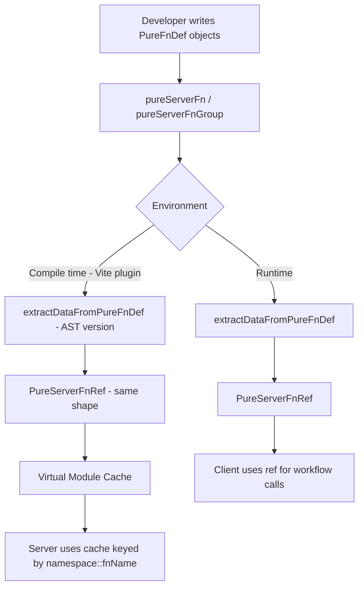
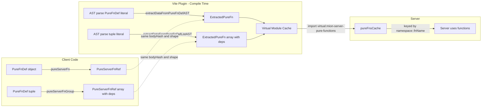

# Pure Server Functions Improvements Plan

## Goal

Make `pureServerFn()` and `pureServerFnGroup()` produce identical `PureServerFnRef` objects at both **runtime** and **compile time** (AST extraction). The virtual module on the server stores a cache of all pure functions discovered at compile time, keyed by `namespace::fnName`, so any server package can use them regardless of where they're defined.

## Architecture Overview



## Current State vs Target State

### Current `pureServerFn` API

```ts
// Current: accepts PureFnDef but tests pass bare functions
pureServerFn(function mapUsers(users) { ... })
// or
pureServerFn({ pureFn: fn, namespace: 'ns', fnName: 'name' })
```

### Target `pureServerFn` API

```ts
// New: ONLY accepts PureFnDef object
pureServerFn({ pureFn: function mapUsers(users) { ... } })
pureServerFn({ pureFn: fn, namespace: 'myNs', fnName: 'myFn', isFactory: false })
```

### Current `pureServerFnGroup` API

```ts
pureServerFnGroup([def1, def2], 'namespace');
```

### Target `pureServerFnGroup` API

```ts
// Tuple literal only - dynamic arrays throw at compile time
const [refA, refB] = pureServerFnGroup([
  {pureFn: fnA, fnName: 'fnA'},
  {pureFn: fnB, fnName: 'fnB'},
]);
// refA.dependencies = ['pureServerFn::fnB']
// refB.dependencies = ['pureServerFn::fnA']
```

---

## Detailed Changes

### 1. Update Types — [`pureFunctions.types.ts`](packages/core/src/types/pureFunctions.types.ts)

**Changes:**

- `PureFnDef` stays as-is (already has the right shape with `namespace?`, `fnName?`, `isFactory?`, `pureFn`)
- `PureServerFnRef` already extends `Required<PureFnDef>` with `bodyHash` and `dependencies` — this is correct
- No type changes needed, the types are already aligned

### 2. Create `extractDataFromPureFnDef` — Runtime Helper in [`pureServerFn.ts`](packages/core/src/pureFns/pureServerFn.ts)

**New function** that extracts all data from a single `PureFnDef` and returns a `PureServerFnRef`:

```ts
/** Extracts PureServerFnRef data from a PureFnDef at runtime */
export function extractDataFromPureFnDef<F extends (...args: any[]) => any>(def: PureFnDef<F>): PureServerFnRef<F> {
  const namespace = def.namespace || PURE_SERVER_FN_NAMESPACE;
  const bodyHash = computePureServerFnBodyHash(namespace, def.pureFn.toString());
  const fnName = def.fnName || def.pureFn.name || bodyHash;
  const isFactory = def.isFactory || false;
  return {namespace, fnName, bodyHash, pureFn: def.pureFn, isFactory};
}
```

This replaces the current private `getFnRef()` function with a public, well-named equivalent.

### 3. Create `extractDataFromPureFnDefList` — Runtime Helper in [`pureServerFn.ts`](packages/core/src/pureFns/pureServerFn.ts)

**New function** that processes a list of `PureFnDef` objects and returns `PureServerFnRef[]` with cross-dependencies:

```ts
/** Extracts PureServerFnRef data from a list of PureFnDef objects, adding cross-dependencies */
export function extractDataFromPureFnDefList<F extends (...args: any[]) => any>(defs: PureFnDef<F>[]): PureServerFnRef<F>[] {
  const refs = defs.map((def) => extractDataFromPureFnDef(def));
  const allKeys = refs.map((ref) => `${ref.namespace}::${ref.fnName}`);
  for (const ref of refs) {
    const ownKey = `${ref.namespace}::${ref.fnName}`;
    ref.dependencies = allKeys.filter((key) => key !== ownKey);
  }
  return refs;
}
```

### 4. Update `pureServerFn()` in [`pureServerFn.ts`](packages/core/src/pureFns/pureServerFn.ts)

Simplify to delegate to `extractDataFromPureFnDef`:

```ts
export function pureServerFn<F extends (...args: any[]) => any>(def: PureFnDef<F>): PureServerFnRef<F> {
  return extractDataFromPureFnDef(def);
}
```

### 5. Update `pureServerFnGroup()` in [`pureServerFn.ts`](packages/core/src/pureFns/pureServerFn.ts)

Simplify to delegate to `extractDataFromPureFnDefList`:

```ts
export function pureServerFnGroup<F extends (...args: any[]) => any>(defs: PureFnDef<F>[]): PureServerFnRef<F>[] {
  return extractDataFromPureFnDefList(defs);
}
```

Remove the old `namespace` parameter and the private `getFnRef()` function.

### 6. Update Compile-Time Extraction — [`extractPureFn.ts`](packages/devtools/src/vite-plugin/extractPureFn.ts)

This is the most complex change. The AST extraction must now parse `PureFnDef` object literals instead of bare function arguments.

#### 6a. New function: `extractDataFromPureFnDefAST`

Parses a single `PureFnDef` object literal from the AST and returns an `ExtractedPureFn` (which maps to `PureServerFnRef`):

```ts
function extractDataFromPureFnDefAST(
  objLiteral: ts.ObjectLiteralExpression,
  sourceFile: ts.SourceFile,
  filePath: string
): ExtractedPureFn {
  // Extract properties from the object literal:
  // - pureFn: required, must be function expression or arrow function
  // - namespace: optional string literal, defaults to PURE_SERVER_FN_NAMESPACE
  // - fnName: optional string literal, falls back to function name or bodyHash
  // - isFactory: optional boolean literal, defaults to false
  // Validate purity of the pureFn body
  // Compute bodyHash using same algorithm as runtime
  // Return ExtractedPureFn with all fields populated
}
```

**Key AST parsing logic:**

- Iterate `objLiteral.properties` looking for `PropertyAssignment` nodes
- For `pureFn`: extract the function expression/arrow function, get body text, param names
- For `namespace`: extract string literal value
- For `fnName`: extract string literal value
- For `isFactory`: extract boolean literal value
- Compute `bodyHash` using `createUniqueHash(namespace + normalizedBody, pureFnHashLength)` — same as runtime

#### 6b. New function: `extractDataFromPureFnDefListAST`

Parses a tuple/array literal of `PureFnDef` objects:

```ts
function extractDataFromPureFnDefListAST(
  arrayLiteral: ts.ArrayLiteralExpression,
  sourceFile: ts.SourceFile,
  filePath: string
): ExtractedPureFn[] {
  // Validate it's a tuple literal (ArrayLiteralExpression), not a dynamic array
  // For each element, it must be an ObjectLiteralExpression
  // Call extractDataFromPureFnDefAST for each element
  // Add cross-dependencies to all extracted functions
  return fns;
}
```

**Tuple validation:** At compile time, the argument to `pureServerFnGroup` must be an `ArrayLiteralExpression` node. If it's an identifier referencing a variable, or a call expression like `Array.from(...)`, throw a `PurityError`:

```ts
if (!ts.isArrayLiteralExpression(arrayArg)) {
  throw new PurityError(
    'pureServerFnGroup() argument must be an array literal (tuple), not a dynamic array',
    filePath,
    arrayArg.getStart(sourceFile)
  );
}
```

#### 6c. Update `extractPureFnsFromSource`

Update the visitor to handle the new API:

- For `pureServerFn(...)` calls: the first argument is now an object literal (`PureFnDef`), not a bare function. Use `extractDataFromPureFnDefAST`.
- For `pureServerFnGroup(...)` calls: the first argument is an array literal of object literals. Use `extractDataFromPureFnDefListAST`.
- Remove `pureServerFactoryFn` handling (factory is now indicated by `isFactory` property in `PureFnDef`).
- Remove the two-pass approach (no longer needed since group takes `PureFnDef[]` directly, not refs).

### 7. Update Virtual Module — [`virtualModule.ts`](packages/devtools/src/vite-plugin/virtualModule.ts)

The virtual module already uses `namespace::fnName` as keys. Update `generateEntryCode` to include `PureServerFnRef`-shaped data:

```ts
function generateEntryCode(fn: ExtractedPureFn): string {
  const cacheKey = `${fn.namespace}::${fn.fnName}`;
  const depsArray = fn.dependencies.map((d) => JSON.stringify(d)).join(', ');

  return `    ${JSON.stringify(cacheKey)}: {
    namespace: ${JSON.stringify(fn.namespace)},
    fnName: ${JSON.stringify(fn.fnName)},
    bodyHash: ${JSON.stringify(fn.bodyHash)},
    isFactory: ${fn.isFactory},
    dependencies: [${depsArray}],
    // createJitFn and pureFn for server-side execution
    pureFn: ${generatePureFnCode(fn)},
  }`;
}
```

The cache shape should match `PureServerFnRef` so the server can use entries directly.

### 8. Update [`ExtractedPureFn`](packages/devtools/src/vite-plugin/types.ts:33) Type

Align with `PureServerFnRef`:

```ts
export interface ExtractedPureFn {
  namespace: string;
  fnName: string;
  paramNames: string[];
  code: string;
  bodyHash: string;
  dependencies: string[]; // namespace::fnName format
  sourceFile: string;
  isFactory: boolean; // renamed from isFactoryWithJitUtils
}
```

### 9. Update Tests — [`pureServerFn.spec.ts`](packages/core/src/pureFns/pureServerFn.spec.ts)

Rewrite all tests to use the new `PureFnDef` object API:

```ts
// Old:
pureServerFn(function mapUsers(users) { ... })

// New:
pureServerFn({ pureFn: function mapUsers(users) { ... } })
pureServerFn({ pureFn: (x) => x * 2 })
pureServerFn({ pureFn: fn, namespace: 'custom', fnName: 'myFn' })
```

Add tests for:

- `extractDataFromPureFnDef` directly
- `extractDataFromPureFnDefList` with cross-dependencies
- `pureServerFnGroup` with tuple input
- Verify runtime and compile-time produce same `bodyHash` for same function

### 10. Keep [`pureFnUtils.ts`](packages/devtools/src/vite-plugin/pureFnUtils.ts) in Sync

The inlined utilities in the vite-plugin must stay in sync with core. No changes needed to the hash algorithm itself, but verify the `PURE_SERVER_FN_NAMESPACE` constant and hash computation match.

---

## Data Flow Diagram



## File Change Summary

| File                                                                       | Package  | Change Type                                                  |
| -------------------------------------------------------------------------- | -------- | ------------------------------------------------------------ |
| [`pureFunctions.types.ts`](packages/core/src/types/pureFunctions.types.ts) | core     | Minor — no changes needed, types already correct             |
| [`pureServerFn.ts`](packages/core/src/pureFns/pureServerFn.ts)             | core     | Major — new extract helpers, simplify public API             |
| [`pureServerFn.spec.ts`](packages/core/src/pureFns/pureServerFn.spec.ts)   | core     | Major — rewrite tests for new API                            |
| [`extractPureFn.ts`](packages/devtools/src/vite-plugin/extractPureFn.ts)   | devtools | Major — new AST extraction for PureFnDef objects             |
| [`virtualModule.ts`](packages/devtools/src/vite-plugin/virtualModule.ts)   | devtools | Moderate — align cache entries with PureServerFnRef          |
| [`types.ts`](packages/devtools/src/vite-plugin/types.ts)                   | devtools | Minor — rename `isFactoryWithJitUtils` to `isFactory`        |
| [`pureFnUtils.ts`](packages/devtools/src/vite-plugin/pureFnUtils.ts)       | devtools | Minor — verify sync with core                                |
| [`mionPlugin.ts`](packages/devtools/src/vite-plugin/mionPlugin.ts)         | devtools | Minor — remove `pureServerFactoryFn` from quick-check string |
