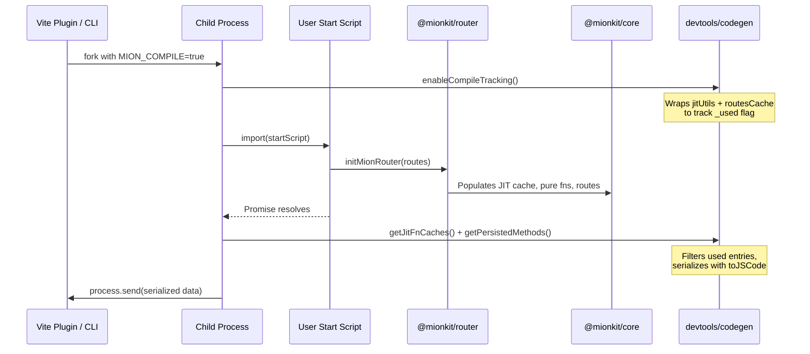
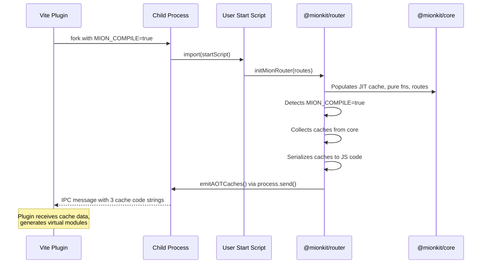

# Plan: Router Cache Emission via IPC (MION_COMPILE Mode)

## Summary

When the Vite plugin needs to generate AOT virtual modules, it forks a child process that runs the user's server start script. The **router itself** should detect it's running in compile mode (`MION_COMPILE=true`) and, once all caches are populated, **emit the cache data back to the parent process via IPC** (`process.send()`).

This moves the "collect and serialize caches" responsibility from the devtools/codegen package into the router itself, making the router the authoritative source of its own cache data.

## Current Flow (Problem)



**Problems:**

1. The codegen package has to reach into core's internals (`getJitFnCaches()`, `getPersistedMethods()`) to extract caches
2. The codegen package wraps `jitUtils` and `routesCache` with tracking proxies — fragile monkey-patching
3. The child process has to know when the router is "done" by awaiting exported promises — brittle heuristic
4. The serialization logic (`compileTypeToJs` / `toJSCode`) lives in codegen, not where the data originates

## Proposed Flow: Router Self-Emits



**Key changes:**

1. Router detects `MION_COMPILE=true` and takes responsibility for emitting caches
2. No external monkey-patching of `jitUtils` or `routesCache`
3. Router knows exactly when it's done initializing (after `registerRoutes` completes)
4. The serialization can happen inside the router or be delegated to a shared utility

## Detailed Design

### 1. New Function in Router: `emitAOTCaches()`

Add a new function to the router package that:

1. Checks if `MION_COMPILE=true`
2. Checks if `process.send` is available (running as child process with IPC)
3. Collects all caches from core
4. Serializes them
5. Sends via `process.send()`

```ts
// packages/router/src/lib/aotEmitter.ts

import {getJitFnCaches, getPersistedMethods} from './methodsCache';
import {getENV} from '@mionkit/core';

export interface AOTCacheMessage {
  type: 'mion-aot-caches';
  jitFnsCode: string;
  pureFnsCode: string;
  routerCacheCode: string;
}

/** Emits AOT caches to the parent process via IPC when running in MION_COMPILE mode */
export async function emitAOTCaches(): Promise<void> {
  if (getENV('MION_COMPILE') !== 'true') return;
  if (typeof process.send !== 'function') return;

  const {jitFnsCache, pureFnsCache} = getJitFnCaches();
  const routerCache = getPersistedMethods();

  // Serialize caches to JS code
  const serialized = await serializeCaches(jitFnsCache, pureFnsCache, routerCache);

  // Send to parent process
  process.send({
    type: 'mion-aot-caches',
    ...serialized,
  } satisfies AOTCacheMessage);
}
```

### 2. Where to Call `emitAOTCaches()`

The emission should happen **after all routes are registered** and all JIT functions are generated. There are two options:

#### Option A: Call from `initMionRouter()` (Recommended)

```ts
// packages/router/src/router.ts
export async function initMionRouter<R extends Routes>(routes: R, opts?: Partial<RouterOptions>): Promise<PublicApi<R>> {
  await initRouter(opts);
  const api = await registerRoutes(routes);

  // After all routes are registered, emit caches if in compile mode
  await emitAOTCaches();

  return api;
}
```

This is the simplest approach because `initMionRouter()` is the standard entry point that users call. By the time it returns, all internal routes (error routes, client routes) and user routes are registered.

#### Option B: Call from platform adapters (node, bun)

The platform adapters already check `MION_COMPILE`:

```ts
// packages/node/src/mionHttp.ts (current)
if (isCompiling) {
  console.log('Compiling routes metadata and skipping mion server initialization...');
  return resolve(server);
}
```

We could add the emission here. But this is less ideal because:

- The adapter doesn't know when all routes are registered
- Users might call `initMionRouter()` separately from `startNodeServer()`
- It couples the emission to specific platform adapters

**Recommendation: Option A** — emit from `initMionRouter()`.

### 3. Serialization Strategy

The serialization needs to convert the in-memory cache objects to JavaScript code strings that can be embedded in virtual modules. Currently this is done by [`compileTypeToJs()`](packages/devtools/src/codegen/cacheCompiler.ts:99) which uses `runType().createJitFunction(JitFunctions.toJSCode)`.

**Two approaches:**

#### Approach A: Router imports serialization from devtools (simple)

```ts
// packages/router/src/lib/aotEmitter.ts
import {serializeCachesToCode} from '@mionkit/devtools/codegen';
```

**Pros:** Reuses existing serialization logic.
**Cons:** Router gets a dependency on devtools (currently devtools depends on router, not the other way around). Creates a circular dependency.

#### Approach B: Move serialization to core or a shared utility (clean)

Move the `toJSCode` serialization into a shared location that both router and devtools can use. Since `toJSCode` is a JIT function from `@mionkit/run-types`, and the router already conditionally loads run-types, this fits naturally.

```ts
// packages/core/src/jit/serializeCaches.ts (new file)
import {getJitFnCaches} from './jitUtils';

export interface SerializedCaches {
  jitFnsCode: string;
  pureFnsCode: string;
  routerCacheCode: string;
}

/** Serializes the current JIT and pure function caches to JS code strings */
export async function serializeJitCachesToCode(routerCache: Record<string, any>): Promise<SerializedCaches> {
  // Dynamically import run-types (only needed in compile mode)
  const {runType, JitFunctions} = await import('@mionkit/run-types');
  const {jitFnsCache, pureFnsCache} = getJitFnCaches();

  const jitRt = runType<typeof jitFnsCache>();
  const pureRt = runType<typeof pureFnsCache>();
  const routerRt = runType<typeof routerCache>();

  const toJSCode = jitRt.createJitFunction(JitFunctions.toJSCode);
  const pureToJSCode = pureRt.createJitFunction(JitFunctions.toJSCode);
  const routerToJSCode = routerRt.createJitFunction(JitFunctions.toJSCode);

  return {
    jitFnsCode: toJSCode(jitFnsCache),
    pureFnsCode: pureToJSCode(pureFnsCache),
    routerCacheCode: routerToJSCode(routerCache),
  };
}
```

**Pros:** No circular dependency. Clean separation.
**Cons:** Needs to handle the dynamic import of run-types.

#### Approach C: Serialize in the router using dynamic import of run-types (pragmatic)

The router already dynamically imports `@mionkit/run-types` in non-AOT mode. We can do the same for serialization:

```ts
// packages/router/src/lib/aotEmitter.ts
async function serializeCaches(jitFnsCache, pureFnsCache, routerCache): Promise<SerializedCaches> {
  // run-types is already loaded at this point (router just used it to generate JIT)
  const {runType, JitFunctions} = await import('@mionkit/run-types');

  // Use toJSCode to serialize each cache
  // ... (same as Approach B but lives in router)
}
```

**Recommendation: Approach C** — keep it in the router. The router already has the run-types dependency and has just used it to generate all the JIT functions. Serializing the caches is a natural extension.

### 4. Filtering Used Entries

Currently, the codegen's [`enableCompileTracking()`](packages/devtools/src/codegen/aot-compile.ts:181) wraps `jitUtils` to track which cache entries are actually used during route registration. This is important because the JIT cache may contain entries from previous compilations or from dependencies that aren't needed.

**Two options for the new design:**

#### Option A: Keep tracking in devtools (worker sets it up before importing start script)

The child process worker (in devtools) still calls `enableCompileTracking()` before importing the start script. The router's `emitAOTCaches()` then filters using the `_used` flag.

```ts
// aotCacheWorker.ts (devtools)
import {enableCompileTracking} from '../codegen/aot-compile';
enableCompileTracking();
await import(startScript); // Router runs, emits caches via IPC
```

**Pros:** No changes to the tracking mechanism.
**Cons:** Still requires devtools to set up tracking before the router runs.

#### Option B: Move tracking into core/router

Make the tracking a first-class feature of core's cache system, activated by `MION_COMPILE=true`.

```ts
// packages/core/src/jit/jitUtils.ts
if (getENV('MION_COMPILE') === 'true') {
  // Automatically enable tracking when in compile mode
  enableCompileTracking();
}
```

**Pros:** Self-contained — no external setup needed.
**Cons:** Adds compile-mode logic to core.

**Recommendation: Option A for now** — keep tracking in the worker. It's already working and the worker is a thin wrapper. We can move it later if needed.

### 5. Complete Worker Flow

```ts
// packages/devtools/src/vite-plugin/aotCacheWorker.ts

import {enableCompileTracking} from '../codegen/aot-compile';

async function main() {
  const startScript = process.argv[2];

  // Enable compile tracking (wraps jitUtils to track _used flag)
  enableCompileTracking();

  // Import the start script — this triggers:
  // 1. initMionRouter() → registers routes → populates caches
  // 2. emitAOTCaches() → detects MION_COMPILE + process.send → sends caches via IPC
  await import(startScript);

  // Note: We don't need to manually collect caches here anymore!
  // The router's emitAOTCaches() handles everything.
  // We just need to wait for the IPC message to be sent.

  // The parent process receives the message and the worker can exit.
  // Give a small delay for the IPC message to flush
  setTimeout(() => process.exit(0), 100);
}

main().catch((err) => {
  console.error('AOT cache worker error:', err);
  process.exit(1);
});
```

### 6. Parent Process (Plugin) Receiving Caches

```ts
// packages/devtools/src/vite-plugin/aotCacheGenerator.ts

export async function generateAOTCaches(options: AOTCacheOptions): Promise<AOTCacheData> {
  return new Promise((resolve, reject) => {
    const child = fork(require.resolve('./aotCacheWorker'), [options.startServerScript!], {
      env: {...process.env, MION_COMPILE: 'true'},
      stdio: ['pipe', 'pipe', 'pipe', 'ipc'],
    });

    child.on('message', (msg: any) => {
      if (msg.type === 'mion-aot-caches') {
        resolve({
          jitFnsCode: msg.jitFnsCode,
          pureFnsCode: msg.pureFnsCode,
          routerCacheCode: msg.routerCacheCode,
        });
      }
    });

    child.on('error', reject);
    child.on('exit', (code) => {
      if (code !== 0) reject(new Error(`AOT cache worker exited with code ${code}`));
    });

    // Timeout safety
    setTimeout(() => {
      child.kill();
      reject(new Error('AOT cache generation timed out'));
    }, 30000);
  });
}
```

### 7. Platform Adapter Changes

The platform adapters (node, bun) currently skip server startup when `MION_COMPILE=true`. This behavior should remain — the server should NOT actually listen on a port during compilation.

No changes needed to [`startNodeServer()`](packages/node/src/mionHttp.ts:40) or [`startBunServer()`](packages/bun/src/bunHttp.ts:36) — they already handle `MION_COMPILE` correctly by skipping the `server.listen()` call.

### 8. Handling `initMionRouter` vs `initRouter` + `registerRoutes`

Users might use either:

- `initMionRouter(routes)` — single call, registers all routes
- `initRouter()` + `registerRoutes(routes1)` + `registerRoutes(routes2)` — multiple calls

For the second pattern, `emitAOTCaches()` can't be called automatically from `initMionRouter()` because the user might register more routes later.

**Solution:** Provide `emitAOTCaches()` as a public export. Users using the multi-step pattern must call it explicitly:

```ts
// User's start script (multi-step pattern)
await initRouter();
await registerRoutes(routes1);
await registerRoutes(routes2);
await emitAOTCaches(); // Must call explicitly
```

For the common `initMionRouter()` pattern, it's called automatically:

```ts
// User's start script (simple pattern)
const api = await initMionRouter(routes); // emitAOTCaches() called internally
```

## Implementation Todo List

- [ ] Create [`packages/router/src/lib/aotEmitter.ts`](packages/router/src/lib/aotEmitter.ts) with `emitAOTCaches()` function
- [ ] Implement cache serialization using dynamic import of `@mionkit/run-types` `toJSCode`
- [ ] Add filtering logic for used entries (reuse `filterUsedJitFns`, `filterUsedPureFns`, `filterUsedRouterCache` from codegen or reimplement)
- [ ] Call `emitAOTCaches()` at the end of [`initMionRouter()`](packages/router/src/router.ts:121)
- [ ] Export `emitAOTCaches()` from router package for multi-step registration pattern
- [ ] Define `AOTCacheMessage` interface (shared between router and plugin)
- [ ] Create [`packages/devtools/src/vite-plugin/aotCacheWorker.ts`](packages/devtools/src/vite-plugin/aotCacheWorker.ts) — thin wrapper that enables tracking and imports start script
- [ ] Create [`packages/devtools/src/vite-plugin/aotCacheGenerator.ts`](packages/devtools/src/vite-plugin/aotCacheGenerator.ts) — forks worker, listens for IPC message
- [ ] Update plugin to use the new generator
- [ ] Write tests for `emitAOTCaches()` (mock `process.send`, verify message format)
- [ ] Write tests for the worker/generator flow
- [ ] Verify platform adapters (node, bun) still skip server startup in compile mode

## Relationship to Main Plan

This plan is a sub-plan of [`plans/aot-virtual-modules-plan.md`](plans/aot-virtual-modules-plan.md). It specifically covers:

- **Phase 2** of the main plan: "Create `aotCacheWorker.ts`" and "Create `aotCacheGenerator.ts`"
- Plus a new step: Adding `emitAOTCaches()` to the router package

The main plan's Phase 2 should reference this plan for the worker/generator implementation details.
