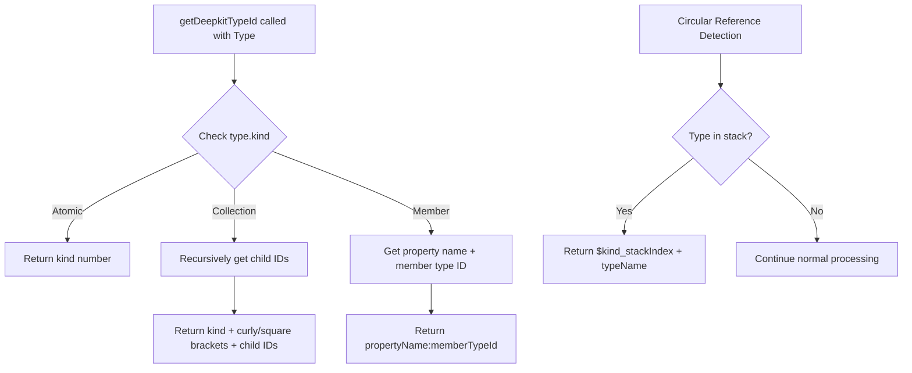
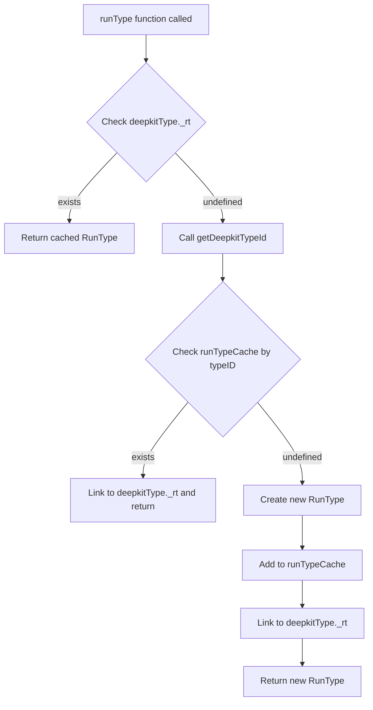

# RunType Caching Implementation Plan

**Date:** 2026-02-01
**Status:** Planning
**Related Issue:** Memory leak in Bun when running mion router

---

## Problem Statement

Memory leaks have been observed when running mion in Bun. Investigation revealed that:

1. **JIT function caching works correctly** - The `jitFnsCache` in `@mionkit/core` stays stable at ~162 entries
2. **RunType instances are being created repeatedly** - The heap snapshot shows massive growth in RunType-related objects
3. **Root cause**: Deepkit can generate multiple Type objects for the same TypeScript type, which breaks the current caching mechanism that relies on `deepkitType._rt`

### Current Caching Mechanism

In [`packages/run-types/src/createRunType.ts`](../packages/run-types/src/createRunType.ts:139-151):

```typescript
function createRunType(deepkitType: Mutable<SrcType>): RunType {
  // RunType reference is stored in the deepkitType._runType so we can access both
  // This also relies on deepkit handling circular types to prevent infinite loop
  const existingType: RunType | undefined = deepkitType._rt;
  // TODO: IMPORTANT: seems like deepkit can generate multiple types objects for the same type
  if (existingType) return existingType;
  // ... creates new RunType instance
}
```

The problem is that if deepkit creates a new Type object for the same TypeScript type, `deepkitType._rt` will be undefined, and a new RunType instance will be created.

### Current getTypeID Implementation

The RunType classes have a `getTypeID()` method that generates a unique identifier based on:

- **Atomic types**: Uses `ReflectionKind` directly - e.g., `5` for string
- **Collection types**: Uses `{childId1,childId2,...}` or `[childId1,childId2,...]` format
- **Member types**: Uses `propertyName:memberTypeId` format

This logic is currently tied to RunType instances, but we need it to work directly with deepkit Type objects.

---

## Solution Architecture

### Key Insight: Extract Type ID Generation from RunType

The current `getTypeID()` logic is embedded in RunType classes. We need to extract this into a standalone function `getDeepkitTypeId()` that works directly with deepkit Type objects. This allows us to:

1. Generate a cache key BEFORE creating a RunType instance
2. Check the cache and return existing RunType if found
3. Only create a new RunType if not in cache

### Layer 1: Standalone getDeepkitTypeId Function

Create a new function that mirrors the logic of RunType's `getTypeID()` but works directly with deepkit Type objects:



### Layer 2: RunType Instance Cache

Add a global cache for RunType instances keyed by their type ID generated from `getDeepkitTypeId()`:



### Layer 3: Router-Level Function Caching - Already Exists

The router already caches JIT functions via `jitFnsCache`. This layer is working correctly.

### Layer 4: Bun-Specific Memory Test

Add a test in the bun package to verify that repeated route calls don't increase RunType instance count.

---

## Implementation Details

### 1. Create getDeepkitTypeId Function

**File:** `packages/run-types/src/lib/deepkitTypeId.ts` (new file)

This function generates a unique type ID directly from a deepkit Type object, mirroring the logic in RunType's `getTypeID()` methods.

```typescript
import {Type, TypeProperty, TypeIndexSignature, ReflectionKind} from '@deepkit/type';
import {MAX_STACK_DEPTH} from '@mionkit/core';
import {ReflectionSubKind} from '../constants.kind';
import {
  hasType,
  hasTypes,
  hasReturn,
  hasParameters,
  hasIndexType,
  hasArguments,
  hasExtendsArguments,
  hasImplements,
} from './guards';

type StrNumber = string | number;

/**
 * Generates a unique type ID directly from a deepkit Type object.
 * This mirrors the logic in RunType's getTypeID() but works without needing a RunType instance.
 * Used for caching RunType instances before they are created.
 */
export function getDeepkitTypeId(type: Type, stack: Type[] = []): StrNumber {
  // Check for circular reference
  const circularId = checkCircularAndGetRefId(type, stack);
  if (circularId !== undefined) return circularId;

  const kind = (type as any).subKind || type.kind;

  // Atomic types - just return the kind
  if (isAtomicKind(type.kind)) {
    // Handle literals specially - include the literal value
    if (type.kind === ReflectionKind.literal) {
      return `${kind}:${JSON.stringify((type as any).literal)}`;
    }
    // Handle enums - include enum values
    if (type.kind === ReflectionKind.enum) {
      const values = (type as any).values || [];
      return `${kind}:{${values.map((v: any) => JSON.stringify(v)).join(',')}}`;
    }
    return kind;
  }

  // Collection types - recursively get child IDs
  if (hasTypes(type)) {
    stack.push(type);
    const childIds = type.types.map((t) => getDeepkitTypeId(t, stack));
    stack.pop();
    const isArray = type.kind === ReflectionKind.tuple || type.kind === ReflectionKind.array;
    const groupID = isArray ? `[${childIds.join(',')}]` : `{${childIds.join(',')}}`;
    return `${kind}${groupID}`;
  }

  // Member types - get property name and member type ID
  if (hasType(type)) {
    stack.push(type);
    const memberTypeId = getDeepkitTypeId(type.type, stack);
    stack.pop();

    // Get property name or index kind
    const propName = (type as TypeProperty).name?.toString() || (type as TypeIndexSignature).index?.kind || kind;
    const optional = (type as any).optional ? '?' : '';
    return `${propName}${optional}:${memberTypeId}`;
  }

  // Function types - include parameters and return type
  if (hasParameters(type) || hasReturn(type)) {
    stack.push(type);
    const parts: string[] = [];
    if (hasParameters(type)) {
      const paramIds = type.parameters.map((p) => getDeepkitTypeId(p, stack));
      parts.push(`(${paramIds.join(',')})`);
    }
    if (hasReturn(type)) {
      parts.push(`=>${getDeepkitTypeId(type.return, stack)}`);
    }
    stack.pop();
    return `${kind}${parts.join('')}`;
  }

  // Class types - include class name
  if (type.kind === ReflectionKind.class) {
    const className = (type as any).classType?.name || 'UnknownClass';
    // Handle special classes like Date, Map, Set
    if ((type as any).classType === Date) return ReflectionSubKind.date;
    if ((type as any).classType === Map) return ReflectionSubKind.map;
    if ((type as any).classType === Set) return ReflectionSubKind.set;

    // For regular classes, include type arguments if present
    if (hasArguments(type) && type.arguments.length > 0) {
      stack.push(type);
      const argIds = type.arguments.map((a) => getDeepkitTypeId(a, stack));
      stack.pop();
      return `${kind}:${className}<${argIds.join(',')}>`;
    }
    return `${kind}:${className}`;
  }

  // Default fallback
  return kind;
}

function checkCircularAndGetRefId(type: Type, stack: Type[]): StrNumber | undefined {
  const inStackIndex = stack.findIndex((t) => {
    if (t === type) return true;
    // Check by deepkit's internal id as well
    return t.id && type.id && t.id === type.id;
  });

  if (inStackIndex >= 0) {
    const name = type.typeName || '';
    return '$' + type.kind + `_${inStackIndex}` + name;
  }
  return undefined;
}

function isAtomicKind(kind: ReflectionKind): boolean {
  return [
    ReflectionKind.any,
    ReflectionKind.bigint,
    ReflectionKind.boolean,
    ReflectionKind.enum,
    ReflectionKind.literal,
    ReflectionKind.never,
    ReflectionKind.null,
    ReflectionKind.number,
    ReflectionKind.object,
    ReflectionKind.regexp,
    ReflectionKind.string,
    ReflectionKind.symbol,
    ReflectionKind.undefined,
    ReflectionKind.unknown,
    ReflectionKind.void,
  ].includes(kind);
}
```

### 2. Extend SrcType with \_typeId Property

**File:** `packages/run-types/src/types.ts`

Add a `_typeId` property to the `SrcType` type to cache the computed type ID on the deepkit Type object itself:

```typescript
export type SrcType<T extends Type = Type> = T & {
  readonly _rt: RunType;
  readonly _typeId?: string; // Cached type ID to avoid recalculation
  readonly subKind?: SubKind;
};
```

### 3. Update getDeepkitTypeId to Cache on Type Object

**File:** `packages/run-types/src/lib/deepkitTypeId.ts`

Update the function to cache the computed ID on the type object:

```typescript
/**
 * Generates a unique type ID directly from a deepkit Type object.
 * The ID is cached on the type object itself via _typeId property.
 */
export function getDeepkitTypeId(type: Type & {_typeId?: string}, stack: Type[] = []): string {
  // Return cached ID if available
  if (type._typeId !== undefined) return type._typeId;

  // Compute the ID
  const typeId = computeDeepkitTypeId(type, stack);

  // Cache on the type object for future lookups
  (type as any)._typeId = typeId;

  return typeId;
}

function computeDeepkitTypeId(type: Type, stack: Type[]): string {
  // ... existing logic from getDeepkitTypeId ...
}
```

### 4. Add RunType Cache in createRunType.ts

**File:** `packages/run-types/src/createRunType.ts`

```typescript
import {getDeepkitTypeId} from './lib/deepkitTypeId';

// Global cache for RunType instances keyed by type ID
const runTypeCache = new Map<string, RunType>();

// Counter for debugging/testing
let runTypeCreationCount = 0;

/** Get the current RunType cache size - useful for testing */
export function getRunTypeCacheSize(): number {
  return runTypeCache.size;
}

/** Get the total number of RunType instances created - useful for testing */
export function getRunTypeCreationCount(): number {
  return runTypeCreationCount;
}

/** Reset the RunType cache - useful for testing */
export function resetRunTypeCache(): void {
  runTypeCache.clear();
  runTypeCreationCount = 0;
}

function createRunType(deepkitType: Mutable<SrcType>): RunType {
  // First check if already linked to this deepkit type
  const existingType: RunType | undefined = deepkitType._rt;
  if (existingType) return existingType;

  // Generate type ID for cache lookup - this also caches the ID on the type object
  const typeId = getDeepkitTypeId(deepkitType);

  // Check global cache
  const cachedRunType = runTypeCache.get(typeId);
  if (cachedRunType) {
    // Link the cached RunType to this deepkit type object
    deepkitType._rt = cachedRunType;
    return cachedRunType;
  }

  // Create new RunType instance
  runTypeCreationCount++;
  let rt: BaseRunType;
  // ... existing switch statement ...

  rt.onCreated(deepkitType);

  // Add to global cache
  runTypeCache.set(typeId, rt);

  return rt;
}
```

### 5. Optimization: Use \_typeId in RunType.getTypeID()

Since we're now computing and caching the type ID on the deepkit Type object, we can simplify the RunType's `getTypeID()` method to use this cached value:

**File:** `packages/run-types/src/lib/baseRunTypes.ts`

```typescript
getTypeID(stack: BaseRunType[] = []): StrNumber {
    // Use cached _typeId from deepkit type if available
    if (this.src._typeId !== undefined) {
        const formatID = this.getFormatTypeID();
        return formatID ? this.src._typeId + formatID : this.src._typeId;
    }
    // Fallback to existing logic
    const formatID = this.getFormatTypeID();
    if (!formatID) return this._getTypeID(stack);
    return this._getTypeID(stack) + formatID;
}
```

### 6. Add Tests for RunType Caching

**File:** `packages/run-types/src/createRunType.spec.ts` (new file)

```typescript
import {runType, getRunTypeCacheSize, getRunTypeCreationCount, resetRunTypeCache} from './createRunType';
import {JitFunctions} from './constants.functions';

describe('RunType Caching', () => {
  beforeEach(() => {
    resetRunTypeCache();
  });

  it('should cache RunType instances for the same type', () => {
    type TestType = {name: string; age: number};

    const rt1 = runType<TestType>();
    const initialCount = getRunTypeCreationCount();

    const rt2 = runType<TestType>();
    const finalCount = getRunTypeCreationCount();

    // Should return the same instance
    expect(rt1).toBe(rt2);
    // Should not create new instances
    expect(finalCount).toBe(initialCount);
  });

  it('should not grow cache when called repeatedly with same type', () => {
    type TestType = {id: number; value: string};

    const initialSize = getRunTypeCacheSize();

    for (let i = 0; i < 1000; i++) {
      runType<TestType>();
    }

    const finalSize = getRunTypeCacheSize();

    // Cache should only have one entry for this type
    expect(finalSize - initialSize).toBeLessThanOrEqual(1);
  });

  it('should create separate cache entries for different types', () => {
    type TypeA = {a: string};
    type TypeB = {b: number};

    const initialSize = getRunTypeCacheSize();

    runType<TypeA>();
    runType<TypeB>();

    const finalSize = getRunTypeCacheSize();

    // Should have two new entries
    expect(finalSize - initialSize).toBe(2);
  });

  it('should handle circular types without infinite loop', () => {
    interface TreeNode {
      value: number;
      children: TreeNode[];
    }

    // Should not throw or hang
    const rt = runType<TreeNode>();
    expect(rt).toBeDefined();

    // Calling again should return cached instance
    const rt2 = runType<TreeNode>();
    expect(rt).toBe(rt2);
  });

  it('should cache _typeId on deepkit type object', () => {
    type TestType = {x: number};

    const rt = runType<TestType>();

    // The _typeId should be cached on the source type
    expect((rt.src as any)._typeId).toBeDefined();
    expect(typeof (rt.src as any)._typeId).toBe('string');
  });
});
```

### 7. Add Tests for getDeepkitTypeId Function

**File:** `packages/run-types/src/lib/deepkitTypeId.spec.ts` (new file)

```typescript
import {getDeepkitTypeId} from './deepkitTypeId';
import {reflect, ReflectionKind} from '@deepkit/type';

describe('getDeepkitTypeId', () => {
  it('should generate consistent IDs for atomic types', () => {
    const stringType = reflect<string>();
    const numberType = reflect<number>();

    expect(getDeepkitTypeId(stringType)).toBe(String(ReflectionKind.string));
    expect(getDeepkitTypeId(numberType)).toBe(String(ReflectionKind.number));
  });

  it('should generate consistent IDs for object types', () => {
    type TestObj = {name: string; age: number};

    const type1 = reflect<TestObj>();
    const type2 = reflect<TestObj>();

    const id1 = getDeepkitTypeId(type1);
    const id2 = getDeepkitTypeId(type2);

    // Same type should produce same ID even if different Type objects
    expect(id1).toBe(id2);
  });

  it('should generate different IDs for different types', () => {
    type TypeA = {a: string};
    type TypeB = {b: number};

    const typeA = reflect<TypeA>();
    const typeB = reflect<TypeB>();

    expect(getDeepkitTypeId(typeA)).not.toBe(getDeepkitTypeId(typeB));
  });

  it('should handle circular types', () => {
    interface Node {
      value: number;
      next?: Node;
    }

    const type = reflect<Node>();

    // Should not throw or hang
    const id = getDeepkitTypeId(type);
    expect(id).toBeDefined();
    expect(typeof id).toBe('string');
  });

  it('should cache ID on type object', () => {
    type TestType = {x: number};
    const type = reflect<TestType>();

    // First call computes and caches
    const id1 = getDeepkitTypeId(type);

    // Second call should return cached value
    const id2 = getDeepkitTypeId(type);

    expect(id1).toBe(id2);
    expect((type as any)._typeId).toBe(id1);
  });
});
```

### 3. Add Memory Leak Test in Bun Package

**File:** `packages/bun/src/bunHttp.memory.test.ts` (new file)

```typescript
import {expect, test, beforeAll, afterAll, describe} from 'bun:test';
import {initRouter, registerRoutes, route, resetRouter} from '@mionkit/router';
import {setBunHttpOpts, resetBunHttpOpts, startBunServer} from './bunHttp';
import {CallContext} from '@mionkit/router';
import {Server} from 'bun';

describe('Memory Leak Prevention', () => {
  type SimpleUser = {name: string; surname: string};
  type Context = CallContext;

  const changeUserName = route((context: Context, user: SimpleUser): SimpleUser => {
    return {name: 'NewName', surname: user.surname};
  });

  let server: Server<any>;
  const port = 8099;

  beforeAll(async () => {
    resetBunHttpOpts();
    resetRouter();
    initRouter({prefix: 'api/'});
    registerRoutes({changeUserName});
    setBunHttpOpts({port});
    server = await startBunServer();
  });

  afterAll(() => {
    server.stop();
  });

  test('should not increase RunType count after many requests', async () => {
    // Import dynamically to get current state
    const {getRunTypeCacheSize, getRunTypeCreationCount} = await import('@mionkit/run-types');

    const initialCacheSize = getRunTypeCacheSize();
    const initialCreationCount = getRunTypeCreationCount();

    // Make many requests
    const requestCount = 1000;
    const requestData = {changeUserName: [{name: 'Test', surname: 'User'}]};

    for (let i = 0; i < requestCount; i++) {
      await fetch(`http://127.0.0.1:${port}/api/changeUserName`, {
        method: 'POST',
        body: JSON.stringify(requestData),
      });
    }

    const finalCacheSize = getRunTypeCacheSize();
    const finalCreationCount = getRunTypeCreationCount();

    // Cache size should not grow significantly
    expect(finalCacheSize - initialCacheSize).toBeLessThan(10);
    // Creation count should not grow significantly
    expect(finalCreationCount - initialCreationCount).toBeLessThan(10);
  });

  test('should maintain stable memory usage', async () => {
    // Force GC before measurement
    if (typeof Bun !== 'undefined' && Bun.gc) {
      Bun.gc(true);
    }

    const initialMemory = process.memoryUsage().heapUsed;

    // Make many requests
    const requestCount = 5000;
    const requestData = {changeUserName: [{name: 'Test', surname: 'User'}]};

    for (let i = 0; i < requestCount; i++) {
      await fetch(`http://127.0.0.1:${port}/api/changeUserName`, {
        method: 'POST',
        body: JSON.stringify(requestData),
      });
    }

    // Force GC after requests
    if (typeof Bun !== 'undefined' && Bun.gc) {
      Bun.gc(true);
    }

    const finalMemory = process.memoryUsage().heapUsed;
    const memoryGrowth = finalMemory - initialMemory;

    // Memory growth should be reasonable - less than 50MB for 5000 requests
    // This is a rough heuristic and may need adjustment
    expect(memoryGrowth).toBeLessThan(50 * 1024 * 1024);
  });
});
```

---

## Potential Challenges

### 1. Type ID Generation Before RunType Creation

The current `getTypeID()` method is on the RunType instance, but we need to generate an ID before creating the instance.

**Solution:** Create standalone `getDeepkitTypeId()` function that mirrors the RunType logic but works directly with deepkit Type objects.

### 2. Circular Type References

Circular types need special handling to avoid infinite loops during ID generation.

**Solution:** Use a stack-based approach similar to the existing RunType implementation - track visited types and return a reference ID when a circular reference is detected.

### 3. Type Arguments and Generics

Generic types with different type arguments should have different cache entries.

**Solution:** Include type arguments in the ID generation for class types.

### 4. Memory Management

The cache itself could grow unboundedly if many different types are used.

**Solution:**

- For most applications, the number of unique types is finite and small
- The `_typeId` is cached on the deepkit Type object itself, so it follows the Type object's lifecycle
- Add cache size monitoring for debugging

### 5. Consistency Between getDeepkitTypeId and RunType.getTypeID

The new `getDeepkitTypeId()` function must produce the same IDs as the existing `RunType.getTypeID()` method.

**Solution:**

- Mirror the exact logic from `_getTypeID()`, `getChildrenTypeID()`, and `getMemberTypeID()` methods
- Add tests to verify consistency between the two approaches
- Consider refactoring RunType to use `getDeepkitTypeId()` internally to ensure consistency

---

## Testing Strategy

### Unit Tests - run-types Package

1. Test that same type returns same RunType instance
2. Test that cache doesn't grow with repeated calls
3. Test that different types get different cache entries
4. Test circular type handling
5. Test generic types with different arguments
6. Test that `_typeId` is cached on deepkit Type object
7. Test consistency between `getDeepkitTypeId()` and `RunType.getTypeID()`

### Integration Tests - bun Package

1. Test that RunType count stays stable during load
2. Test that memory usage stays stable during load
3. Test with various route parameter types

### Performance Tests

1. Benchmark RunType creation with and without caching
2. Measure cache lookup overhead
3. Compare memory usage before and after fix

---

## Rollout Plan

1. **Phase 1:** Create `getDeepkitTypeId()` function in new file
2. **Phase 2:** Add `_typeId` property to SrcType
3. **Phase 3:** Add RunType cache in `createRunType.ts`
4. **Phase 4:** Optimize `RunType.getTypeID()` to use cached `_typeId`
5. **Phase 5:** Add unit tests for caching behavior
6. **Phase 6:** Add integration tests in bun package
7. **Phase 7:** Run benchmarks to verify fix
8. **Phase 8:** Update documentation

---

## Files to Modify

| File                                               | Changes                                   |
| -------------------------------------------------- | ----------------------------------------- |
| `packages/run-types/src/lib/deepkitTypeId.ts`      | New file - standalone type ID generation  |
| `packages/run-types/src/lib/deepkitTypeId.spec.ts` | New file - tests for type ID generation   |
| `packages/run-types/src/types.ts`                  | Add `_typeId` property to SrcType         |
| `packages/run-types/src/createRunType.ts`          | Add RunType cache and helper functions    |
| `packages/run-types/src/createRunType.spec.ts`     | New file - unit tests for caching         |
| `packages/run-types/src/lib/baseRunTypes.ts`       | Optimize getTypeID to use cached \_typeId |
| `packages/run-types/index.ts`                      | Export new cache functions                |
| `packages/bun/src/bunHttp.memory.test.ts`          | New file - memory leak tests              |

---

## Success Criteria

1. RunType cache size stays stable during repeated route calls
2. Memory usage in Bun stays stable during load testing
3. No performance regression in route handling
4. All existing tests pass
5. New caching tests pass
