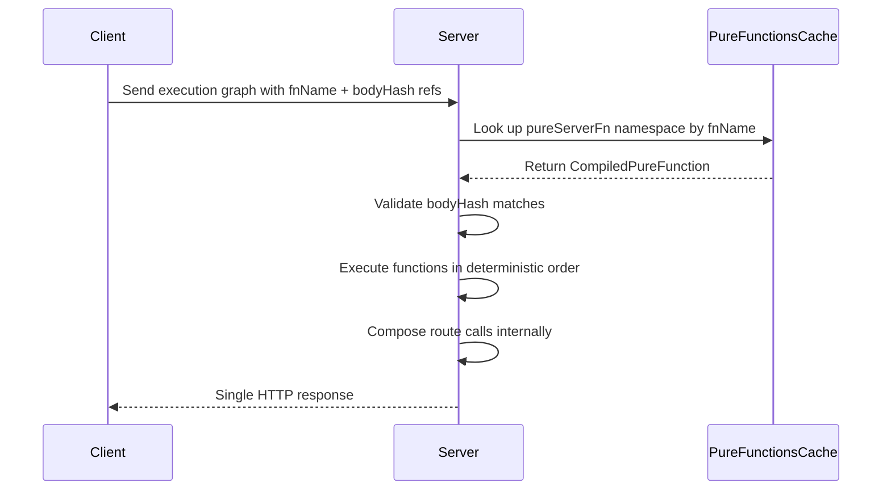

# Vite Plugin Spec: Pure Server Functions

---

## Plugin Name

`@mionkit/server-pure-functions`

---

## 1. Conceptual Goals

This plugin enables **client-defined, server-executed pure mapping functions** that are:

- ✅ Deterministic and side-effect free
- ✅ Serializable via AST extraction at build time
- ✅ Secure — no runtime function transfer, only hash IDs over the wire
- ✅ Compatible with monorepos — client and server in separate packages
- ✅ Built on top of the existing mion pure functions infrastructure

This is NOT a Next.js-style server action system.

> The purpose is to allow clients to define pure mapping functions that run on the server
> to orchestrate multiple route calls inside a single HTTP request.

---

## 2. Problem Statement

Currently:

- mion [`pureFn()`](packages/core/src/pureFns/pureFn.ts:22) only compiles functions that are reached at server runtime
- Functions defined in the client cannot be safely sent to the server
- Sending functions over the network is insecure
- Monorepos separate client and server packages — the server has no visibility into client-defined functions

We need:

1. Build-time extraction of pure functions defined in client code
2. AST-based serialization into [`PureFunctionData`](packages/core/src/types/pureFunctions.types.ts:37)
3. Deterministic hashing via [`createUniqueHash()`](packages/core/src/pureFns/quickHash.ts)
4. Server-side pre-registration into the existing [`PureFunctionsCache`](packages/core/src/types/general.types.ts:249)
5. No runtime function transport — only hash IDs are transmitted

---

## 3. Relationship to Existing Pure Functions Infrastructure

This plugin is **not a new system** — it is a build-time extension of the existing mion pure functions architecture. Everything it produces must be compatible with and consumable by the existing runtime.

### Core Types Used

- [`PureFunctionData`](packages/core/src/types/pureFunctions.types.ts:37) — the serializable data shape for a pure function:

```ts
interface PureFunctionData {
  readonly namespace: string;
  readonly paramNames: string[];
  readonly code: string;
  readonly fnName: string;
  readonly bodyHash: string;
  readonly dependencies: Set<string>;
}
```

- [`CompiledPureFunction`](packages/core/src/types/pureFunctions.types.ts:51) — extends `PureFunctionData` with `createJitFn` and `fn`
- [`PureFunctionsCache`](packages/core/src/types/general.types.ts:249) — the namespaced registry: `Record<string, Record<string, CompiledPureFunction>>`

### Namespaced Registry Model

The pure functions cache is a **two-level namespaced map**:

```
PureFunctionsCache = {
    [namespace: string]: {
        [fnName: string]: CompiledPureFunction
    }
}
```

Existing namespaces include:

- `'mion'` — core utility pure functions registered by [`registerCorePureUtils()`](packages/core/src/pureFns/corePureUtils.ts:124)

This plugin introduces a new namespace:

- `'pureServerFn'` — all functions defined via the `pureServerFn()` API are automatically placed in this namespace. Users do not specify the namespace.

### Registration Flow

At build time, the plugin extracts function data and produces a `PureFunctionsCache`-compatible artifact. At server startup, this artifact is loaded into the global cache via [`addAOTCaches()`](packages/core/src/jitUtils.ts:162) or [`jitUtils.addPureFn()`](packages/core/src/jitUtils.ts:61), exactly as existing AOT-compiled pure functions are loaded today.

---

## 4. Pure Function Constraints

Pure functions must:

- Not access outer closure scope
- Not use mutable global state
- Not perform side effects
- Be fully serializable from AST
- Have deterministic output for the same inputs
- Use only serializable inputs
- Only reference other `pureServerFn` functions as dependencies

These constraints are **enforced at build time**. If a function violates purity, the build fails with a clear error.

---

## 5. Developer API

### Client Usage

```ts
import {pureServerFn} from '@mionkit/server-pure-functions';

export const mapUsersToPreferences = pureServerFn(function mapUsersToPreferences(users) {
  return users.map((u) => ({userId: u.id}));
});
```

### Rules

- Only named function expressions or named arrow functions allowed — the name becomes `fnName` in [`PureFunctionData`](packages/core/src/types/pureFunctions.types.ts:37)
- No closure variables
- No external imports except other `pureServerFn` references
- The `'pureServerFn'` namespace is assigned automatically — users never specify it

### What `pureServerFn()` Returns

At runtime on the client, `pureServerFn()` returns a lightweight reference object containing only the `fnName` and `bodyHash`. The actual function body is never shipped to the client bundle in production — it is stripped and replaced with the hash reference.

---

## 6. Virtual Module — The Registry

The plugin emits a virtual module that serves as the `PureFunctionsCache` for the `'pureServerFn'` namespace.

### Virtual Module ID

```
virtual:mion-server-pure-functions
```

### Generated Module Shape

The virtual module exports a `PureFunctionsCache`-compatible structure:

```ts
// virtual:mion-server-pure-functions
export const pureFnsCache = {
    pureServerFn: {
        mapUsersToPreferences: {
            namespace: 'pureServerFn',
            fnName: 'mapUsersToPreferences',
            paramNames: ['users'],
            code: 'return users.map((u) => ({userId: u.id}));',
            bodyHash: 'a1b2c3d4',
            dependencies: new Set(),
            createJitFn: /* generated closure */,
            fn: undefined,
        },
        // ... more entries
    },
};
```

This is a single namespace entry `'pureServerFn'` containing all extracted functions, each conforming to [`CompiledPureFunction`](packages/core/src/types/pureFunctions.types.ts:51).

---

## 7. Plugin Architecture

### Phase A — Client Build: Scan and Extract

Runs during the client Vite build.

Responsibilities:

1. Scan source files for `pureServerFn()` call sites
2. Parse AST to extract function body, parameter names, and dependency graph
3. Validate purity constraints — fail build on violations
4. Generate deterministic `bodyHash` using the same algorithm as [`createUniqueHash()`](packages/core/src/pureFns/quickHash.ts)
5. Produce [`PureFunctionData`](packages/core/src/types/pureFunctions.types.ts:37) entries under the `'pureServerFn'` namespace
6. Emit the virtual module `virtual:mion-server-pure-functions`
7. In production, also emit a physical registry artifact for cross-package consumption

### Phase B — Server Build: Consume and Register

Runs during the server Vite build.

Server config:

```ts
pureFunctionsPlugin({
  clientPackage: '@myorg/web-client',
});
```

Responsibilities:

1. Locate the emitted client registry artifact from the client package
2. Load the `PureFunctionsCache` data
3. Register all entries into the server runtime via [`addAOTCaches()`](packages/core/src/jitUtils.ts:162) or [`jitUtils.addPureFn()`](packages/core/src/jitUtils.ts:61)
4. Validate `bodyHash` consistency between client and server builds

---

## 8. Monorepo Support

The plugin must work in a monorepo where client and server are separate packages:

```
packages/
  web-client/     # defines pureServerFn() calls
  api-server/     # consumes the registry
```

Resolution strategy:

1. Resolve the client package path from `clientPackage` option
2. Locate the emitted registry file within the client package build output
3. Load into the server build graph

No shared source code is required between client and server.

---

## 9. Build Modes

### Development

- Uses virtual module — no disk artifacts required
- HMR regenerates the registry on file changes
- Hash validation is advisory — warnings instead of errors

### Production

- Emits a physical registry file alongside the client build output
- Server build reads the physical file
- Hash validation is strict — mismatches fail the build

---

## 10. Security Model

No runtime function transfer. Only `bodyHash` IDs are transmitted over the wire.

Server validates:

```
client bodyHash === registry bodyHash
```

If mismatch → reject the request.

This prevents:

- Code injection
- Modified client functions
- Runtime evaluation attacks

This is the same hash validation model already used by [`jitUtils.addPureFn()`](packages/core/src/jitUtils.ts:61) for body hash mismatch detection.

---

## 11. Execution Model

Request flow:



1. Client sends an execution graph referencing pure function IDs from the `'pureServerFn'` namespace
2. Server looks up functions in the `PureFunctionsCache` under `'pureServerFn'`
3. Server validates `bodyHash` matches
4. Server executes functions in deterministic order, composing route calls
5. Single HTTP response returned

---

## 12. Testing Strategy

### E2E Testing with Monorepo Fixture

The plugin package must include an **internal monorepo fixture** used for end-to-end testing. This fixture simulates a real-world monorepo setup:

```
packages/server-pure-functions/
  src/                          # plugin source
  test/
    e2e/
      fixture/                  # monorepo fixture
        package.json            # workspace root
        packages/
          test-client/          # defines pureServerFn calls
            src/
              pureFns.ts        # pureServerFn definitions
            vite.config.ts      # uses the plugin in client mode
            package.json
          test-server/          # consumes the registry
            src/
              server.ts         # loads and uses the registry
            vite.config.ts      # uses the plugin in server mode
            package.json
      e2e.spec.ts               # e2e test suite
```

### E2E Test Cases

- **Build extraction**: Client build correctly extracts `pureServerFn()` calls into `PureFunctionData` entries
- **Namespace assignment**: All extracted functions are placed in the `'pureServerFn'` namespace
- **Registry shape**: The emitted registry conforms to `PureFunctionsCache` structure
- **Cross-package consumption**: Server build successfully loads the client-emitted registry
- **Hash validation**: Mismatched hashes between client and server are detected and rejected
- **Purity enforcement**: Functions violating purity constraints cause build failures
- **HMR in dev mode**: Modifying a `pureServerFn` in dev mode regenerates the virtual module

### Unit Tests

Standard unit tests for individual plugin functions — AST extraction, hash generation, purity validation, etc.

---

## 13. Long-Term Extensions

- Static graph validation at build time
- Compile-time dependency resolution across `pureServerFn` calls
- Server execution batching optimizer
- Automatic request collapsing
- Full execution plan analysis

---

## Summary

This plugin is a **build-time extension** of the existing mion pure functions system. It:

- Extracts client-defined pure functions at build time into [`PureFunctionData`](packages/core/src/types/pureFunctions.types.ts:37) entries
- Places them in the `'pureServerFn'` namespace within the existing [`PureFunctionsCache`](packages/core/src/types/general.types.ts:249)
- Emits a virtual module that is a `PureFunctionsCache`-compatible registry
- Enables the server to load and execute these functions using the existing [`addAOTCaches()`](packages/core/src/jitUtils.ts:162) / [`jitUtils.addPureFn()`](packages/core/src/jitUtils.ts:61) infrastructure
- Validates integrity via `bodyHash` — the same mechanism already in [`jitUtils`](packages/core/src/jitUtils.ts:61)
- Tests e2e functionality using an internal monorepo fixture that simulates real client/server separation

It is not server actions. It is a **precompiled pure function execution layer for request orchestration**, built on top of the existing mion pure functions infrastructure.

---

End of Specification.
