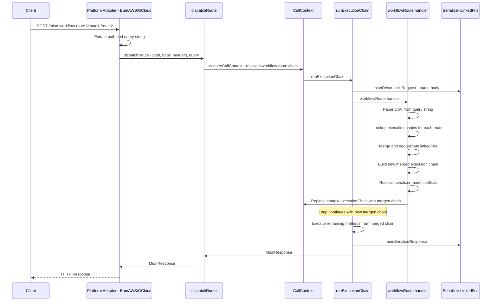

# Workflow Feature Plan

## Overview

Workflows allow calling multiple routes in a single HTTP request. A workflow request hits a special mion internal route (`mion-workflow-route`) with the target routes specified as a CSV query string. The router then dynamically builds a merged execution chain from all the specified routes and replaces the current context's execution chain.

**URL format:** `POST /mion-workflow-route?/api/route1,/api/route2,/api/route3`

**Body format:** Same as current multi-route body — `{"route1Id": [p1, p2], "route2Id": [p3, p4]}`

---

## Architecture



### Execution Chain Merging

The merged execution chain is built by combining the execution chains of all requested routes, with deduplication of shared linkedFns:

```mermaid
flowchart TD
    subgraph Original Workflow Chain
        A[mionDeserializeRequest] --> B[workflowRoute handler]
        B --> C[mionSerializeResponse]
    end

    subgraph Route1 Chain
        D1[startLinkedFns] --> E1[preLinkedFn-auth]
        E1 --> F1[route1 handler]
        F1 --> G1[postLinkedFn-log]
        G1 --> H1[endLinkedFns]
    end

    subgraph Route2 Chain
        D2[startLinkedFns] --> E2[preLinkedFn-auth]
        E2 --> F2[route2 handler]
        F2 --> G2[postLinkedFn-log]
        G2 --> H2[endLinkedFns]
    end

    subgraph Merged Chain - replaces original
        MA[mionDeserializeRequest] --> MB[preLinkedFn-auth]
        MB --> MC[route1 handler]
        MC --> MD[route2 handler]
        MD --> ME[postLinkedFn-log]
        ME --> MF[mionSerializeResponse]
    end
```



**Key rules for merging:**

- LinkedFns with the same ID are deduplicated — only one instance in the merged chain
- Route handlers are placed in the order specified in the CSV
- after new merged execution chain is created, current one is truncated, after the current route, and appended, so the whole merged execution chain is ran after current workflow route

---

## Detailed Steps

### Step 1: Validate comma in route names

**File:** [`packages/router/src/router.ts`](packages/router/src/router.ts:248)

In [`recursiveFlatRoutes()`](packages/router/src/router.ts:233), where route names are validated (line ~253-254), add a check that the route key does not contain a comma character. This ensures CSV parsing of workflow query strings is always unambiguous.

```ts
// After the numeric check at line 254
if (key.includes(',')) throw new Error(`Invalid route: ${join(...newPointer)}. Route names cannot contain commas.`);
```

### Step 2: Add optional query string to dispatchRoute

**File:** [`packages/router/src/dispatch.ts`](packages/router/src/dispatch.ts:27)

Add an optional `urlQuery` parameter to [`dispatchRoute()`](packages/router/src/dispatch.ts:27):

```ts
export async function dispatchRoute<Req, Resp>(
  path: string,
  reqRawBody: RawRequestBody,
  reqHeaders: MionHeaders,
  respHeaders: MionHeaders,
  rawRequest: Req,
  rawResponse?: Resp,
  reqBodyType?: SerializerCode,
  urlQuery?: string // NEW: optional query string for workflows
): Promise<MionResponse>;
```

Pass `urlQuery` through to [`acquireCallContext()`](packages/router/src/callContext.ts:69) and store it on the [`CallContext`](packages/router/src/types/context.ts:16).

### Step 3: Add urlQuery to CallContext type

**File:** [`packages/router/src/types/context.ts`](packages/router/src/types/context.ts:16)

Add an optional `urlQuery` field to the [`CallContext`](packages/router/src/types/context.ts:16) interface:

```ts
export interface CallContext<ContextData extends Record<string, any> = any> {
  readonly path: string;
  readonly request: MionRequest;
  readonly response: MionResponse;
  shared: ContextData;
  readonly executionChain: MethodsExecutionChain;
  readonly urlQuery?: string; // NEW: query string from URL
}
```

### Step 4: Update callContext.ts to pass urlQuery

**File:** [`packages/router/src/callContext.ts`](packages/router/src/callContext.ts)

Update [`createCallContext()`](packages/router/src/callContext.ts:34) and [`acquireCallContext()`](packages/router/src/callContext.ts:69) to accept and store `urlQuery`.

### Step 5: Update platform adapters to extract and pass query string

**Files:**

- [`packages/bun/src/bunHttp.ts`](packages/bun/src/bunHttp.ts:58) — Already extracts `queryStart` at line 61. Pass the query portion to `dispatchRoute`.
- [`packages/aws/src/awsLambda.ts`](packages/aws/src/awsLambda.ts:34) — Extract query from `rawRequest.queryStringParameters` or `rawRequest.multiValueQueryStringParameters`. AWS API Gateway provides these as parsed objects, so we need to reconstruct the raw query string.
- [`packages/gcloud/src/googleCF.ts`](packages/gcloud/src/googleCF.ts:35) — Extract query from `rawRequest.url` or `rawRequest.query`.

For each adapter, extract the raw query string (everything after `?`) and pass it as the new `urlQuery` parameter.

### Step 6: Implement workflow route handler

**File:** [`packages/router/src/routes/workflow.routes.ts`](packages/router/src/routes/workflow.routes.ts)

This is the core implementation.

The workflow handler will:

1. **Parse the CSV query string** from `ctx.urlQuery` to get route paths
2. **Apply path transforms** using `routerOptions.pathTransform` if configured (same as [`callContext.ts:43`](packages/router/src/callContext.ts:43))
3. **Look up execution chains** for each route path using [`getRouteExecutionChain()`](packages/router/src/router.ts:81)
4. **Validate** all routes exist — throw `RpcError` if any route is not found
5. **Build merged execution chain:**
   - Collect all methods from all route chains, excluding `startLinkedFns` and `endLinkedFns` (they are already in the workflow chain)
   - Deduplicate linkedFns by ID using a Set
   - Order: pre-linkedFns first, then route handlers in CSV order, then post-linkedFns
6. **Resolve serializer mode:** If all routes agree on a serializer, use it. If conflicting, use `routerOptions.serializer` default.
7. **Replace `context.executionChain`** — truncate the current chain and append the merged methods. Since `runExecutionChain` reads `context.executionChain.methods.length` dynamically in the loop, modifying the array in-place will work.

**Implementation approach for chain replacement:**

The workflow handler runs at position `routeIndex` in the current chain. After it executes, the loop in [`runExecutionChain()`](packages/router/src/dispatch.ts:66) continues with `i++`. We need to:

1. Build the merged methods array (all the route-specific linkedFns and route handlers)
2. Splice them into `context.executionChain.methods` right after the current workflow route position, replacing the remaining methods (which would just be `endLinkedFns`)
3. Keep `endLinkedFns` at the end (specifically `mionSerializeResponse`)

Since the loop reads `context.executionChain.methods.length` on each iteration, the dynamically inserted methods will be picked up.

```ts
// Pseudocode for the workflow handler
function workflowHandler(ctx: CallContext): void {
    const query = ctx.urlQuery;
    if (!query) throw new RpcError({...});

    const routePaths = query.split(',').map(p => p.trim()).filter(Boolean);
    if (routePaths.length === 0) throw new RpcError({...});

    const seenIds = new Set<string>();
    const mergedMethods: RemoteMethod[] = [];
    let resolvedSerializer: SerializerCode | undefined;

    // Mark current chain methods as seen to avoid duplicates
    for (const method of ctx.executionChain.methods) {
        seenIds.add(method.id);
    }

    for (const routePath of routePaths) {
        const chain = getRouteExecutionChain(routePath);
        if (!chain) throw new RpcError({type: 'route-not-found', ...});

        // Resolve serializer
        if (!resolvedSerializer) resolvedSerializer = chain.serializer;
        else if (resolvedSerializer !== chain.serializer) resolvedSerializer = defaultSerializer;

        for (const method of chain.methods) {
            if (seenIds.has(method.id)) continue;
            seenIds.add(method.id);
            mergedMethods.push(method);
        }
    }

    // Find the position after the workflow route in current chain
    const currentMethods = ctx.executionChain.methods;
    const workflowRouteIndex = ctx.executionChain.routeIndex;

    // Insert merged methods after workflow route, before endLinkedFns
    const endLinkedFnsCount = endLinkedFns.length;
    const insertPosition = currentMethods.length - endLinkedFnsCount;
    currentMethods.splice(insertPosition, 0, ...mergedMethods);

    // Update serializer if resolved
    if (resolvedSerializer) {
        (ctx.executionChain as Mutable<MethodsExecutionChain>).serializer = resolvedSerializer;
    }
}
```

### Step 7: Add tests

**Files to create/modify:**

- `packages/router/src/routes/workflow.routes.spec.ts` — Unit tests for the workflow handler
- `packages/router/src/router.spec.ts` — Add test for comma validation in route names

**Test cases:**

- Route names with commas are rejected during registration
- Workflow with single route works correctly
- Workflow with multiple routes merges execution chains
- Workflow with shared linkedFns deduplicates them
- Workflow with non-existent route returns error
- Workflow with empty query string returns error
- Workflow with conflicting serializer modes falls back to default
- Error in first route prevents subsequent routes from executing
- Path transforms are applied to workflow route paths

---

## Files Changed Summary

| File                                                                                                       | Change                                           |
| ---------------------------------------------------------------------------------------------------------- | ------------------------------------------------ |
| [`packages/router/src/router.ts`](packages/router/src/router.ts)                                           | Add comma validation for route names             |
| [`packages/router/src/dispatch.ts`](packages/router/src/dispatch.ts)                                       | Add optional `urlQuery` param to `dispatchRoute` |
| [`packages/router/src/types/context.ts`](packages/router/src/types/context.ts)                             | Add `urlQuery` to `CallContext`                  |
| [`packages/router/src/callContext.ts`](packages/router/src/callContext.ts)                                 | Pass `urlQuery` through context creation         |
| [`packages/router/src/routes/workflow.routes.ts`](packages/router/src/routes/workflow.routes.ts)           | Implement workflow handler logic                 |
| [`packages/bun/src/bunHttp.ts`](packages/bun/src/bunHttp.ts)                                               | Extract and pass query string                    |
| [`packages/aws/src/awsLambda.ts`](packages/aws/src/awsLambda.ts)                                           | Extract and pass query string                    |
| [`packages/gcloud/src/googleCF.ts`](packages/gcloud/src/googleCF.ts)                                       | Extract and pass query string                    |
| [`packages/router/src/routes/workflow.routes.spec.ts`](packages/router/src/routes/workflow.routes.spec.ts) | New test file                                    |
| [`packages/router/src/router.spec.ts`](packages/router/src/router.spec.ts)                                 | Add comma validation test                        |

---

## Open Questions / Risks

1. **Workflow route as `route` vs `rawLinkedFn`**: Currently the workflow is defined as a `route`. Since it needs to modify `context.executionChain` (which is internal router behavior), it might be cleaner as a `rawLinkedFn` which has access to `(context, rawRequest, rawResponse, opts)`. However, using `route` works too since `CallContext` already has `executionChain`. The tradeoff is that `rawLinkedFn` is private/internal by design, which fits better semantically.

2. **Binary serialization for workflows**: The binary serializer in [`serializer.routes.ts`](packages/router/src/routes/serializer.routes.ts:53) builds a methods map from `context.executionChain.methods`. Since we modify the chain dynamically, the deserializer runs BEFORE the workflow handler modifies the chain. This means binary deserialization won't know about the merged routes' methods. **This is likely fine for JSON** (body is already parsed as a flat object), but **binary workflows may need special handling** or could be unsupported initially.

3. **AOT mode compatibility**: In AOT mode, all routes must be pre-compiled. Workflows are dynamic by nature. The workflow route itself is pre-compiled, but the merged chain is built at runtime from existing pre-compiled routes, so this should work fine.

4. **`pathTransform` on workflow route paths**: The paths in the CSV query string should be the final paths as they appear in the flatRouter. If `pathTransform` is configured, should it be applied to each CSV path? The user confirmed yes — we need to apply the same transform as in [`callContext.ts:43`](packages/router/src/callContext.ts:43).
