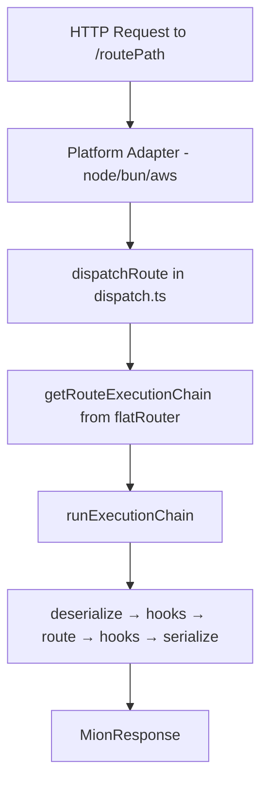
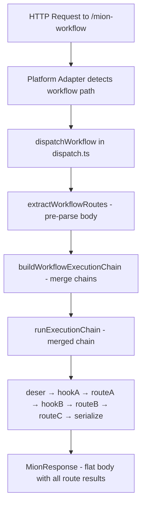
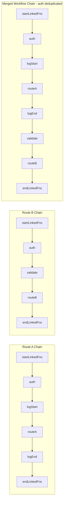

# Workflow Request Feature Plan

## Overview

Add the ability to call **multiple routes in a single HTTP request** via a "workflow" concept. The request body includes a special `mion@workflow` property listing route IDs to execute in order. All routes share a single `CallContext`, and if any route/hook fails, subsequent routes are skipped (existing error-skipping behavior).

**Important naming distinction:**

- **URL path:** `/mion-workflow` (URL-safe, no encoding needed)
- **Body property:** `mion@workflow` (follows existing `mion@` naming pattern like `mion@notFound`, `mion@platformError`)

## Current Architecture

### Request Flow (Single Route)



### Current Body Format

```json
{
  "hookId": ["hookParams"],
  "routeId": ["routeParam1", "routeParam2"]
}
```

### Current Execution Chain Structure

Each route has a pre-computed [`MethodsExecutionList`](packages/router/src/types/remoteMethods.ts:46) stored in the `flatRouter` Map:

```
[startLinkedFns..., preLevelLinkedFns..., ROUTE, postLevelLinkedFns..., endLinkedFns...]
```

Where `startLinkedFns` = `[mionDeserializeRequest]` and `endLinkedFns` = `[mionSerializeResponse]`.

## Proposed Design

### Workflow Request Flow



### Workflow Body Format

```json
{
  "mion@workflow": ["routeA", "routeB", "routeC"],
  "hookId": ["hookParams"],
  "routeA": ["param1"],
  "routeB": ["param2"],
  "routeC": ["param3"]
}
```

### Workflow Response Format (unchanged from current)

```json
{
  "hookId": "hookResult",
  "routeA": "resultA",
  "routeB": "resultB",
  "routeC": "resultC"
}
```

### Merged Execution Chain

For routes A, B, C with chains:

- Route A: `[deserialize, auth, logStart, routeA, logEnd, serialize]`
- Route B: `[deserialize, auth, validate, routeB, serialize]`
- Route C: `[deserialize, routeC, cleanup, serialize]`

The merged workflow chain becomes:

```
[deserialize, auth, logStart, routeA, logEnd, validate, routeB, routeC, cleanup, serialize]
```

**Merge Rules:**

- `startLinkedFns` (deserialize) run once at the beginning
- `endLinkedFns` (serialize) run once at the end
- **LinkedFns are deduplicated by ID** — since the request body only contains one entry per linkedFn, running the same linkedFn twice with the same params is pointless. If `auth` appears in both route A and route B chains, it only runs once in the merged chain.
- The existing error-skipping behavior (`if response.hasErrors && !executable.options.runOnError continue`) handles failure propagation automatically — if route A fails, routes B and C are skipped

### Execution Chain Merge Visualization



## Implementation Steps

### Step 1: Add workflow constants to core

**File:** [`packages/core/src/constants.ts`](packages/core/src/constants.ts)

Add new entries to `MION_ROUTES`:

```typescript
export const MION_ROUTES = {
  // ... existing entries
  /** Workflow route for executing multiple routes in a single request */
  workflow: 'mion@workflow',
  /** URL path for workflow requests - uses hyphen instead of @ for URL safety */
  workflowPath: 'mion-workflow',
} as const;
```

### Step 2: Create workflow module

**File:** `packages/router/src/workflow.ts` (new file)

Two functions:

#### `extractWorkflowRoutes(rawBody: RawRequestBody): string[] | null`

- Pre-parses the raw body (JSON string) to extract the `mion@workflow` array
- Returns `null` if not a workflow request (no `mion@workflow` property)
- Returns the array of route IDs if it is a workflow request
- Throws `RpcError` if `mion@workflow` is present but invalid (not an array, empty, etc.)

#### `buildWorkflowExecutionChain(routeIds: string[]): MethodsExecutionList`

- For each route ID, converts to path and retrieves its `MethodsExecutionList` from `getRouteExecutionChain`
- Extracts the "middle" portion of each chain (everything between startLinkedFns and endLinkedFns)
- **Deduplicates linkedFns by ID** — tracks seen linkedFn IDs and skips duplicates
- Wraps with startLinkedFns at the beginning and endLinkedFns at the end
- Returns the merged `MethodsExecutionList`
- Throws `RpcError` if any route is not found

Key implementation detail for deduplication:

```typescript
const seenLinkedFnIds = new Set<string>();
const mergedMiddle: RemoteMethod[] = [];

for (const routeId of routeIds) {
  const chain = getRouteExecutionChain(routePath);
  // Extract middle portion (skip start/end linkedFns)
  const middle = chain.methods.slice(startLinkedFns.length, chain.methods.length - endLinkedFns.length);
  for (const method of middle) {
    if (method.type === HandlerType.route) {
      // Routes are never deduplicated
      mergedMiddle.push(method);
    } else if (!seenLinkedFnIds.has(method.id)) {
      seenLinkedFnIds.add(method.id);
      mergedMiddle.push(method);
    }
  }
}
```

### Step 3: Create `dispatchWorkflow` function

**File:** [`packages/router/src/dispatch.ts`](packages/router/src/dispatch.ts)

Create a **new** `dispatchWorkflow` function alongside the existing `dispatchRoute`. The existing `dispatchRoute` remains **completely untouched** — no performance impact on the regular request path.

```typescript
/** Dispatches a workflow request that executes multiple routes in a single call */
export async function dispatchWorkflow<Req, Resp>(
    reqRawBody: RawRequestBody,
    reqHeaders: MionHeaders,
    respHeaders: MionHeaders,
    rawRequest: Req,
    rawResponse?: Resp,
    reqBodyType?: SerializerCode
): Promise<MionResponse> {
    const opts = getRouterOptions();
    const workflowPath = `/${MION_ROUTES.workflowPath}`;
    const usePooling = opts.maxContextPoolSize > 0;
    const context = usePooling
        ? acquireCallContext(workflowPath, opts, reqRawBody, rawRequest, reqHeaders, respHeaders, reqBodyType)
        : createCallContext(workflowPath, opts, reqRawBody, rawRequest, reqHeaders, respHeaders, reqBodyType);

    try {
        // Pre-parse body to extract workflow route list
        const routeIds = extractWorkflowRoutes(reqRawBody);
        if (!routeIds) throw new RpcError({...});

        // Build merged execution chain
        const executionChain = buildWorkflowExecutionChain(routeIds);

        // Store on context for serializer access
        (context as Mutable<CallContext>)._executionChain = executionChain;

        await runExecutionChain(context, rawRequest, rawResponse, executionChain, opts);
        return context.response;
    } catch (err) {
        return Promise.reject(err);
    } finally {
        if (usePooling) releaseCallContext(context, opts.maxContextPoolSize);
    }
}
```

Note: `dispatchWorkflow` does NOT take a `path` parameter — the path is always `/mion-workflow`. Platform adapters detect the workflow path and call `dispatchWorkflow` instead of `dispatchRoute`.

**Platform adapter changes:** Each adapter (node, bun, aws, gcloud) needs a small change to detect the workflow path and call `dispatchWorkflow`. For example in [`packages/node/src/mionHttp.ts`](packages/node/src/mionHttp.ts):

```typescript
// In httpRequestHandler, after body is collected:
const isWorkflow = path === `/${MION_ROUTES.workflowPath}`;
const mionResponse = isWorkflow
  ? await dispatchWorkflow(reqRawBody, reqHeaders, respHeaders, httpReq, httpResponse, reqBodyType)
  : await dispatchRoute(path, reqRawBody, reqHeaders, respHeaders, httpReq, httpResponse, reqBodyType);
```

This keeps `dispatchRoute` completely untouched while cleanly separating the workflow path.

### Step 4: Add `_executionChain` to CallContext

**File:** [`packages/router/src/types/context.ts`](packages/router/src/types/context.ts)

Add an optional internal field to `CallContext`:

```typescript
export interface CallContext<ContextData extends Record<string, any> = any> {
  // ... existing fields ...
  /** @internal Override execution chain for workflow requests - used by serializer */
  readonly _executionChain?: MethodsExecutionList;
}
```

This field is needed because [`serializeResponseBody`](packages/router/src/routes/serializer.routes.ts:89) and [`deserializeRequestBody`](packages/router/src/routes/serializer.routes.ts:35) call `getRouteExecutionChain(context.path)` to get the methods list. For workflow requests, `context.path` is `/mion-workflow` which isn't in the flatRouter, so the serializer needs the merged chain from the context.

### Step 5: Update serializer to use context execution chain

**File:** [`packages/router/src/routes/serializer.routes.ts`](packages/router/src/routes/serializer.routes.ts)

Modify `deserializeRequestBody` and `serializeResponseBody` to check for `context._executionChain` first:

```typescript
// In deserializeRequestBody (for binary mode):
const executionChain = context._executionChain?.methods || getRouteExecutionChain(context.path)?.methods || [];

// In serializeResponseBody:
const executionChain = context._executionChain || getRouteExecutionChain(context.path)!;
```

Also, `deserializeRequestBody` has a special case for array bodies:

```typescript
if (Array.isArray(parsedBody)) {
  parsedBody = {[getRouteExecutableFromPath(context.path).id]: parsedBody};
}
```

This won't apply to workflow requests (body is always an object with `mion@workflow`), but we should guard against it.

### Step 6: Export workflow module

**File:** [`packages/router/index.ts`](packages/router/index.ts)

Add: `export * from './src/workflow';`

### Step 7: Update platform adapters

Each platform adapter needs a small change to detect the workflow path and call `dispatchWorkflow` instead of `dispatchRoute`.

**File:** [`packages/node/src/mionHttp.ts`](packages/node/src/mionHttp.ts)

```typescript
import {dispatchRoute, dispatchWorkflow} from '@mionkit/router';
import {MION_ROUTES} from '@mionkit/core';

// In httpRequestHandler, replace the dispatchRoute call:
const workflowPath = `/${MION_ROUTES.workflowPath}`;
const mionResponse =
  path === workflowPath
    ? await dispatchWorkflow(reqRawBody, reqHeaders, respHeaders, httpReq, httpResponse, reqBodyType)
    : await dispatchRoute(path, reqRawBody, reqHeaders, respHeaders, httpReq, httpResponse, reqBodyType);
```

**File:** [`packages/bun/src/bunHttp.ts`](packages/bun/src/bunHttp.ts) — same pattern
**File:** [`packages/aws/src/awsLambda.ts`](packages/aws/src/awsLambda.ts) — same pattern

### Step 8: Write tests

**File:** `packages/router/src/workflow.spec.ts` (new file)

Test cases:

- Basic workflow with 2 routes - both execute and return results
- Workflow with 3+ routes - all execute in order
- Workflow with shared hooks - hooks are deduplicated (auth runs once, not twice)
- Workflow where first route fails - subsequent routes are skipped
- Workflow where a hook fails - all routes are skipped
- Workflow with `runOnError` hooks - still execute after failure
- Workflow with empty route list - returns error
- Workflow with non-existent route - returns error
- Workflow response contains results from all successful routes in flat format
- `extractWorkflowRoutes` returns null for non-workflow bodies
- `extractWorkflowRoutes` returns route array for valid workflow bodies
- `buildWorkflowExecutionChain` correctly merges chains with deduplication

## Files to Modify/Create

| File                                                                                                 | Action | Description                                                              |
| ---------------------------------------------------------------------------------------------------- | ------ | ------------------------------------------------------------------------ |
| [`packages/core/src/constants.ts`](packages/core/src/constants.ts)                                   | Modify | Add `workflow` and `workflowPath` to `MION_ROUTES`                       |
| `packages/router/src/workflow.ts`                                                                    | Create | `buildWorkflowExecutionChain` and `extractWorkflowRoutes` functions      |
| [`packages/router/src/dispatch.ts`](packages/router/src/dispatch.ts)                                 | Modify | Add new `dispatchWorkflow` function (`dispatchRoute` untouched)          |
| [`packages/router/src/types/context.ts`](packages/router/src/types/context.ts)                       | Modify | Add optional `_executionChain` to `CallContext`                          |
| [`packages/router/src/routes/serializer.routes.ts`](packages/router/src/routes/serializer.routes.ts) | Modify | Use `context._executionChain` when available                             |
| [`packages/router/index.ts`](packages/router/index.ts)                                               | Modify | Export workflow module                                                   |
| [`packages/node/src/mionHttp.ts`](packages/node/src/mionHttp.ts)                                     | Modify | Detect workflow path, call `dispatchWorkflow` instead of `dispatchRoute` |
| [`packages/bun/src/bunHttp.ts`](packages/bun/src/bunHttp.ts)                                         | Modify | Detect workflow path, call `dispatchWorkflow` instead of `dispatchRoute` |
| [`packages/aws/src/awsLambda.ts`](packages/aws/src/awsLambda.ts)                                     | Modify | Detect workflow path, call `dispatchWorkflow` instead of `dispatchRoute` |
| [`packages/gcloud/src/googleCF.ts`](packages/gcloud/src/googleCF.ts)                                 | Modify | Detect workflow path, call `dispatchWorkflow` instead of `dispatchRoute` |
| `packages/router/src/workflow.spec.ts`                                                               | Create | Tests for workflow functionality                                         |

## Risk Assessment

- **Low risk:** Adding `MION_ROUTES.workflow` constant - no impact on existing code
- **Low risk:** New `workflow.ts` file - isolated new code
- **Low risk:** `dispatchRoute` is completely untouched - zero performance impact on existing requests
- **Low risk:** Platform adapter changes are minimal (one conditional to detect workflow path)
- **Medium risk:** Modifying serializer to use context-provided execution chain - needs careful testing
- **Low risk:** Binary serialization not supported initially for workflows - can be added later

## Out of Scope (Future Work)

- Client-side workflow API
- Binary serialization for workflow requests
- Workflow-specific error types/codes
- Workflow timeout/cancellation
- Parallel route execution within a workflow
